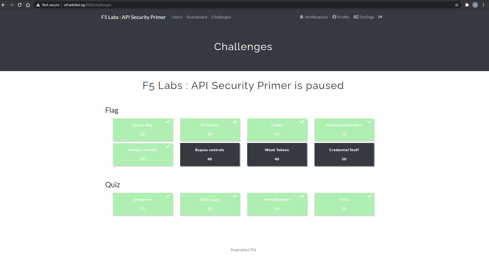
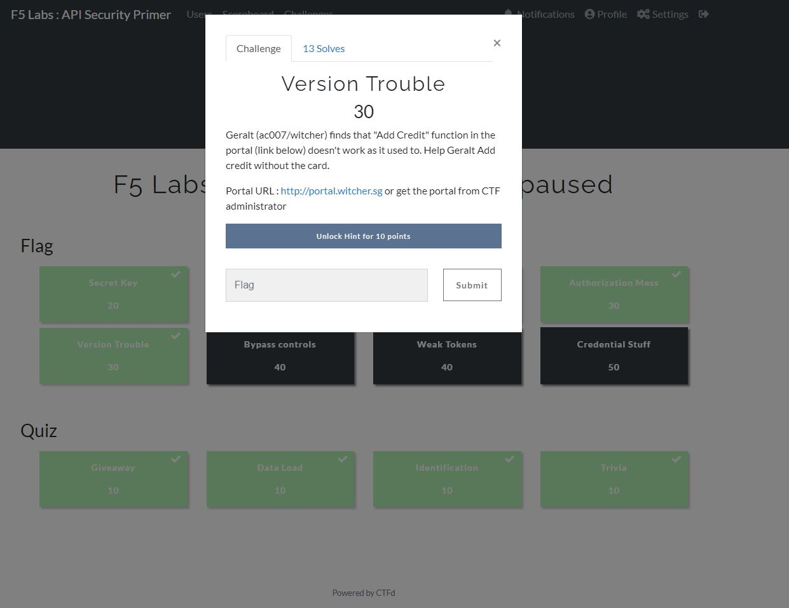

+++
author = "Jeff Chang"
title= "I participated my very first hackathon !" 
date= "2021-03-18"
description= "There is nothing related to technical skills or programming. In this post, I would like to record down my very first hackthon which held virtually through online in 18-03-2021" 
tags = [
    "Non-technical","Hackathon"
]
categories = [
    "Non-technical","Hackathon"
]
image = "cover.jpg"
+++
This is my very first time participating in a hackathon.  
The title of this virtual hackathon is called [API security challenge](https://www.jomhack.com/apisecurity/) which is organized by [JomHack](https://www.jomhack.com/) and F5/NGINX.  
Unlike the most of the hackathon which usually last for at least 48 hours, this virtual hackathon was actually last for only **2 hours** which is quite chill and relax.

The scopes of this hackathon were actually try to hack into their website or system such as edit their customer informations (credit card info), get the user access by decoding the JWT (JSON Web Token) and etc  

As long as we managed to did the hacking based on the challenges criteria. The system will return the answer and we can then use it and submit as answer to get our points. 
And it's so called capturing the **Flag**
 

The winning requirement is pretty straight forward. The highest points will be the winner for this hackathon.  

I was glad that I was at least managed to solve most of the question by inpecting , observering and keep trying to makes API call and eventually capture the **Flag**  

In conclusion, it was very fun and I gained a memorable experience in my developer career. Gonna participate more event in the FUTURE !!!

