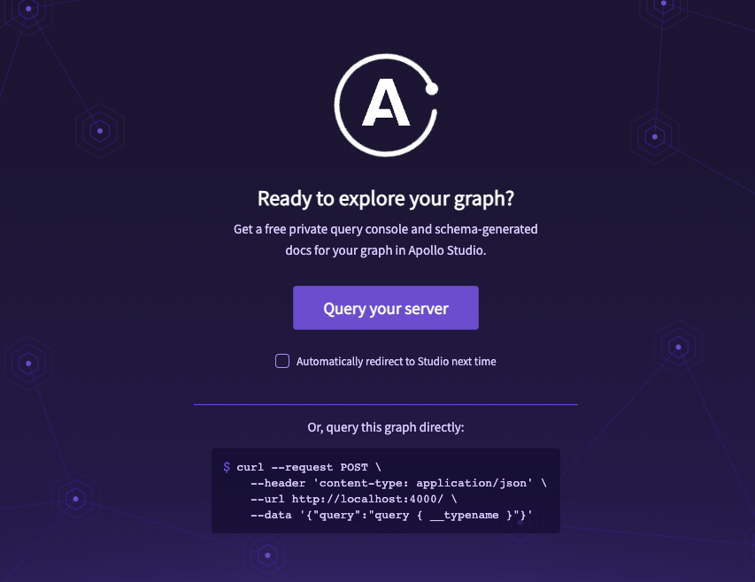
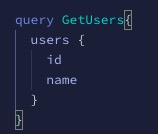
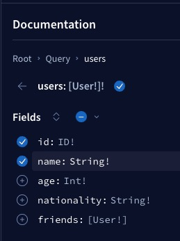
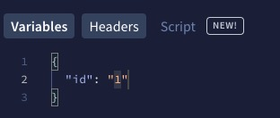

+++
author = "Jeff Chang"
title = "Understanding GraphQL Query and Mutation in Apollo Server"
date = "2023-05-23"
description = "In this article, we will be going through the fundamental of GraphQL in Apollo Server with NodeJs"
tags = [
    "nodejs", "graphql"
]
categories = [
    "Node","Javascript", "GraphQL"
]
image= "cover.png"
+++

## Table of contents

- [Introduction](#introduction)
- [Schema and Types](#schema-type)
- [Query](#query)
- [Mutations](#mutations)
- [Link multiple query type](#link-types)
- [Final source code](#conclusion)

### Introduction<a name="introduction"></a>

Before we get started, it's high recommend to clone the [Github repo](https://github.com/Jeffcw96/graphlq-learning-journey) and we can follow along with the article contents.

The first step after we downloaded the repo is to checkout the the **starter** folder and run `npm install` and `npm run start` to start our Apollo GraphQL server locally.

We can now navigate to http://localhost:4000/ and here is how it should look like



We could then click on the **Query your server** button and it shall brings us to the GraphQL editor

### Schema and Types<a name="schema-type"></a>

There are total of 5 scalar types available in GraphQL

- `ID`: The ID scalar type represents a unique identifier, often used to refetch an object or as the key for a cache. The ID type is serialized in the same way as a String; however, defining it as an ID signifies that it is not intended to be human‐readable.
- `Int`: A signed 32‐bit integer.
- `Float`: A signed double-precision floating-point value.
- `String`: A UTF‐8 character sequence.
- `Boolean`: `true` or `false`.

Here is one of the GraphQL example type in our Github repo:

```typescript
type User {
  id: ID!
  name: String!
  age: Int!
  nationality: String!
  friends: [User!]
}
```

We now structed our `User` type to have a `id` field to be an `ID` scalar type which most of the time will be our unique identifier from the database. We also have the rest of the fields called `name`, `age`, `nationality` and `friends`.

The exclamation mark right beside of the scalar type is stands for **non-nullable** field. In other words, these field must be existed from our data source when we are querying from the GraphQL command.

For the `friends` field, it's a little special as it's an **Array** type. `[User!]` scalar type means the field will now contains whatever we have specified for the `User` type. It also means it's a **nullable** field **BUT** when it also means it cannot be a empty array

Checkout the [official docs](https://graphql.org/learn/schema/) if you are keen to learn more

### Query<a name="query"></a>

There is query ready in our starter pack. Let's play around with that by typing our query in the GraphQL editor.



```typescript
...
query GetUsers{
  users {
    id
    name
  }
}
```

We will first need to name our query, in this case we named it as `GetUsers` and it's totally customizable and up to your own preference. Then inside the bracket, it's gonna we what query type we are referring too. If you look at the Query type in the `type-def.js` file, the starter pack code has already provided an example to return a list of users. Inside the query type, instead of returning every fields provided by the query which normally what we seen for REST API. We could actually specify what are fields to be returned in our query. In this case, we only want the `id` and `name` to be returned in our query

GraphQL also smart enough to automatically create a documentation based on whatever we have defined in our Query and Mutation by explaining what fields are available in every Query and Mutation



Before we actually create our own query resolver, we would need to definite it's type in the `type-def.js` file. What are we going to do next is to create a resolver that return a specific user by ID.

```typescript
...

const typeDefs = gql`
  type Query {
    users: [User!]!
    user(id: ID!): User!
  }

  ...
`;
```

Since our new resolver query is to return a specific user by ID. We would then need the id as the input parameter and the return type will be an User.
We can navigate to `resolver.js` file and create our resolver for this query type.

> Take note that we could access our resolve input variable from the second argument. eg: `args.id`

```javascript
const { Users } = require("../data");

const resolvers = {
  Query: {
    users: () => {
      return Users;
    },
    user: (_parent, args) => {
      const id = args.id;
      return Users.find((user) => Number(user.id) === Number(id));
    },
  },
};

module.exports = { resolvers };
```

#### Outcome

We could use the following query in our GraphQL editor

```typescript
query GetUser {
  user(id: "1") {
    id
    nationality
  }
}
```

However, there is a better way to structure the query by introducing the id variable:

```typescript
query GetUser($id: ID!) {
  user(id: $id) {
    id
    nationality
  }
}
```

And we could specify the value of `$id` variable:


### Mutation<a name="mutations"></a>

We now understand how to query the data from GraphQL server. Let's create some Mutation to add in a new user. The concept is almost similar to what we have for the Query type where we first need to define the input and return type of the mutation.

We can also create an [input type](https://graphql.org/graphql-js/mutations-and-input-types/) which hold the entities when we are creating a new user

```ts
...
type Mutation {
  createUser(input: CreateUserInput!): User
}

input CreateUserInput {
  name: String!
  age: Int!
  nationality: String!
}
```

_type-def.js_

And now, we can then add in our logic for the resolver. Instead of wrapping the resolver under Query object, we should now wrap them into the Mutation object.

Also take note that we can access ou

```javascript
const { Users } = require("../data");

const resolvers = {
  Query: {
    users: () => {
      return Users;
    },
    user: (_parent, args) => {
      const id = args.id;
      return Users.find((user) => Number(user.id) === Number(id));
    },
  },
  Mutation: {
    // The object key store in args will be depends on what we define in type-def. If we name it as input then it will be args.input
    createUser: (_parent, args) => {
      const id = Users[Users.length - 1].id + 1;
      const user = {
        ...args.input,
        id,
      };
      Users.push(user);
      return user;
    },
  },
};

module.exports = { resolvers };
```

_resolvers.js_

#### Outcome

<video controls muted style="width:100%">
  <source src="mutation-outcome.mov" type="video/mp4">
  <source src="mutation-outcome.ogg" type="video/ogg">
</video>

#### Explaination

As you can see, it's pretty much same with what we did for the Query and we just have to change the `Query` systax to `Mutation` and fill in the value under the variable panel.

```typescript
mutation CreateUser($input: CreateUserInput! ){
  createUser(input: $input) {
    name,
    nationality,
    id
  }
}
```

### Link multiple Query type<a name="link-types"></a>

Let's say we have 2 different type called `User` and `Sport`. The data from `User` does not containing any data from `Sport` and vice versa. How can we join them by creating a custom field in the type?


const { gql } = require("apollo-server");

const typeDefs = gql`
  type Query {
    users: [User!]!
    user(id: ID!): User!
  }

  type Mutation {
    createUser(input: CreateUserInput!): User
  }

  type User {
    id: ID!
    name: String!
    age: Int!
    nationality: String!
    friends: [User!]
    favouriteSports: [Sport!]
  }

  type Sport {
    id: ID!
    name: String!
    minimumPlayers: Int!
    maximumPlayers: Int!
  }

  input CreateUserInput {
    name: String!
    age: Int!
    nationality: String!
  }
`;

module.exports = {
  typeDefs,
};


_type-def.js_

As you can see we have defined a new type called `Sport` as well as we have introduce a new field called `favouriteSports` which will return an array of `Sport` type. Instead of manually adding the `Sport` data into `User`, GraphQL actually allow us to create a custom type resolver, in this case will be `User`.

You should be able to import another constant data called `Sports` that are storing in the same location with `Users`


const { Users, Sports } = require("../data");

const resolvers = {
  Query: {
    users: () => {
      return Users;
    },
    user: (_parent, args) => {
      const id = args.id;
      return Users.find((user) => Number(user.id) === Number(id));
    },
  },
  User: {
    favouriteSports: () =>
      Sports.filter(
        (sport) => sport.minimumPlayers >= 2 && sport.maximumPlayers <= 4
      ),
  },
  Mutation: {
    createUser: (_parent, args) => {
      const id = Users[Users.length - 1].id + 1;
      const user = {
        ...args.input,
        id,
      };
      Users.push(user);
      return user;
    },
  },
};

module.exports = { resolvers };


_resolvers.js_

#### Outcome

<video controls muted style="width:100%">
  <source src="linked-type-query.mov" type="video/mp4">
  <source src="linked-type-query.ogg" type="video/ogg">
</video>

#### Explaination

We are able to retrieve the **Badminton**, **Ping Pong** and **Squash** in every returned user data because they are fulfilling the logic we defined in the `favouriteSports` resolver.

### Conclusion<a name="conclusion"></a>

The final source code is available in the [Github final folder](https://github.com/Jeffcw96/graphlq-learning-journey/tree/master/final). Feel free to playaround and there will be more and more episode coming in for GraphQL topics.