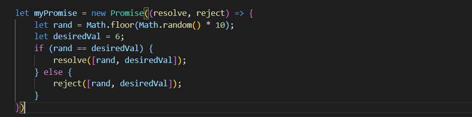
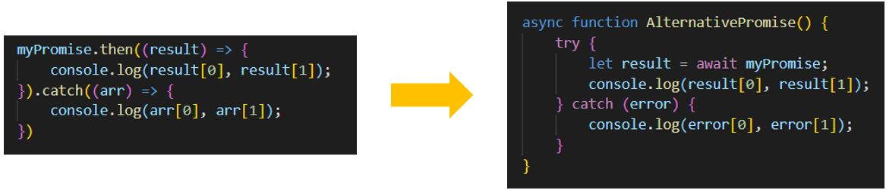
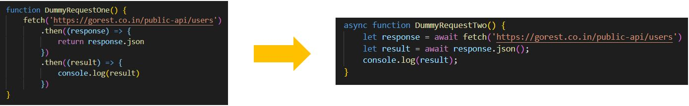

+++
author = "Jeff Chang"
title = "Async Await"
date = "2020-11-15"
description = "Introducing Async/ Await. A better way to handle and write Promise"
tags = [
    "javascript"
]
categories = [
    "Javascript"
]
metakeywords = "Async, Await, Javascript, Promise"
image = "cover.jpg"
+++

Async/Await is another way to write asynchronous code in much easier and cleaner way to read. In this article, you will learn how you can simplify and transform your your callback or Promise code into Async/Await way. 
<!--more-->

Before you start reading this article, please make sure you already have the basic knowledge of how **Promise** work in javascript. If you are not clear about **Promise** work. Please checkout my previous blog which talks about how to create a **Promise** function and work on it. [Learn More](/p/promise)

We will be using back the Previous code and transform them from **Promise** to **Async/Await**

What we previously did was we uses **.then** to handle whatever inside the **resolve** state and **.catch** for whatever inside **reject** state. Let's see how we can transform them into **Async/ Await** function. 

<small style="padding-left:15px">Copy the full code here</small>


let myPromise = new Promise((resolve, reject) => {
    let rand = Math.floor(Math.random() * 10);
    let desiredVal = 6;
    if (rand == desiredVal) {
        resolve([rand, desiredVal]);
    } else {
        reject([rand, desiredVal]);
    }
})

myPromise.then((result) => {
    console.log(result[0], result[1]);
}).catch((arr) => {
    console.log(result[0], result[1]);
})

async function AlternativePromise() {
    try {
        let result = await myPromise;
        console.log(result[0], result[1]);
    } catch (error) {
        console.log(error[0], error[1]);
    }
}

AlternativePromise();


As we can see the **.Then** method is being replace to **Await**. In order to use await, we must include **Async** infront of our function, it can be any type function like callback, traditional function, arrow function and etc. As await method is always **Resolve** the promise, we need to wrap them up into a **Try/Catch** statement so that resolve code will be executed inside try statement while reject will be executed inside catch statement.

You might not notice how Async/Await can be so useful because the example above is only returning single Promise. What if there are nested Promise returning such as **Fetch API** which first return the Promise of response status, and inside that Promise it return another Promise for response data.

<small style="padding-left:15px">Copy the full code here</small>


function DummyRequestOne() {
    fetch('https://gorest.co.in/public-api/users')
        .then((response) => {
            return response.json
        })
        .then((result) => {
            console.log(result)
        })
}

async function DummyRequestTwo() {
    let response = await fetch('https://gorest.co.in/public-api/users')
    let result = await response.json();
    console.log(result);
}


### Summary
There are few things we need to be aware when we use **Async/ Await** function
* Must include **Async** keyword infront of the function
* **Await** method is only use for **Resolve** state
* Wrap the code inside **Try/ Catch**, resolve state in **(Try)** and reject state inside **(Catch)**

{}

