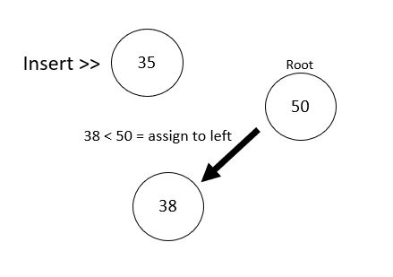
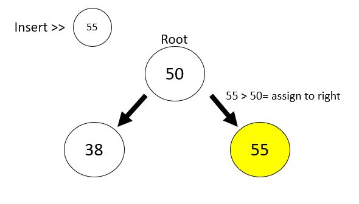
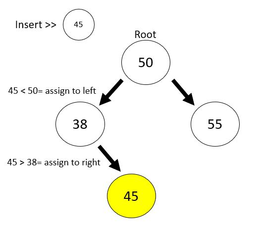
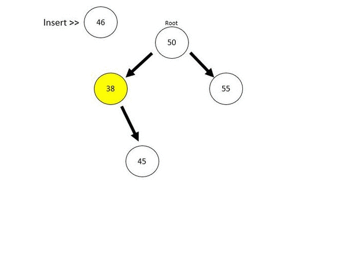

+++
author = "Jeff Chang"
title = "Binary Search Tree"
date = "2020-10-05"
description = "A common type of binary tree is a binary search tree, in which every node has a value that is greater than or equal to the node values in the left sub-tree, and less than or equal to the node values in the right sub-tree."
tags = [
    "javascript","algorithm & data-structure"
]
categories = [
    "Algorithm"
]
metakeywords = "data-structure, algorithm, binary search tree, javascript, class, ES6, OOP"
image = "cover.jpg"
+++

Unlike array or linked list which are linear, Binary Search Tree **(BST)** is constructed in a non-linear form.

Each element inside the BST is called node. It has 2 information from the node which are the current value and pointer that pointing to the next node or their child node. Usually the very first node is known as ROOT and the following will be child node. 

There are some rules about this algorithm that is the node pointing from **left** will be the **smaller** value node while the node pointing from the **right** will be the **larger** value node. These rules make this algorithm very powerful as it has been **naturally sorted** without any post processing. 

Basic theory done, Let’s dive into practical code.

We will use first create a specific class which matched the pattern and structure of this BST algorithm.


class BinarySearchTree {
    constructor(val) {
        this.value = val;
        this.left = null;
        this.right = null;
    }
}

//Assign 50 as the root value
let BST = new BinarySearchTree(50);


After the initialization is done, we can now implement some basic function and method such as insert *(insert node into the tree*, contain *(check if the value is inside the tree)*, max and min *(maximum and minimum value of the tree)* from this algorithm.

## Insert


insert = (val) => {
    //assign left if input value is lesser than the current node value
    //assign right if input value is larger than the current node value
    let currentNode = val > this.value ? "right" : "left";

    //recursively check & compare with the child node until there is no child node left
    if (this[currentNode]) {
        this[currentNode].insert(val);
    } else {
        this[currentNode] = new BinarySearchTree(val)
    }
}
BST.insert(38);
BST.insert(55);


Based on the code above, we will recursively check the current node, if the inserted value is greater than the current node value *(first layer will be root value)* it will be assign to **“right”** and assign **“left”** if it’s lesser than the current node.

  
  

Then <small> **if(this[currentNode])** </small>execution code will be run if this the node has child node *can be **"right"** or **"left"** side* depends on greater than or lesser than current node value.

Then we will compare the inserted value with the child node and apply same concept until there is no child node left. Then we can now assign our value into a new node.

For better explanation later, we can insert more nodes into the tree.


BST.insert(46);
BST.insert(43);
BST.insert(68);
BST.insert(66);
BST.insert(85);
BST.insert(35);
BST.insert(23);


And the output will be like:

## Contain


contain = (val) => {
    let currentNode = val > this.value ? this.right : this.left;
    while (currentNode) {
        if (val == currentNode.value) {
            return true
        }
        if (val < currentNode.value) {
            currentNode = currentNode.left;
        } else {
            currentNode = currentNode.right;
        }
    }
    return false
}


The contain method is quite similar with the insert method. This case, instead of using the recursive way to do it, we will use while loop to handle it. <small> **let currentNode = val > this.value ? this.right : this.left;** </small> This code is used to check the value inserted with the root value. 

After that, we will loop through the node value and point to right if value is larger than the current node and left if it’s lesser. If finally we found the current node value is equal to the value we enter. Then we will return **true**. If there is no more child node left, then it will auto break from while loop and return **false** as **NOT FOUND**.

## Max


max = () => {
    //As BST is naturally sorted, deepest node from right path will be the highest value of the tree
    let maxVal = this.right;
    while (maxVal) {
        maxVal = maxVal.right;

        //if the tree doesnt have the child node, get current value and break
        if (maxVal.right == null) {
            maxVal = maxVal.value
            break
        }
    }
    console.log("maxVal", maxVal);
}


As we discussed earlier, one good thing for this BST algorithm is that it is **naturally sorted** by larger value will be store to right side, smaller value will be store to left side. Since now we are searching for the **Maximum** value of the tree. What we can do is just keep dive in to the right node and return the final node as the largest value node.

## Min


min = () => {
    //As BST is naturally sorted, deepest node from left path will be the smallest value of the tree
    let minVal = this.left;
    while (minVal) {
        minVal = minVal.left;

        if (minVal.left == null) {
            minVal = minVal.value
            break
        }
    }
    console.log("minVal", minVal);
}


It’s pretty straight forward for finding the **Minimum** value of the tree as well. We will now keep dive into the left node and return the final node as the smallest value node.

[Check full code here](https://github.com/Jeffcw96/Binary-Search-Tree)

{}

