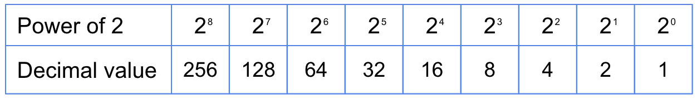
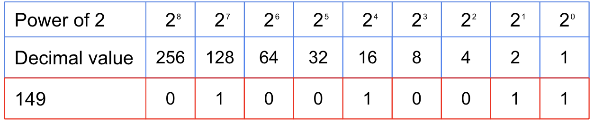

+++
author = "Jeff Chang"
title = "Create a decimal to binary converter"
date = "2022-03-13"
description = "In this article we will going through the concept for decimal to binary conversion and create a decimal-to-binary converter in JavaScript"
tags = [
    "javascript"
]
categories = [
    "Javascript"
]
image = "cover.jpg"
+++

- [Concept](#concept)
- [Application](#application)

## Concept

Based on the table above, we can then utilize the decimal value for the decimal to binary number subtraction.

Let's take a number `147` for conversion. The calculation will be :  
147 = 128 + 16 + 2 + 1

And now we can based on the table above and start allocate `1` for those involved in the calculation and `0` for not involving in the calculation.

Final result: `010010011`

## Application

<!-- prettier-ignore -->

function decimalBinaryConverter(decimal){
    const decimalArr = [256,128,64,32,16,8,4,2,1]
    let binary = ""
    for (let bit of decimalArr){
        if((decimal & bit) === bit){
            binary += "1"
        }else{
            binary += "0"
        }
    }
}

// will return `010010011`
console.log(decimalBinaryConverter(147))


### Explanation

1. We first initialize a array variable called `decimalArr` with the decimal values from 2^N
2. Then we can start to iterate the array and start comparing the argument `decimal` with the index value of our `decimalArr`
3. We can utilize the bitwise [AND operator](https://www.w3schools.com/js/js_bitwise.asp). More reference on the [AND logic gate](https://www.tutorialspoint.com/computer_logical_organization/logic_gates.htm)
4. `(decimal & bit) === bit`
   - `147 & 128` will gives you **128**
   - `147 & 64` will gives you **0**
   - `147 & 32` will gives you **0**
   - `147 & 16` will gives you **16**
5. And we can based on this condition and convert our decimal to binary number accordingly
