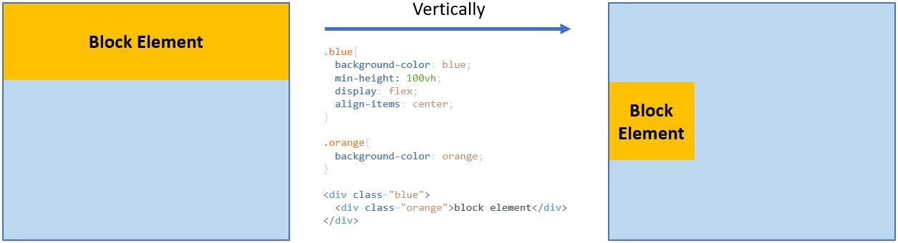
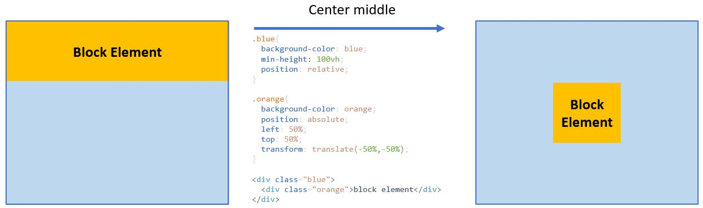

+++
author = "Jeff Chang"
title = "How to center a DOM element"
date = "2020-12-06"
description = "Center an element sometimes can be very confusing. It can be center horizontally, center vertically or center both horizontally and vertically in the same time. In this article, we will be discussed multiple approaches to center the element in different situation."
tags = [
    "html", "css"
]
categories = [
  "Front-end","HTML","CSS"
]
metakeywords = "center a div, html, css, display block, display flex, justfify content, align item, position relative, position absolute"
image = "cover.jpg"
+++

* [Text align](#textAlign)
* [Margin auto](#margin)
* [Flexbox](#flexbox)
* [Position Relative & Absolute](#position)

## Text Align
The first method will be <code>text-align: center;</code>. This method is useful when you wanted to center horizontally the text inside the DOM element. 

However, this method is useful when the width of the DOM element is 100% or equivalent to it's parent element. In otherwords, the DOM element will no be centered it's width is not 100%. To handle such case, we can use <code style="margin-left:10px">margin: 0 auto</code>

## Margin Auto
<code>margin: 0 auto;</code> will be useful when we specify the width for the DOM element and wanted to center them in the middle

<small style="display:block"><em>Note: This method only can be used on [block element](https://www.w3schools.com/css/css_inline-block.asp). In other words, [inline-element](https://www.w3schools.com/css/css_inline-block.asp) such as <code>span</code> will no be affected as it's width will be just right fitted from it's content</em></small>

## Flexbox
Flexbox allows us to either center horizontally, vertically or both at the same time.

#### Center Horizontally
In order to center the desired element horizontally by using flexbox, it first needed to be wrapped inside a flex element. Then we can use <code>justify-content: center</code> to center the DOM element. [Learn more on justify-content property](https://developer.mozilla.org/en-US/docs/Web/CSS/justify-content)

#### Center Vertically
Center the element vertically is relatively similar to center horizontally where instead of using <code>justify-content: center</code>, we can now use <code>align-items: center</code> to center it vertically. [Learn more on align-items property](https://developer.mozilla.org/en-US/docs/Web/CSS/align-items)

## Position Relative & Absolute
The last method from this article to center the element is by using <code>poition: relative</code> and <code>poition: absolute</code>. **Position absolute** need to be wrapped under **Position relative**, otherwise it will consider **body** as it's parent element. We can then adjust the value for <code>left</code> and <code>top</code> to allocate the position that we want. <code>transform: translate(x,x)</code> property will be recommended to use together with position absolute to allocate precise location.

<small style="padding-left:15px">Copy the code here</small>


.blue{
  background-color: blue;
  min-height: 100vh;
  position: relative;
}

.orange{
  background-color: orange;
  position: absolute;
  left: 50%;
  top: 50%;
  transform: translate(-50%,-50%);
}


<div class="blue">
  <div class="orange">block element



### Summary
* <code>margin: 0 auto</code> can be used when it's a block element and specify value of width
* Flexbox (<code>display: flex</code>)
    * <code>justify-content: center</code> to center horizontally
    * <code>align-items: center</code> to center vertically
    * Using both together will ceter the element right at the middle
* <code>position: absolute</code> better to be wrapped under <code>position: relative</code> otherwise it will consider <strong>body</strong> as it's parent
    * It's a good practice to use <code>transform: translate(x,x)</code> to allocate the element precisely.

{}

