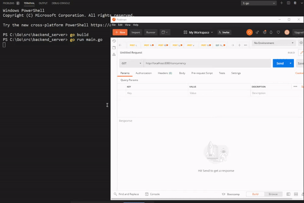
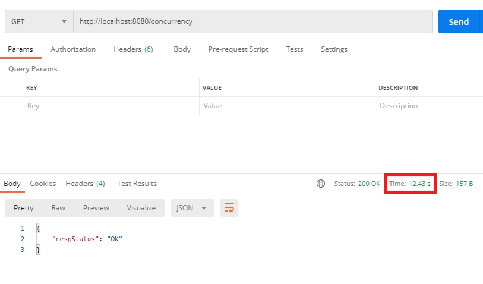
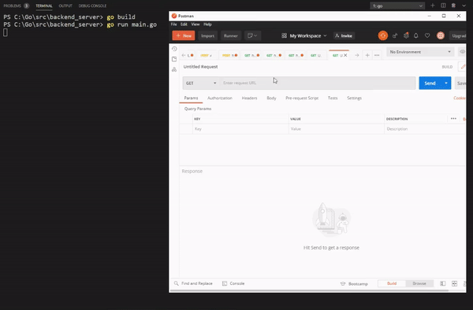
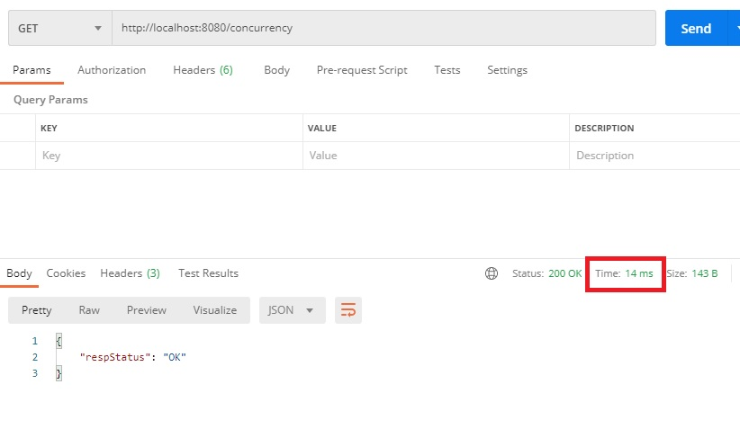
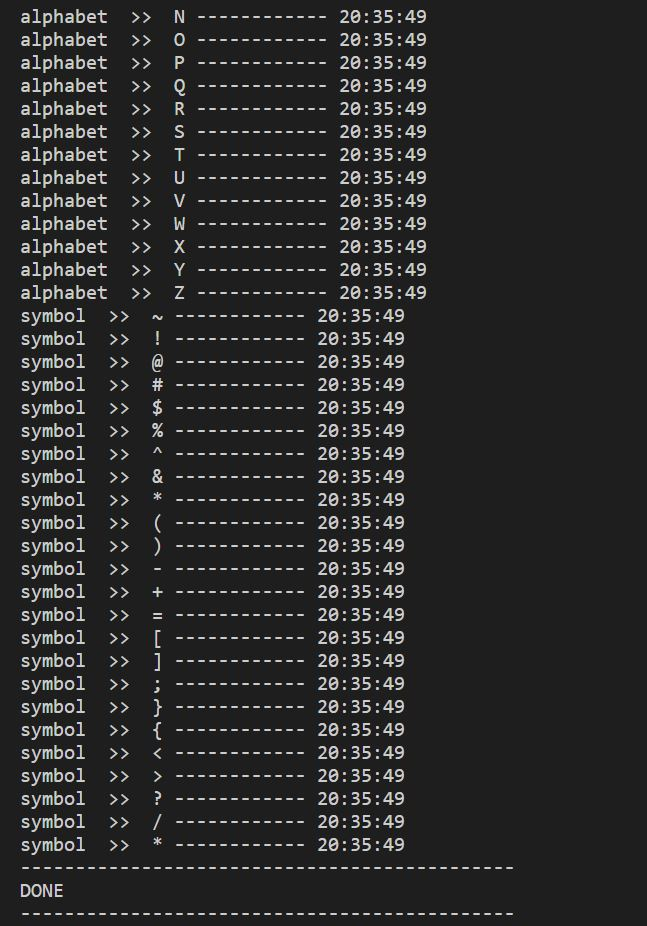
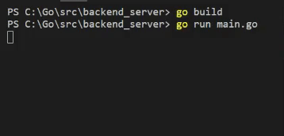

+++
author = "Jeff Chang"
title = "Concurrency & Parallelism with Go"
date = "2021-04-10"
description = "Have you ever wonder how to speed up your program especially when you trying to receive a quick reponse from HTTP Request as soon as possible while there are bunch of code need to be executed in the API. In this article, we will be going through how to increase our performance via concurrency and parallelism"
tags = [
    "go"
]
categories = [
	"GO"
]
image = "cover.jpg"
+++
Before we get started. Please make sure you have imported the necessary modules as listed below

package main

import (
	"encoding/json"
	"fmt"
	"log"
	"net/http"
	"sync"
	"time"

	"github.com/gorilla/mux"
)


In this article, I will be create 2 API which one of them will be using concurrency method while the other will be using parallelism approach. Below is showing the main function with end points and API function.

func main() {
	r := mux.NewRouter()
	r.HandleFunc("/concurrency", ConcurrencyAPI).Methods("GET")
	r.HandleFunc("/parallelism", ParallelismAPI).Methods("GET")

	log.Fatal(http.ListenAndServe(":8080", r))
}


* [CONCURRENCY](#CONCURRENCY)
* [PARALLELISM](#PARALLELISM)

## CONCURRENCY
Before we started to look at how powerful concurrency is. Let's see how much time required to run a simple program that will print out the index until 9999 of the for-loop

func ConcurrencyAPI(w http.ResponseWriter, r *http.Request) {
	ConcurrencyFunc()

	status := Status{RespStatus: "OK"}
	fmt.Println("---------------------------------------------")
	fmt.Println("DONE")
	fmt.Println("---------------------------------------------")

	w.Header().Set("Content-type", "application/json; charset=UTF-8")
	w.WriteHeader(http.StatusOK)
	json.NewEncoder(w).Encode(status)
}

func ConcurrencyFunc() {
	for i := 0; i <= 9999; i++ {
		fmt.Println("current i", i)
	}
}


### Result

##### Response Time

### Explanation
As it's just like a code nature where the code will be executed each line by line. However, it will be very bad if we need to take around 13 seconds to complete a HTTP Request.  
This is where [concurrency with goroutine](https://www.geeksforgeeks.org/goroutines-concurrency-in-golang/#:~:text=A%20Goroutine%20is%20a%20function,like%20a%20light%20weighted%20thread.) come into play. We can let the **wrap the blocks of code into goroutine** so that it will be executed asynchronously without blocking the following code and slowing down our response time.

### Concurrency with Goroutine
Kindly add a keyword **"go"** infront of the function needed to be execute asynchronously as shown in below

	go ConcurrencyFunc()


### Result

##### Response Time

### Explanation
As we can see from the response time now is being shorten to 14 ms which is much faster as the program do not need to wait the for-loop execution complete. 
You might now wonder, what about if I'm required to response something from the for loop in the sense that we will return the http response after the for-loop execution is complete. This is where parallelism comes into play.

## PARALLELISM
Parallelism allow us to deal with lots of things at once by separating the task into different thread, cores or processor which will shorten down the execution times.  
However, a bad design parallelism structure may lead to even slow execution.    For example we are running 2 task parallelly (downloading tons of file and processing tons of file). Let's say now the process of downloading file is completed and user is waiting for the response. However, because of the second parallelism task haven't completed. It will only respond back to user when both of the process are completed.


	DownloadFile() // ---- run parallelly
	ProcessFile()  // ---- run parallelly

	// Will be executed when both task above are completed executed
	PromptDownloadedFileToUser()  



Let's see how to create a simple parallelism function in go by using goroutine and waitGroup

func ParallelismAPI(w http.ResponseWriter, r *http.Request) {
	alphabet := []string{"A", "B", "C", "D", "E", "F", "G", "H", "I", "J", "K", "L", "M", "N", "O", "P", "Q", "R", "S", "T", "U", "V", "W", "X", "Y", "Z"}
	symbol := []string{"~", "!", "@", "#", "$", "%", "^", "&", "*", "(", ")", "-", "+", "=", "[", "]", ";", "}", "{", "<", ">", "?", "/", "*"}

	var waitGroup sync.WaitGroup
	waitGroup.Add(2) // total goroutine we going to wait

	go ParallelismFunc(alphabet, "alphabet", &waitGroup)
	go ParallelismFunc(symbol, "symbol", &waitGroup)

	waitGroup.Wait()
	fmt.Println("---------------------------------------------")
	fmt.Println("DONE")
	fmt.Println("---------------------------------------------")
	status := Status{RespStatus: "Done"}
	w.Header().Set("Content-type", "application/json; charset=UTF-8")
	w.WriteHeader(http.StatusOK)
	json.NewEncoder(w).Encode(status)

}

func ParallelismFunc(slice []string, label string, wg *sync.WaitGroup) {
	defer wg.Done()
	for i := 0; i < len(slice); i++ {
		fmt.Println(label, " >> ", slice[i], "------------", time.Now().Format("15:04:05"))
	}
}


### Result

### Explanation
1. First we declare a variable called `waitGroup` from [sync.WaitGroup](https://gobyexample.com/waitgroups)
2. Then we used a method called [`.Add( No. of goroutine )`](https://golang.org/pkg/sync/#WaitGroup.Add) which allows us to define the total of goroutine we are going to wait.
3. Next, we defined our goroutine function and in this example is called `ParallelismFunc` which takes in 3 parameters (slice, label and the waitGroup variable)
4. The function itself is pretty straight forward as it will prints out all the element from the slices as well as the current time.
5. Noted there is a code `defer wg.Done()`. The [`defer`](https://tour.golang.org/flowcontrol/12) keyword is telling the program that this line of code will be executed when the function is completed / going to return 
6. The `wg.Done` can be imagined like it will inform our program that this goroutine is now completed executed.
7. Last but not least, we can then put `waitGroup.Wait()` after the goroutine code and it will then wait for the goroutine to be completed.

You might not understand or seen clearly on example above   Below provided another example where we uses [time.Sleep](https://golang.org/pkg/time/#Sleep) in the program


func ParallelismAPI(w http.ResponseWriter, r *http.Request) {
	var waitGroup sync.WaitGroup
	waitGroup.Add(2) // total process we going to wait

	go MachineSleep("First GoRoutine ", 5, &waitGroup)
	go MachineSleep("Second GoRoutine ", 0, &waitGroup)

	waitGroup.Wait()
	fmt.Println("---------------------------------------------")
	fmt.Println("DONE")
	fmt.Println("---------------------------------------------")
	status := Status{RespStatus: "Done"}
	w.Header().Set("Content-type", "application/json; charset=UTF-8")
	w.WriteHeader(http.StatusOK)
	json.NewEncoder(w).Encode(status)

}

func MachineSleep(label string, second int, wg *sync.WaitGroup) {
	defer wg.Done()
	fmt.Println(label, "------------", time.Now().Format("15:04:05"))
	time.Sleep(time.Duration(second) * time.Second)
	fmt.Println(label, "is Done", "------------", time.Now().Format("15:04:05"))
}



### Result

### Explanation
1. First we declare a variable called `waitGroup` from [sync.WaitGroup](https://gobyexample.com/waitgroups)
2. Then we used a method called [`.Add( No. of goroutine )`](https://golang.org/pkg/sync/#WaitGroup.Add) which allows us to define the total of goroutine we are going to wait.
3. Now, the function ` MachineSleep(label string, second int, wg *sync.WaitGroup)` is now taking 3 parametes which are the label, total second to be waited as well as the waitGroup variable.
4. The result is pretty straight forward as well, we passed 5 delay seconds for the first goroutine and 0 delay second for second goroutine. 
5. When the program started to run, it will straight away prints out 3 statements which are 
	- `First GoRoutine ------- currentTime`
	- `Second GoRoutine ------- currentTime`
	- `Second GoRoutine  is Done ------- currentTime`.
	- Then after **5 seconds of delay**, we will see `First GoRoutine  is Done ------------ time after 5 seconds` being prints out. 
6. If we **didn't** apply any parallelism structure on this program. The output shall be
	- `First GoRoutine ------- currentTime`
	- `First GoRoutine  is Done ------------ time after 5 seconds`
	- `Second GoRoutine ------- currentTime`
	- `Second GoRoutine  is Done ------- currentTime`.
	

