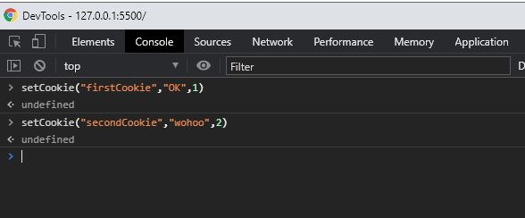
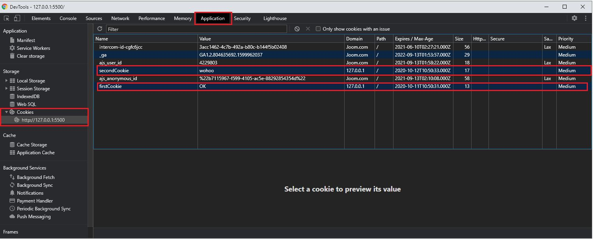
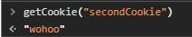
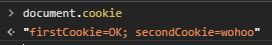

+++
author = "Jeff Chang"
title= "Cookie" 
date= "2020-10-10"
description= "Cookies are usually small text files, given ID tags that are stored on your computer's browser directory or program data subfolders." 
tags = [
  "javascript",
]
categories = [
  "HTML","CSS","Javascript","Front-end"
]
metakeywords= "cookies, Set Cookie, Get Cookie, Cookie Expiry, Cookie Path, Cookie Domain, Cookie Secure"
image = "cover.jpg"
+++

It usually used to recognize your computer when you visit the website, analyze the use of website, track you navigate the website and enable the use of e-commerce facilities such as **affiliate marketing**

## Set Cookie
This code will set and store a cookie (key = **firstCookie**, value = **OK**) in our browser

document.cookie = "firstCookie=OK; expires=Mon, 11 Oct 2018 17:55:55 UTC"

Let's create a function for storing the cookie for easily change the parameters value.

function setCookie(cName, cValue, days) {
    //get current date
    var d = new Date();
    d.setTime(d.getTime() + (days * 24 * 60 * 60 * 1000));
    document.cookie = cName + "=" + cValue + ";" + "expires=" + d.toUTCString(); + "path/"
}

We have now created a function to set a cookie. Let's try it out on our browser. *p/s I'm using live server extension in visual studo code to serve our file in local server*

We can check our cookie data by heading to *developer tools(F12) => Application => Cookies => your domain*

## Get Cookie


function getCookie(cName) {
    var name = cName + "=";
    var allCookie = document.cookie.split(';');
    for (var i = 0; i < allCookie.length; i++) {
        var currCookie = allCookie[i];
        //So we need to check if the first character of the current index is empty, we need to extract out the space as we only concern for the cookie
        while (currCookie.charAt(0) == ' ') {
            currCookie = currCookie.substring(1);
        }
        if (currCookie.indexOf(name) == 0) {
            return currCookie.substring(name.length, currCookie.length);
        }
    }
    return "";
}

Let’s run document.cookie and see what is the result.

As we can see the cookie is separated by semicolon as well as a empty space will be added for second cookie onwards. In order to find our desired cookie, we first pass the cookie name into the function created, and then we split all the cookie by semicolon and does not include the empty space for the cookie name. Then we return the cookie value when it matched with the current cookie.

<h2>Delete Cookie</h2>

function deleteCookie(cName) {
    document.cookie = cName + "=; expires=Thu, 01 Jan 1970 00:00:00 UTC; path=/;";
}

Delete cookie is pretty straight forward, simply pass in the cookie name you want to delete with the expired date.
 
 

## Set Cookie Path, Domain & Secure
<h3>Cookie Path</h3>

In this case we will set the path to **“/"** means we can access and get the cookie in every path of the domain. Let’s say our domain is “example.com” and we set the path to *path = user*. Then we can only get and access this cookie with this path such as  *“example.com/user”* or *“example.com/user/orderDetails”*. Something like “example.com/promotion” is not able to get this cookie value.

<h3>Cookie Domain</h3>

document.cookie = 'name=JeffDevs; domain=example.com;'


The domain setting from cookie is used to define which domain are authorized to access the cookie. For example if we never configure this setting in our main domain which is *“example.com”* and we trying to get this value from our subdomain such as “subdomain.example.com”, it will be failed to do so.

To get this data, we need to clearly defined the domain setting from cookie which is **domain=example.com** then we will be able to get this data from every subdomain and main domain.

<h3>Cookie Secure</h3>

document.cookie = 'name=JeffDevs; Secure;'


Adding the Secure parameter makes sure the cookie can only be transmitted securely over HTTPS. For example, we can get the cookie from https://example.com but **not** http://example.com

{}

