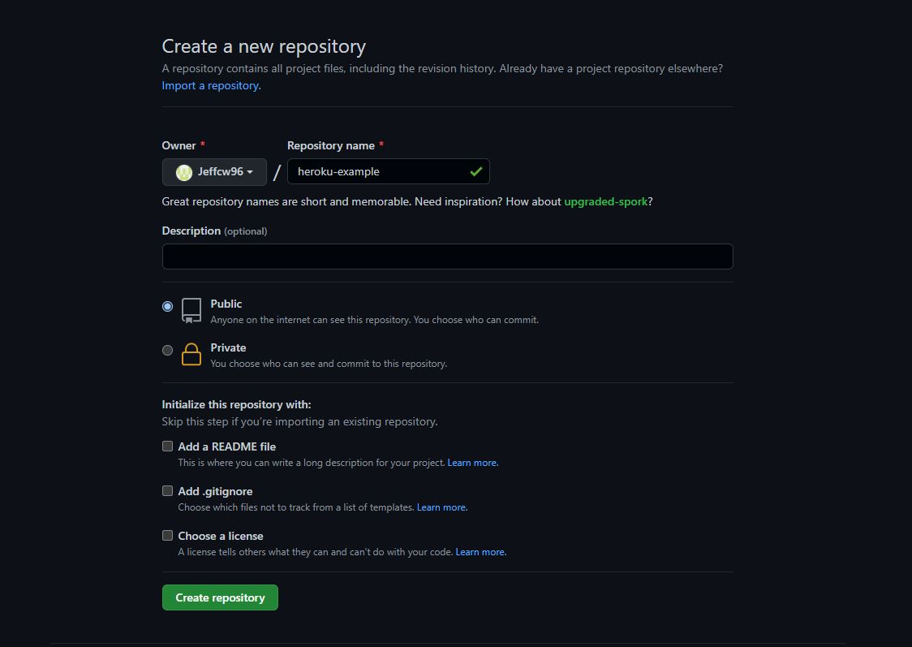
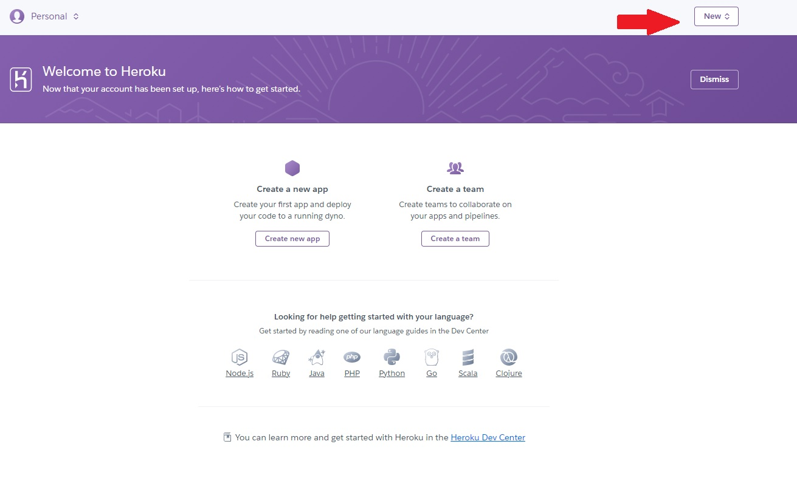
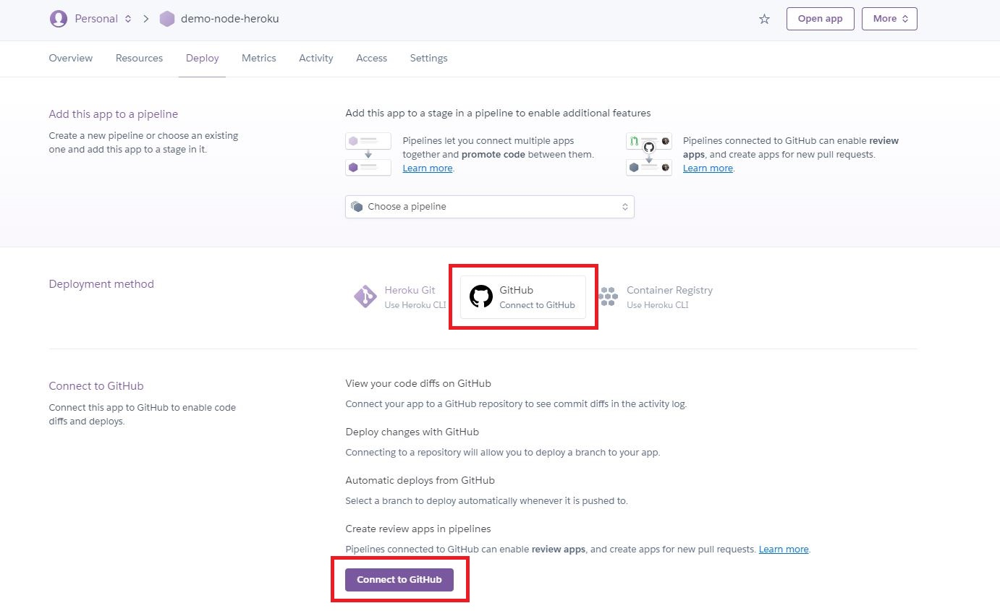
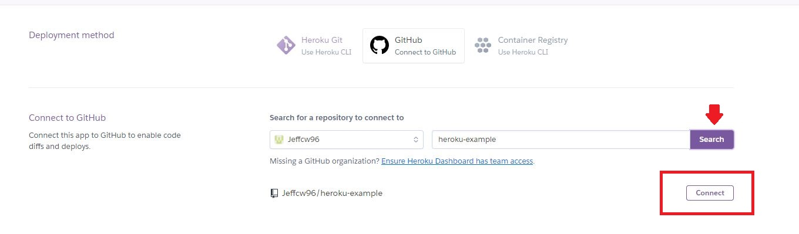
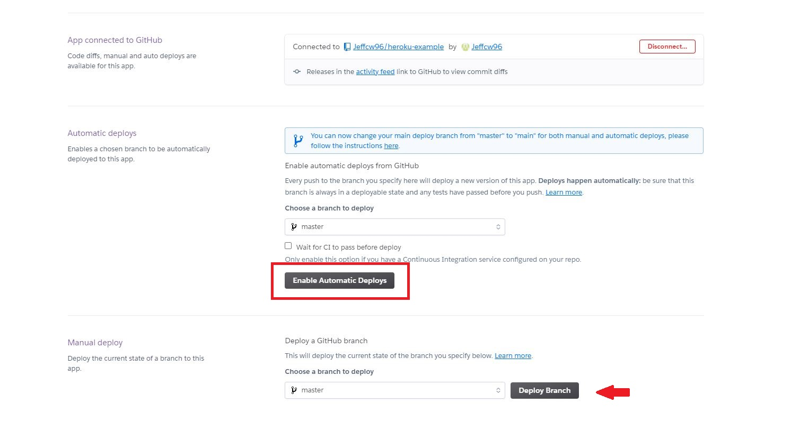
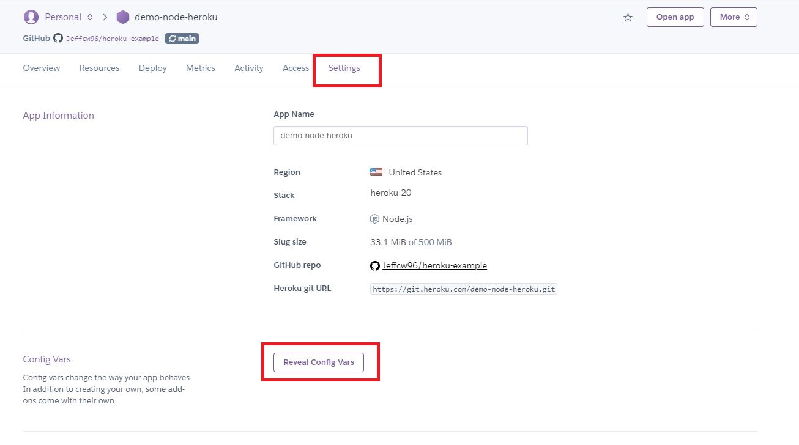
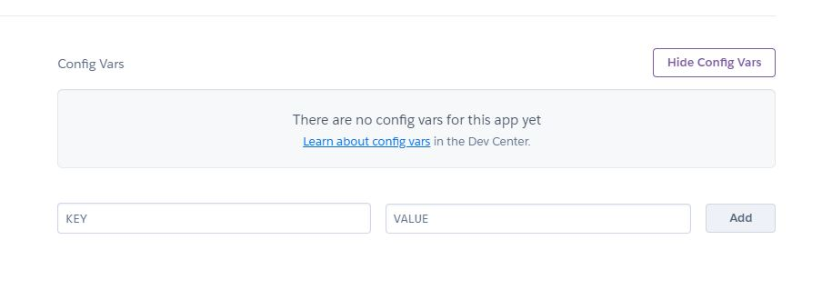

+++
author = "Jeff Chang"
title = "Deploy Node Application to Heroku"
date = "2021-09-26"
description = "Heroku makes DevOps easy !!! Whether you're building a simple prototype or a business-critical product, Heroku's fully-managed platform gives you the simplest path to delivering your desire project"
tags = [
    "javascript", "devops"
]
categories = [
  "DevOps","NodeJs","Javascript"
]
metakeywords = "devops, nodejs, javascript, deploy node application to heroku"
image = "cover.jpg"
+++

# Sections
* [Prerequisite](#prerequisite)
* [Create a simple node app](#node)
* [Upload code to Github repository](#upload-github)
* [Deploy in Heroku with Github repository](#upload-heroku)
* [Configure environment variable](#env)

## Prerequisite
- Make sure you have created an account in [heroku](https://signup.heroku.com/login) and [github](https://github.com/signup)

## Create a simple node app

const express = require('express');
const app = express();

app.get("/", (req, res) => {
    res.send("Server is Running")
})

const port = process.env.PORT || 3000;
app.listen(port, () => {
    console.log(`App running on port ${port}...`);
});


## Create a simple node app
- Login into Github Account
- Create New Repository
    * 
- Create `.gitignore` file to ignore files such as  'node_modules, .env and etc'
- Upload code into Github Repository via Git bash / Terminal
    *   
        git init
        git add .
        git commit -m "< commit message >"
        git branch -M master
        git remote add origin < your respository link >
        git push -u origin master
        

## Deploy in Heroku with Github repository
- Login into Heroku Account
- **New** -> **Create New App** -> **Enter project name and region** 
    * 

- Select Github as Deployment Method
    * 
    * 

- Setup Automate Deployment
    * Select the branch we wanted to trigger deployment when it's **updated / merged**
    * 

After the deployment is finished, you shall see your project in `https://<your project name>.herokuapp.com`

## Configure environment variable
- Kindly select your project under dashboard project listing, then navigate to setting tab and select **Reveal Config Var**. 
    * 
- Now you're able to enter the environment variable inside here such as JWT Secret key, Access token and etc
    * 