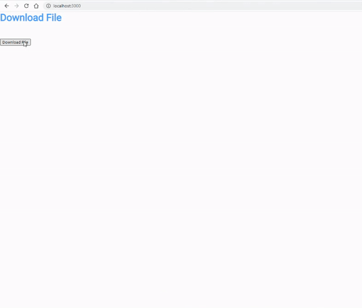

+++
author = "Jeff Chang"
title = "Download File with Go"
date = "2021-01-23"
description = "In this article, we wil be going through http download file with Golang and Javascript"
tags = [
    "javascript", "go"
]
categories = [
	"Javascript", "GO"
]
+++
Before we get started, please ensure you already understand the [basic of REST API in GO](/p/rest-api-with-go/)  
Let's see the final result of this tutorial

## Result

Basically when the user is click on the button, it will then trigger the javascript function `downloadFile()` to make http request to the backend server in order to download the file.

## Go

func DownloadFile(w http.ResponseWriter, r *http.Request) {
	Openfile, err := os.Open("C://Users/User/Desktop/Download/Download.xlsx") //Open the file to be downloaded later
	defer Openfile.Close() //Close after function return

	if err != nil {		
		http.Error(w, "File not found.", 404) //return 404 if file is not found
		return
	}

	tempBuffer := make([]byte, 512) //Create a byte form to read the file later
	Openfile.Read(tempBuffer) //Read the file into  byte
	FileContentType := http.DetectContentType(tempBuffer) //Get file header

	FileStat, _ := Openfile.Stat() //Get info from file
	FileSize := strconv.FormatInt(FileStat.Size(), 10) //Get file size as a string

	Filename := "demo_download"

	//Set the headers
	w.Header().Set("Content-Type", FileContentType+";"+Filename)
	w.Header().Set("Content-Length", FileSize)

	Openfile.Seek(0, 0) //We read 512 bytes from the file already so we reset the offset back to 0
	io.Copy(w, Openfile) //'Copy' the file to the client
}


### Explanation
1. Open the file from it's directory.
2. Create a **Byte** variable and **Read** the file data
3. Get the content type based on the file data by using `http.DetectContentType(< byte >)`
4. Get the file infomation such as size under the method `*File.Openfile.Stat()`
5. Define the file name and set into the **Content-Type** Header together with it's content type
6. Set **Content-Length** Header based on the file size
7. Copy and response the file back to the client size by using `io.Copy(< HTTP Response >, < file >)`

## Javascript

function downloadFile() {
    let url = "http://localhost:3000/downloadFile"
    let options = {
        method: 'GET',
        headers: new Headers({
            'Content-Type': 'application/json',
        }),
        mode: 'cors',
        cache: 'default'
    };
    let strMimeType;
    let strFileName;

    //Perform a GET Request to server
    fetch(url, options)
    .then(function (response) {
        let contentType = response.headers.get("Content-Type"); //Get File name from content type
        strMimeType = "application/vnd.openxmlformats-officedocument.spreadsheetml.sheet";
        strFileName = contentType.split(";")[1];
        return response.blob();

    }).then(function (myBlob) {
        let downloadLink = window.document.createElement('a');
        downloadLink.href = window.URL.createObjectURL(new Blob([myBlob], { type: strMimeType }));
        downloadLink.download = strFileName;
        document.body.appendChild(downloadLink);
        downloadLink.click();
        document.body.removeChild(downloadLink);
    }).catch((e) => {
        console.log("e", e);
    });
}


### Explanation
1. Make a GET request to the server
2. Get the file info like File name from the Reponse **Content-Type** Header
3. Define the MIME type of the file. [Please refer here to get the common MIME type](https://developer.mozilla.org/en-US/docs/Web/HTTP/Basics_of_HTTP/MIME_types/Common_types) 
4. Return the response in [BLOB object](https://developer.mozilla.org/en-US/docs/Web/API/Body/blob)
5. Create a [URL.createObjectURL()](https://developer.mozilla.org/en-US/docs/Web/API/URL/createObjectURL) inside the window and start downloading by firing the anchor link with the method `.click()`