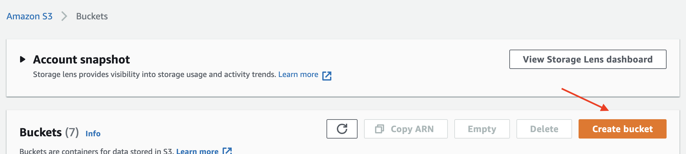
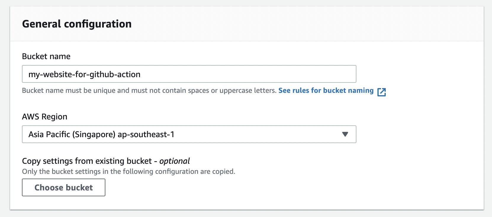
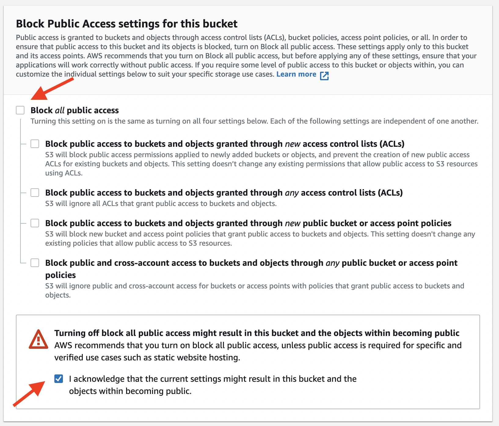
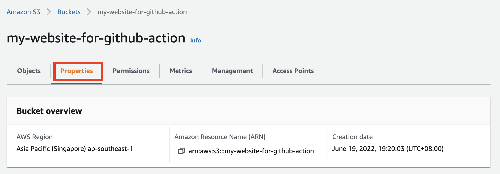
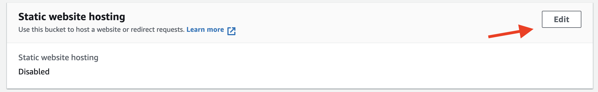
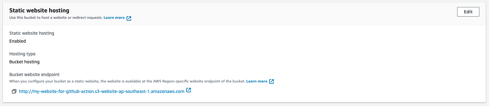
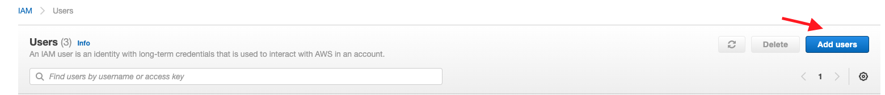
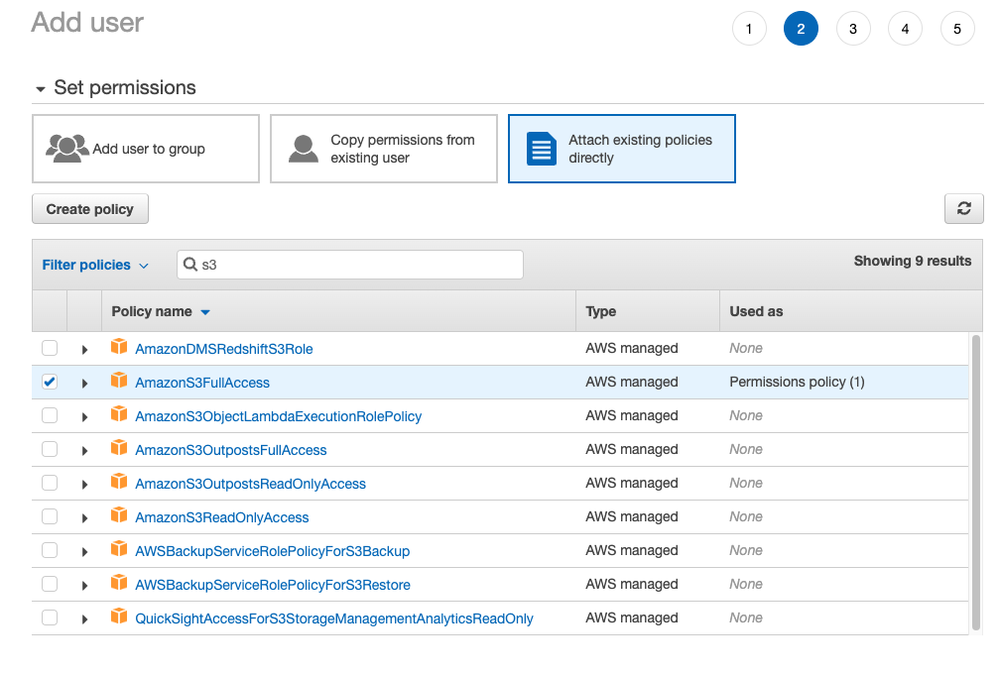
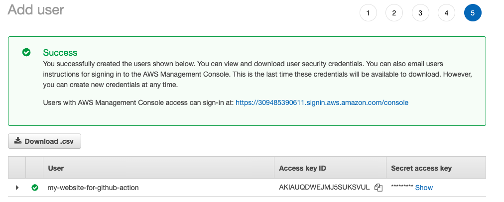
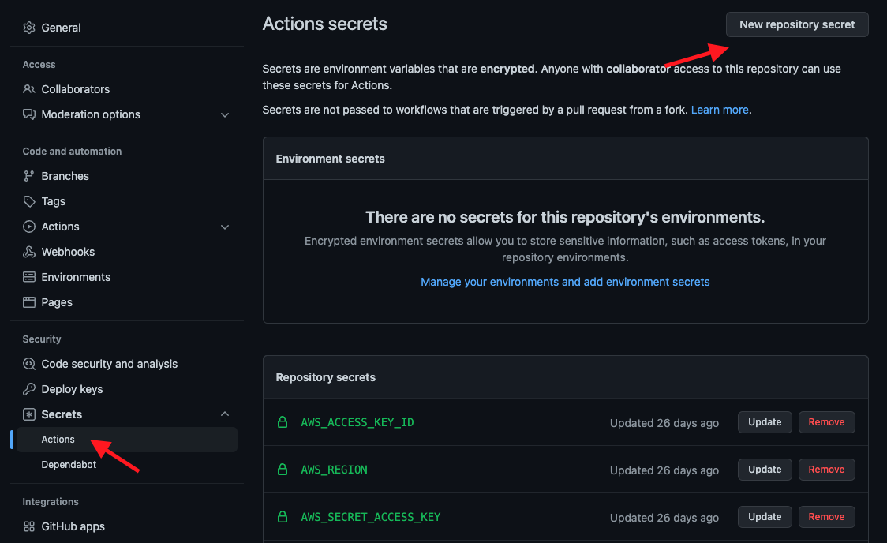

+++
author = "Jeff Chang"
title = "Automate your deployment with Github Action CI/CD and AWS"
date = "2022-06-19"
description = "In this article, we will be going through step by step on how to automate the deployment on AWS S3 static site hosting with Github action and HUGO"
tags = [
    "devops"
]
categories = [
	"DevOps"
]
image = "cover.png"
+++

## Table of contents

- [Create AWS S3 bucket for website hosting](#aws-s3-static-website-hosting)
- [Create IAM role in AWS](#aws-iam)
- [Attach credentials in Github repository](#github-credentials)
- [Configure Github workflows](#github-workflows)
  - [Workflow example for React and Vue application](#node-workflow-example)

## Create AWS S3 bucket for website hosting<a name="aws-s3-static-website-hosting"></a>

Before everything started, we need to ensure our AWS S3 bucket is created so that our files could be uploaded via Github workflow later.

### 1. To create new S3 bucket

Search and navigate to AWS Management Console S3 and click on the **Create bucket** button.

<div style="max-width:80%; margin:0 auto">
    
</div>

### 2. Create bucket and enable public access

Enter our bucket name and select AWS region.

<div style="max-width:80%; margin:0 auto">
    
</div>

<!-- prettier-ignore -->
In order to allow everyone access our website in public, we would need to uncheck the *Block all public access* rule.

<div style="max-width:80%; margin:0 auto">
    
</div>

Also, we would need to attach our bucket policy

```
{
    "Version": "2012-10-17",
    "Statement": [
        {
            "Effect": "Allow",
            "Principal": "*",
            "Action": "s3:GetObject",
            "Resource": "arn:aws:s3:::YOUR_BUCKET_NAME_HERE/*"
        }
    ]
}
```

### 3. Enable Static website hosting

The next step will be enable the static website hosting property for the bucket. To do this, we can go to the _Properties_ tab of the bucket and **scroll to the most bottom** to click on the **Edit** button

<div style="max-width:80%; margin:0 auto">
    
</div>

<div style="max-width:80%; margin:0 auto">
    
</div>

We can now enable our static website hosting option and we would need to specify the filename refers the website home page. This is normally **index.html** file. We could also specified the error webpage and it will automatically shows up when something goes wrong in our website.

<div style="max-width:80%; margin:0 auto">
    
</div>

And our website will now able to access by anyone with the given url

<div style="max-width:100%; margin:0 auto">
    
</div>

## Create IAM role in AWS<a name="aws-iam"></a>

Since we are going automate upload files to S3 bucket process in github action later. We would need to generate a AWS secret and access key so that it will authorize our github repository to perform the upload action

### 1. To create new AWS IAM user

Search and navigate to AWS Management Console S3 and click on the **Create bucket** button.

<div style="max-width:100%; margin:0 auto">
    
</div>

### 2. Create AWS IAM user with Programmatic Access

Select **Programmatic Access** for the credential type

<div style="max-width:80%; margin:0 auto">
    
</div>

### 3. Attach S3 bucket policy

Select attach existing policies directly and select **AmazonS3FullAccess** option.

_Note: You may also select the 'Add user to group' option if you already have a group policy, as long as it has **AmazonS3FullAccess** policy, then you are good to go_

<div style="max-width:80%; margin:0 auto">
    
</div>

### 4. Get credentials

We will skip the **"Add Tags"** step here but feel free to add a proper tag. After we done the previous steps and hit on the **Create User** button, please **download** the given CSV it will no longer available on the site once we close the webpage.

And when you open the CSV file, it will shows you the **Access key ID** and **Secret access key** value

<div style="max-width:80%; margin:0 auto">
    
</div>

## Attach credentials in Github repository<a name="github-credentials"></a>

And now we could:

1. Go to our github repository
2. Navigate to the Setting tab
3. Select **Secrets** -> **Actions** on the left panel
4. Create our custom repository secrets such as **AWS_ACCESS_KEY_ID, AWS_REGION** and **AWS_SECRET_ACCESS_KEY** by referring the value from the csv file we downloaded in earlier.
5. Delete the CSV file as it no longer needed

<div style="max-width:80%; margin:0 auto">
    
</div>

## Configure Github workflows<a name="github-workflows"></a>

Finally, we have reach our last step, which is to create and configure our github workflow. The very first step is to create a `.yml` file under your project directory **.github/workflows/YOUR_FILE_NAME.yml**.

In this article, I'm using [HUGO](https://gohugo.io/) for building my static website. However, it applies the same concept if you are using other modern frontend framework such as React, Vue and etc. It's just some of the GitHub action plugins and commands will be different.

```yml
name: deployment

on:
  push:
    branches: [master]

  # Allows you to run this workflow manually from the Actions tab
  workflow_dispatch:

# A workflow run is made up of one or more jobs that can run sequentially or in parallel
jobs:
  build:
    # The type of runner that the job will run on
    runs-on: ubuntu-latest

    steps:
      # Checks-out repositiory
      - uses: actions/checkout@v3

      - name: Setup Hugo
        uses: peaceiris/actions-hugo@v2
        with:
          hugo-version: "0.89.4"
          extended: true

      - name: Build
        run: hugo --minify

      - name: Configure AWS credentials
        uses: aws-actions/configure-aws-credentials@v1
        with:
          aws-access-key-id: ${{ secrets.AWS_ACCESS_KEY_ID }}
          aws-secret-access-key: ${{ secrets.AWS_SECRET_ACCESS_KEY }}
          aws-region: ${{ secrets.AWS_REGION }}

      - name: Deploy to S3
        run: aws s3 sync ./YOUR-BUILD-DIR s3://${{ secrets.BUCKET_NAME }}
```

### Explainations

- `name`: It's optional and it will appear in the Actions tab of the GitHub repository
- `on`: This is the workflow event and allow you to trigger the **jobs** when it fulfilled the condition. In this article, we are configuring `push` event and specify it as **master** branch. In the sense of it will trigger the **job** below when the **master** branch of the repository has changed. We could also specify other event like trigger when **pull request** is created. For more info, see [here](https://docs.github.com/en/actions/using-workflows/workflow-syntax-for-github-actions#onpushpull_requestpull_request_targetpathspaths-ignore)
- `job`: We can group multiple steps into 1 job and configure the **jobs** to run in sequentially or parallelly
- `build`: This label is custimizable and will be shown up on the jobs dashboard.
- `runs-on`: Configure the job to run in which virtual environment. Refer [here](https://docs.github.com/en/actions/using-workflows/workflow-syntax-for-github-actions#jobsjob_idruns-on) for the list of environments
- `steps`: Groups together all the steps that run in the **build** job.
- `uses: actions/checkout@v3`: The `uses` keyword specifies that this step will run v3 of the `actions/checkout` action. This action will checkout your current repository

```yml
name: Setup Hugo
uses: peaceiris/actions-hugo@v2
with:
  hugo-version: "0.89.4"
  extended: true
```

- `name`: Label of the step
- Checkout their documentation from [marketplace](https://github.com/marketplace/actions/hugo-setup) or [github readme](https://github.com/peaceiris/actions-hugo) for available options
- `hugo --minify` command will then build and generate static file from my HUGO application
- And finally we could used the built file and upload to AWS S3 bucket by providing the right credentials
- And now once you push or merge the changes to **master** branch, it will trigger the workflow and start the process. You could also view the workflow by navigating to the **Actions** tab of the repository

**TIPS**
The tips here is not memorizing the step but understanding the entire process. You could imagine or think this process as the following:

1. Checkout our current repository
2. Build the static file
3. Upload to S3 bucket

The idea is we need to understand what we want to do, then we could based on that and start looking for the relevant [GitHub marketplace plugins](https://github.com/marketplace?type=actions) to achieve the automation

### Workflow example for React and Vue application<a name="node-workflow-example"></a>

```yml
name: deployment

on:
  push:
    branches: [master]

jobs:
  deploy:
    runs-on: ubuntu-latest
    steps:
      - uses: actions/checkout@v2

      - name: Configure AWS credentials
        uses: aws-actions/configure-aws-credentials@v1
        with:
          aws-access-key-id: ${{ secrets.AWS_ACCESS_KEY_ID }}
          aws-secret-access-key: ${{ secrets.AWS_SECRET_ACCESS_KEY }}
          aws-region: ${{ secrets.AWS_REGION }}

      - name: Use Node.js 12.x
        uses: actions/setup-node@v1
        with:
          node-version: 12.x

      - name: Install dependencies
        run: npm install

      - name: Build
        run: npm run build

      - name: Deploy
        run: aws s3 sync ./YOUR-BUILD-DIR s3://YOUR-BUCKET-NAME
```
