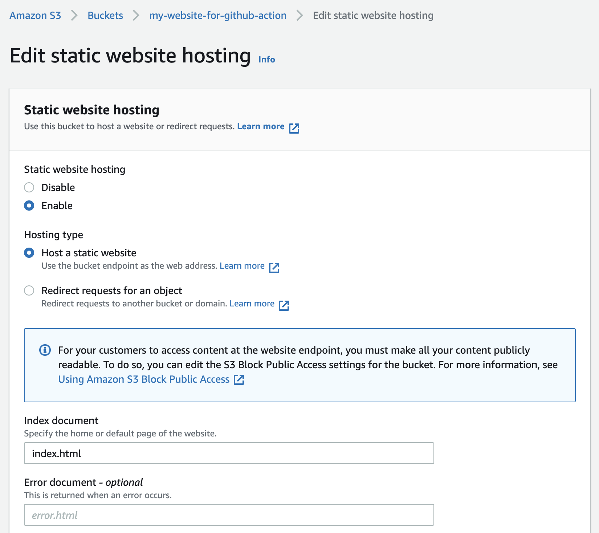

+++
author = "Jeff Chang"
title = "Automate your deployment with Github Action CI/CD and AWS"
date = "2022-06-18"
description = "In this article, we will be going through step by step on how to automate the deployment on AWS S3 static site hosting with Github action"
tags = [
    "devops"
]
categories = [
	"DevOps"
]
+++

## Table of contents

- [Create AWS S3 bucket for website hosting](#aws-s3-static-website-hosting)
- [Create IAM role in AWS](#aws-iam)
- [Attach credentials in Github repository](#github-credentials)
- [Start Github workflos](#github-workflows)
- [Result]()
- [Aggregation $lookup](#lookup)
- [Clean up Response Output by using $project](#clean-up)

## Create AWS S3 bucket for website hosting<a name="aws-s3-static-website-hosting"></a>

Before everything started, we need to ensure our AWS S3 bucket is created so that our files could be uploaded via Github workflow later.

#### 1. To create new S3 bucket

Search and navigate to AWS Management Console S3 and click on the **Create bucket** button.

<div style="max-width:80%; margin:0 auto">
    
</div>

#### 2. Create bucket and enable public access

Enter our bucket name and select AWS region.

<div style="max-width:80%; margin:0 auto">
    
</div>

<!-- prettier-ignore -->
In order to allow everyone access our website in public, we would need to uncheck the *Block all public access* rule.

<div style="max-width:80%; margin:0 auto">
    
</div>

Also, we would need to attach our bucket policy

```
{
    "Version": "2012-10-17",
    "Statement": [
        {
            "Effect": "Allow",
            "Principal": "*",
            "Action": "s3:GetObject",
            "Resource": "arn:aws:s3:::YOUR_BUCKET_NAME_HERE/*"
        }
    ]
}
```

#### 3. Enable Static website hosting

The next step will be enable the static website hosting property for the bucket. To do this, we can go to the _Properties_ tab of the bucket and **scroll to the most bottom** to click on the **Edit** button

<div style="max-width:80%; margin:0 auto">
    
</div>

<div style="max-width:80%; margin:0 auto">
    
</div>

We can now enable our static website hosting option and we would need to specify the filename refers the website home page. This is normally **index.html** file. We could also specified the error webpage and it will automatically shows up when something goes wrong in our website.

<div style="max-width:80%; margin:0 auto">
    
</div>
