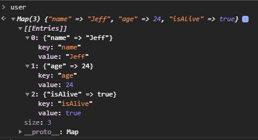
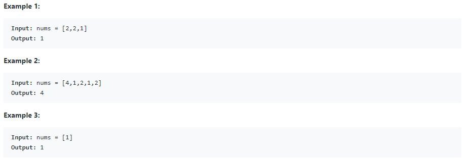
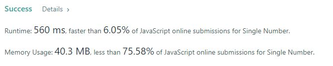
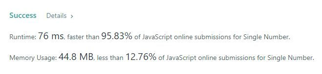

+++
author = "Jeff Chang"
title = "HashMap"
date = "2020-11-22"
description = "Javascript itself comes with Object and Hashmaps(Map) that will organize and arrange the data into key-value pairs. Hashmap are organized as linked list in the sense that it remembers the original insertion order of the keys"
tags = [
    "javascript","algorithm & data-structure"
]
categories = [
    "Algorithm","Javascript"
]
image = "cover.jpg"
metakeywords = "Javascript, Hash Map, Map, Hash Table, Algorithm and Data Structure"
+++

Have you ever encountering the issue of long processing time by iterating an array using nested for loop? If yes, **Hashmap(Map)** might be a good alternative choice to achieve the better result. Javascript itself comes with Hashmaps data structure that can organize and arrange the data into key-value pairs. They are organized as linked list in the sense that it remembers the original insertion order of the keys
<!--more-->

First, they are several useful methods and properties introduced from this data structure:

* HashMap.size returns the number of elements in the hashmap.
* HashMap.clear() removes all element in the hashmap.
* HashMap.set( <**key**> , <**value**> ) set and store the value for the key in the hashmap
* HashMap.get( <**key**> ) returns the value for this particular key.
* HashMap.has( <**key**> ) returns a boolean. 
    <li style="list-style:none">- <strong>True</strong> = Key is exisitng in the hashmap</li>
    <li style="list-style:none">- <strong>False</strong> = Key is Not exisitng in the hashmap</li>
* HashMap.delete( <**key**> ) returns a boolean.
    <li style="list-style:none">- <strong>True</strong> = the existed object has been successfully removed</li>
    <li style="list-style:none">- <strong>False</strong> = element is not found </li> 

### *Set:*

let user = new Map();
user.set("name","Jeff");
user.set("age",24);
user.set("isAlive",true);


Result In Browser

<em><small style="display:block">Noted: Previous value will be overwritten by inserting the new value with same key</small></em>

### *Get:*

user.set("name"); // return "Jeff"
user.set("age"); // return 24
user.set("isAlive"; // return true


### *Has:*

user.has("name"); // return true
user.has("hobby"); // return false


### *Delete:*

user.delete("isAlive"); // return true
user.has("hobby"); // return false


## Application
Let's take one of the famous question from LeetCode

Given a **non-empty** array of integers nums, every element appears twice except for one. Find that single one. Constraint: Each element in the array appears twice except for one element which appears only once.

**Follow up:** Could you implement a solution with a linear runtime complexity and without using extra memory? [Full question here](https://leetcode.com/problems/single-number/)

## Nested For-Loop
In such case, the most standard and beginner way is by using nested for loop

var singleNumber = function(nums) { 
    for(let i = 0; i < nums.length; i++){
        let duplicate = false;
        for(let j = 0; j < nums.length; j++){
            //Skip if same index
            if(i == j){
                continue
            }
            //found duplicated            
            if(nums[i] == nums[j]){
                duplicate = true;
            }        
        }
        //return if duplicate of current index is not found
        if(!duplicate){
            return nums[i]
        }
    }
};

##### Explanation
1. Get the current index value of the array
2. Loop through the same array
3. If their index is same, skip this index as this is not consider duiplicated value
4. If the current index value matches with other index in the same array, duplicated is true
5. At the end of each iteration check the variable duplicated
6. If it's false in the sense that it doesn't found any other same number in the array
7. If it's true means it has duplicated value in the same array

The code above can solve the problem but it somehow taking too much processing time.
Let's see how we can solve this by using hashmap.

## Hashmap

var singleNumber = function(nums) {
    const numsMap = new Map();
    for(let i = 0; i < nums.length; i++){
        //increase the value when current index is found on the Map
        if(numsMap.has(nums[i])){
            numsMap.set(nums[i],numsMap.has(nums[i])+1)
        }else{
            numsMap.set(nums[i],1)
        }            
    }
    
    for (let [key, value] of numsMap) {
        //return the value that appear only once
        if(value == 1){
            return key
        }
    }  
};

##### Explanation
1. Initialize a Hashmap(Map)
2. Loop through the array
3. If current index value is matched one of the key from the Map, increase the value from by 1
4. If the current index value doesn't match one of these key from the Map, set current value to the Map
6. Iterate the Map, return when the value is equal to one (unique number of the array)

As we can see, hashmap take much shorter processing time compare to nested for-loop. However, there are some downside of this algorithm which is it will consume more memory usage. In my opinion, Hashmap can be very useful when we are trying to iterate and compate in small medium data set.

### Summary
* Hashmap introduce few methods and properties which are Set, Get, Has, Delete, Size and Clear
* Hashmap is organized in key value pair
* Hashmap is useful when trying to iterate and compare the element of array
* Hashmap will consume more memory compare to for loop

{}

