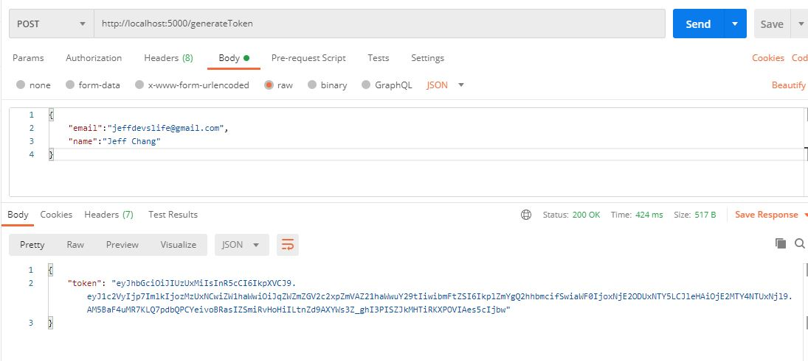
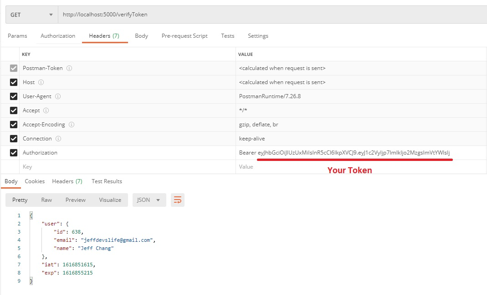

+++
author = "Jeff Chang"
title= "JSON Web Token" 
date= "2021-03-27"
description= "JSON wen token (JWT) is slowly becoming a standard token format that we use to authenticate our client in our modern web application nowadays. Let's talks a little bit about this with NodeJs" 
tags = [
    "nodejs", "javascript"
]
categories = [
	"Node Js", "Javascript"
]
image = "cover.jpg"
+++
In this article, we will use Postman for testing the APIs and covering:
* [Generate a JWT token](#GENERATE)
* [Verify a JWT token](#VERIFY)
* [Summary](#SUMMARY)

First of all, please make sure you've installed these 2 packages:  
[jsonwebtoken](https://www.npmjs.com/package/jsonwebtoken) and [express](https://www.npmjs.com/package/express)

## Generate a JWT token
Let's include the packages we just installed and start our server at PORT 5000

const express = require('express');
const jwt = require('jsonwebtoken');
const app = express();
app.use(express.json()); // middleware to read json body

app.listen(process.env.PORT || 5000, () => console.log('server is running at port 5000'))


Now, let's write an API that will generate a JWT token which will encode the email address and name from request payload.

app.post("/generateToken", async (req, res) => {
    try {
        //custom JWT claims
        const jwtClaimsObject = {
            user: {
                id: Math.floor((Math.random() * 99999) + 1),
                email: req.body.email, //email from request payload
                name: req.body.name //name from request payload
            }
        }
        const token = jwt.sign(jwtClaimsObject, "< your secret value >", { algorithm: "HS512", expiresIn: '1h', })
        res.json({ token: token })

    } catch (error) {
        console.error(error.message);
        res.status(500).json({ error: 'error generating token' })
    }
})


### Explanation
1. Create A **POST** http method API with endpoint **http://localhost:5000/generateToken** to generate JWT
2. Create a custom JWT Claims which stores our information
    * In this case we assign random number into user id which normally we wont do in this way. The real case will be putting the unique number/ id (from database) into the user id
3. Then, we can use the `jwt.sign` method which takes in at least **3 parameters** which are our jwt claim object, our serect/ private key (used to verify and decode our token) and other options like algorithm, issuer, expires time and etc
    * There are some **algorithm references** you can refer below:
        * HS256:    HMAC using SHA-256 hash algorithm (default)
        * HS384:    HMAC using SHA-384 hash algorithm
        * HS512:    HMAC using SHA-512 hash algorithm
        * RS256:    RSASSA using SHA-256 hash algorithm
        * RS384:    RSASSA using SHA-384 hash algorithm
        * RS512:    RSASSA using SHA-512 hash algorithm
        * ES256:    ECDSA using P-256 curve and SHA-256 hash algorithm
        * ES384:    ECDSA using P-384 curve and SHA-384 hash algorithm
        * ES512:    ECDSA using P-521 curve and SHA-512 hash algorithm
        * none:     No digital signature or MAC value included
    * For the **expiry time** it can be expressed into string or number such as 60, "2 days", "10h", "7d". [Expiry Reference](https://github.com/zeit/ms.js)
4. Response back the jwt to our client so that we can attach them in the request header for future API calls

### Result

## Verify a JWT token
Let's write an API that will verify and decode JWT token.

app.get("/verifyToken", async (req, res) => {
    try {
        const authHeader = req.header("Authorization");

        //Return if missing header/ wrong Authorization header format
        if (!authHeader || !authHeader.startsWith("Bearer ")) {
            res.status(403).json({ error: "Forbidden Access" })
            return
        }

        const token = authHeader.substring(7, authHeader.length);

        if (token === "") {
            res.status(403).json({ error: "Forbidden Access" })
            return
        }
        const decodeClaims = jwt.verify(token, "< your secret value >")

        res.json(decodeClaims)

    } catch (error) {
        console.error(error.message);
        res.status(500).json({ error: 'errorr' })
    }
})


### Explanation
1. Create A **GET** http method API with endpoint **http://localhost:5000/verifyToken** to verify JWT
2. For best practice, we will attach our **JWT** together with the **Bearer** inside **Authorization** header [Refer here for more info](https://jwt.io/introduction)
    * This is to follow the pattern of [`Authorization: <type> <credentials>`](https://developer.mozilla.org/en-US/docs/Web/HTTP/Headers/Authorization)
3. Use jwt.verify method to decode the JWT claims by providing the correct secret/ private key
4. Return the decoded jwt claims to our client

### Result

## Summary
1. Never include your credentials info like password in your JWT claims as you can get the user Id can check password from database
2. You should always save your secret/ private key into a safety place like process.env which is the file under gitignore control
3. JWT is very useful to act as a API middleware to determined whether the user/ client is authorize to access the endpoint 

 