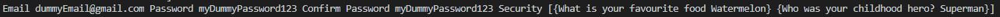

+++
author = "Jeff Chang"
title = "Passing JSON from Front-end to Backend"
date = "2020-10-17"
description = "Let's learn how to pass JSON object to backend with browser API and GO Server 😎"
tags = [
    "javascript","go"
]
categories = [
    "GO","Javascript"
]
metakeywords = "Javascript, Golang, JSON, Fetch API, Destructure JSON"
image = "cover.jpg"
+++

In this article, we will be passing json data from browser to our backend server. We will then use GO to handle the data that send from front end. There are few things that you might interested to know before you start following this tutorial which is send data via [Fetch API](/p/xhr-fetch/) and [Backend Server with Golang](/p/setup-go-server/).

I also use back and modified the [previous layout](/p/password-detector/) for this example and serve in **127.0.0.1/5500**. Each input field id have been listed down in the picture below so that we can easily follow up with the code later. This is how it currently looks like.

## Front end

Let’s start assigning the DOM element to our variable in javascript

var email = document.getElementById("emailAddress").value;
var password = document.getElementById("userPassword").value;
var confirmPassword = document.getElementById("confirmPassword").value;
var securityQuestionOne = document.getElementById("securityQuestionOne");
var securityQuestionTwo = document.getElementById("securityQuestionTwo");
var firstAnswer = document.getElementById("firstAnswer");
var secondAnswer = document.getElementById("secondAnswer");


For the **security question**, Instead of passing each value into the json. We can wrap them up in an json array for better arrangement. 

//Create an array for storing all security json data
var securityArr = []
var securityDataOne = {};
var securityDataTwo = {};

//Get the selected option text
securityDataOne.question = securityQuestionOne.options[securityQuestionOne.selectedIndex].text;
securityDataOne.answer = firstAnswer.value;
securityDataTwo.question = securityQuestionTwo.options[securityQuestionTwo.selectedIndex].text;
securityDataTwo.answer = secondAnswer.value;

securityArr.push(securityDataOne);
securityArr.push(securityDataTwo);



And this is the data we going to send to the backend server

Next, we can start working on the request configuration *Fetch API*.

var fetchOptions = {
    method: "POST",
    header: new Headers({
        "Content-Type": "application/json",
    }),
    //cross origin mode is needed as we are not using the same domain
    mode: "cors"
}


And now we can start passing in our json data as the request payload as well as making a POST request to our backend according to the url stated.

const url = "http://localhost:8080/postRequest"
var jsonData = {}
jsonData.email = email;
jsonData.password = password;
jsonData.confirmPassword = confirmPassword;
jsonData.security = securityArr;

fetchOptions.body = JSON.stringify(jsonData);

fetch(url,fetchOptions)
.then((response)=>{
    return response.json();
})
.then((result)=>{
    console.log("result");
})


## Backend
There are several things we need to create and configure before we start handling the data from front end. First, we will be using 2 library in Go to for handling the HTTP request in this example.


"github.com/gorilla/mux"
"github.com/rs/cors"


Then we need structs for passing the data later

type User struct {
    Email           string         `json:"email"`
    Password        string         `json:"password"`
    ConfirmPassword string         `json:"confirmPassword"`
    Security        []SecurityInfo `json:"security"`
}

type SecurityInfo struct {
    Question string `json:"question"`
    Answer   string `json:"answer"`
}

<small style="display:block"><em>Note: The data type of the field as well as the exported field (`json:”xxxx”`) need to be match with the json data we get later on.</em></small>

As you can see for **Security** field is an array type of another struct called **SecurityInfo**, this is because early on we have wrapped all the security question into an array in the front end. In order to decode this field, we need to create another struct that matched the security object name which is **question** and **answer**. 

After the Struct is created, we can go and setup our golang server. I’m using gorilla mux and Go library [Cors Handler](https://github.com/rs/cors) for handling the router. This will be serve is the **port 8080** and the path will be **"localhost:8080/postRequest"**. Since the front-end and backend are not in the same origin, there are some parameters we need to include in the [Cross-origin resource sharing (CORS)](https://developer.mozilla.org/en-US/docs/Web/HTTP/CORS) to ensure no problem on the data transfer.


func main() {
    r := mux.NewRouter()
    r.HandleFunc("/postRequest", PostRequest).Methods("POST")

    corsOpts := cors.New(cors.Options{
        //allow http://127.0.0.1:5500 origin
        AllowedOrigins: []string{"http://127.0.0.1:5500"},              
        AllowedMethods: []string{"GET", "POST","DELETE","PUT"},
        AllowedHeaders: []string{"Content-Type", "Access-Control-Allow-Origin"},
    })
    handler := corsOpts.Handler(r)
    http.ListenAndServe(":8080", handler)
}


For the AllowOrigin field, we have set the address to **http://127.0.0.1:5500**in order to avoid the CORS issue when we sending the request from front end. Otherwise, you may put * for allowing every domain to access it.

Let's see what the code inside **PostRequest** function <kbd>localhost:8080/postRequest</kbd>

func PostRequest(w http.ResponseWriter, r *http.Request) {
    jsonFeed, err := ioutil.ReadAll(r.Body)
    fmt.Println("jsonFeed", jsonFeed)
}


**And this the log output for jsonFeed variable**

Code above is to read the request data, since the ioutil.ReadAll function is returning byte data type, we wouldn’t able to see the information until we unmarshal *(In javascript is JSON.parse)* it.

user := User{}
json.Unmarshal([]byte(jsonFeed), &user)
fmt.Println("Email", user.Email, "Password", user.Password, "Confirm Password", user.ConfirmPassword, "Security", user.Security)


Since early on we created the struct which match the field of JSON data, we can now unmarshal the JSON data into this variable, and now we can call the json data by simple access with the field of User struct.

For the Security field *(array)* we can access the data by iterate through them. 

securityArr := user.Security
for i := 0; i < len(securityArr); i++ {
    fmt.Println(securityArr[i].Question, ">>", securityArr[i].Answer)
}


Then we can send back some data as response to the browser, this case we will use return json response as well. 

status := Status{RespStatus: "OK"}
w.Header().Set("Content-type", "application/json; charset=UTF-8")
w.WriteHeader(http.StatusOK)
json.NewEncoder(w).Encode(status)


**And this is the response we saw in browser**

{}

