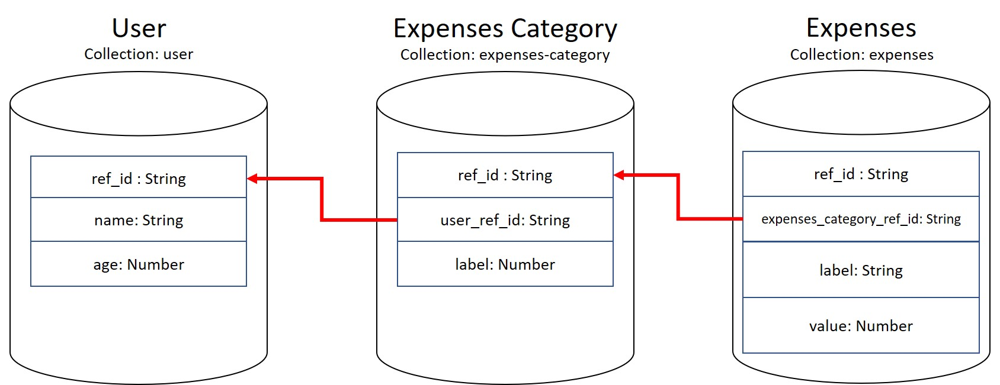
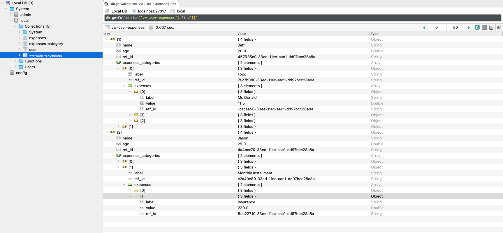

+++
author = "Jeff Chang"
title = "Create View with MongoDB"
date = "2021-12-18"
description = "CreateView in Mongodb come in handy when we dealing with complex and large aggregation pipeline query"
tags = [
    "nodejs", "mongodb"
]
categories = [
	"NodeJs", "MongoDB"
]
image = "cover.jpg"
+++

* [Prerequisite](#prerequisite)
* [Recap from previous article](#recap)
* [How CreateView works](#how-it-works)

## Prerequisite
Please ensure you have gone through our previous article  **Mongo Join Collection** [https://jeffdevslife.com/p/mongodb-join-multiple-collections-with-lookup/](https://jeffdevslife.com/p/mongodb-join-multiple-collections-with-lookup/)as we will be using back the data from these 3 collections:

1. User
2. Expenses-Category
3. Expenses

### Recap from previous article "Mongo Join Collection"

Each `user` will have different `expenses category` while each `expenses category` will have one or more `expenses` record(s)  
Previously, we are using [aggregation](https://docs.mongodb.com/manual/aggregation/) method with [$lookup](https://docs.mongodb.com/manual/reference/operator/aggregation/lookup/) operator in order to get the combine data from these 3 collections.

### How CreateView works

db.createView(&lt;view&gt;, &lt;source&gt;, &lt;pipeline&gt;, &lt;options&gt;)
* view - name of view to be created
* source - collection we are referring
* pipeline - aggregation pipeline stage where we able to use $lookup, $match, $unwind and other operators
* options - Additional options for the method.

### CreateView Query
Query below is running in **Robo 3T** GUI [https://robomongo.org/download](https://robomongo.org/download)

db.createView('vw-user-expenses','user', [{
    $lookup: {
        from: "expenses-category",
        let: { "userRefId": "$ref_id" },
        pipeline: [
            {
                $match: {
                    $expr: { $eq: ["$user_ref_id", "$$userRefId"] }
                }
            },
            {
                $lookup: {
                    from: "expenses",
                    let: { "categoryRefId": "$ref_id" },
                    pipeline: [
                        {
                            $match: {
                                $expr: { $eq: ["$expenses_category_ref_id", "$$categoryRefId"] }
                            }
                        },
                        {
                            $project: {
                                _id: 0,
                                ref_id: 1,
                                label: 1,
                                value: 1
                            }
                        }
                    ],
                    as: "expenses"
                },
            },
            {
                $project: {
                    _id: 0,
                    __v: 0,
                    user_ref_id: 0
                }
            }
        ],
        as: "expenses_categories"
    }
},
{
    $project: {
        _id: 0,
        __v: 0
    }
}])


### Result

### Explanation
1. We uses **prefix** `vw` in `vw-user-expenses` for the `view name` so that we could know this is actually a view instead of collection. *It might have different UI for other Mongo GUI tool like Mongo Compass to identify the 'views'*
2. Since collection `User` is the highest layer among 3 collections, therefore we need to pass the collection name `user` as our second parameter which is under `source`
3. For the pipeline it's actually modified from our previous article which is from [https://jeffdevslife.com//p/mongodb-join-multiple-collections-with-lookup/#lookup](/p/mongodb-join-multiple-collections-with-lookup/#lookup). What we modified was removing the `$match` operator so that now it able to find every documents in our database instead of find by matching the `id` parameter
4. As you can see the final result image above, our `views` data are actually the query result from our aggregation pipeline which is same as our result in previous article [https://jeffdevslife.com/p/mongodb-join-multiple-collections-with-lookup/#clean-up](/p/mongodb-join-multiple-collections-with-lookup/#clean-up) or [filtered_response.json](https://jeffdevslife.com/p/mongodb-join-multiple-collections-with-lookup/filtered_response.json).
5. So we can now run our query in this **created view** such as :
    * [db.collection.find()](https://docs.mongodb.com/manual/reference/method/db.collection.find/#mongodb-method-db.collection.find)
    * [db.collection.findOne()](https://docs.mongodb.com/manual/reference/method/db.collection.findOne/#mongodb-method-db.collection.findOne)
    * [db.collection.aggregate()](https://docs.mongodb.com/manual/reference/method/db.collection.aggregate/#mongodb-method-db.collection.aggregate)
    * [db.collection.countDocuments()](https://docs.mongodb.com/manual/reference/method/db.collection.countDocuments/#mongodb-method-db.collection.countDocuments)
    * [db.collection.estimatedDocumentCount()](https://docs.mongodb.com/manual/reference/method/db.collection.estimatedDocumentCount/#mongodb-method-db.collection.estimatedDocumentCount)
    * [db.collection.count()](https://docs.mongodb.com/manual/reference/method/db.collection.count/#mongodb-method-db.collection.count)
    * [db.collection.distinct()](https://docs.mongodb.com/manual/reference/method/db.collection.distinct/#mongodb-method-db.collection.distinct)
6. There are few things we need to take note and get advantages from it
    * It create a view of our aggregation pipeline data without running a complex query
    * It will automatically update our view when we inserted new document in one of the related collection. For example, when we insert a new document in `user` collection, the `view` will be automatically create and update a new document for it.
    * All documents are **read-only**. We **CANNOT** directly create / insert new document in `view`. It must be referring to the existing collection

    