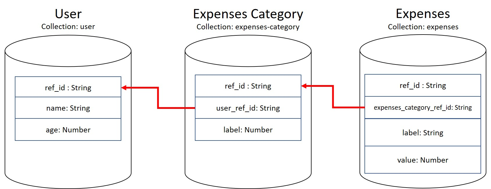

+++
author = "Jeff Chang"
title = "MongoDB join multiple collections with $lookup"
date = "2021-10-24"
description = "In this article, we will be using 'Expenses Recorder' to demonstrate how to use $lookup operator in MongoDB aggregation to combine the data in nested collections"
tags = [
    "nodejs", "mongodb"
]
categories = [
	"NodeJs", "MongoDB"
]
image = "cover2.jpg"
+++
We will first introduce the structure and relationships between each collections, then we will be going through how to use [$lookup](https://docs.mongodb.com/manual/reference/operator/aggregation/lookup/) in mongodb aggregation to get our desired output

* [User Collection](#user)
* [Expenses Category Collection](#expenses-category)
* [Expenses Collection](#expenses)
* [Relationship between each Collections](#collection-relationship)
* [Aggregation $lookup](#lookup)
* [Clean up Response Output by using $project](#clean-up)

## Documents in User Collection

/* 1 */
{ 
    "_id" : ObjectId("6173e5fe7fc8622cbc56a108"),
    "name" : "Jeff",
    "age" : 20,
    "ref_id" : "457935c0-33ed-11ec-aac1-dd97bcc28a8a",
    "__v" : 0
}

/* 2 */
{
    "_id" : ObjectId("6173e6067fc8622cbc56a10a"),
    "name" : "Jason",
    "age" : 25,
    "ref_id" : "4a4bcc70-33ed-11ec-aac1-dd97bcc28a8a",
    "__v" : 0
}


 

## Documents in Expenses Category Collection

/* 1 */
{
    "_id" : ObjectId("6173e6577fc8622cbc56a10c"),
    "label" : "Food",
    "user_ref_id" : "457935c0-33ed-11ec-aac1-dd97bcc28a8a",
    "ref_id" : "7a27b0d0-33ed-11ec-aac1-dd97bcc28a8a",
    "__v" : 0
}

/* 2 */
{
    "_id" : ObjectId("6173e6677fc8622cbc56a10e"),
    "label" : "Entertainment",
    "user_ref_id" : "457935c0-33ed-11ec-aac1-dd97bcc28a8a",
    "ref_id" : "84021f00-33ed-11ec-aac1-dd97bcc28a8a",
    "__v" : 0
}

/* 3 */
{
    "_id" : ObjectId("6173e69d7fc8622cbc56a112"),
    "label" : "Transportation",
    "user_ref_id" : "4a4bcc70-33ed-11ec-aac1-dd97bcc28a8a",
    "ref_id" : "a3e28580-33ed-11ec-aac1-dd97bcc28a8a",
    "__v" : 0
}

/* 4 */
{
    "_id" : ObjectId("6173e6d07fc8622cbc56a114"),
    "label" : "Monthly Installment",
    "user_ref_id" : "4a4bcc70-33ed-11ec-aac1-dd97bcc28a8a",
    "ref_id" : "c2a40e80-33ed-11ec-aac1-dd97bcc28a8a",
    "__v" : 0
}


 

## Documents in Expenses Collection

/* 1 */
{
    "_id" : ObjectId("6173e7677fc8622cbc56a116"),
    "label" : "Mc Donald",
    "value" : 11.5,
    "expenses_category_ref_id" : "7a27b0d0-33ed-11ec-aac1-dd97bcc28a8a",
    "ref_id" : "1cacea50-33ee-11ec-aac1-dd97bcc28a8a",
    "__v" : 0
}

/* 2 */
{
    "_id" : ObjectId("6173e7767fc8622cbc56a118"),
    "label" : "KFC",
    "value" : 15,
    "expenses_category_ref_id" : "7a27b0d0-33ed-11ec-aac1-dd97bcc28a8a",
    "ref_id" : "25358420-33ee-11ec-aac1-dd97bcc28a8a",
    "__v" : 0
}

/* 3 */
{
    "_id" : ObjectId("6173e78a7fc8622cbc56a11a"),
    "label" : "Sushi King",
    "value" : 35,
    "expenses_category_ref_id" : "7a27b0d0-33ed-11ec-aac1-dd97bcc28a8a",
    "ref_id" : "312787b0-33ee-11ec-aac1-dd97bcc28a8a",
    "__v" : 0
}

/* 4 */
{
    "_id" : ObjectId("6173e7e07fc8622cbc56a11c"),
    "label" : "karaoke",
    "value" : 45,
    "expenses_category_ref_id" : "84021f00-33ed-11ec-aac1-dd97bcc28a8a",
    "ref_id" : "649c2330-33ee-11ec-aac1-dd97bcc28a8a",
    "__v" : 0
}

/* 5 */
{
    "_id" : ObjectId("6173e7f87fc8622cbc56a11e"),
    "label" : "Petrol Fee",
    "value" : 65,
    "expenses_category_ref_id" : "a3e28580-33ed-11ec-aac1-dd97bcc28a8a",
    "ref_id" : "72f1b940-33ee-11ec-aac1-dd97bcc28a8a",
    "__v" : 0
}

/* 6 */
{
    "_id" : ObjectId("6173e8047fc8622cbc56a120"),
    "label" : "Car Maintenance Service",
    "value" : 150,
    "expenses_category_ref_id" : "a3e28580-33ed-11ec-aac1-dd97bcc28a8a",
    "ref_id" : "7a206860-33ee-11ec-aac1-dd97bcc28a8a",
    "__v" : 0
}

/* 7 */
{
    "_id" : ObjectId("6173e8147fc8622cbc56a122"),
    "label" : "House Loan",
    "value" : 1500,
    "expenses_category_ref_id" : "c2a40e80-33ed-11ec-aac1-dd97bcc28a8a",
    "ref_id" : "83b31f30-33ee-11ec-aac1-dd97bcc28a8a",
    "__v" : 0
}

/* 8 */
{
    "_id" : ObjectId("6173e8237fc8622cbc56a124"),
    "label" : "Insurance",
    "value" : 230,
    "expenses_category_ref_id" : "c2a40e80-33ed-11ec-aac1-dd97bcc28a8a",
    "ref_id" : "8cc22710-33ee-11ec-aac1-dd97bcc28a8a",
    "__v" : 0
}


 

## Relationship between each Collections

As we can observe the diagram above, collection `Expenses Category` is actually having **child-to-parent** relationship where it stored the `user-ref-id` field which is equivalent to `ref-id` in `User` collection. 
  

Moving on, we also have collection `Expenses` which also having the **child-to-parent** relationship where it stored the `expenses-category-ref-id` field which is equivalent to `ref-id` in `Expenses Category` collection.

 

## Aggregation $lookup
Controller below is belongs to the route `http://localhost:3000/user/:id` where the parameter `id` is the `ref_id` of the **User**


//Import your Models here
const User = require('../../models/User')
const ExpensesCategory = require('../../models/ExpensesCategory')
const Expenses = require('../../models/Expenses')

exports.getUser = async (req, res) => {
    try {
        const userId = req.params.id
        const result = await User.aggregate([
            {
                $match: {
                    "ref_id": userId
                }
            },
            {
                $lookup: {
                    from: "expenses-category",
                    let: { "userRefId": "$ref_id" },
                    pipeline: [
                        {
                            $match: {
                                $expr: { $eq: ["$user_ref_id", "$$userRefId"] }
                            }
                        },
                        {
                            $lookup: {
                                from: "expenses",
                                let: { "categoryRefId": "$ref_id" },
                                pipeline: [
                                    {
                                        $match: {
                                            $expr: { $eq: ["$expenses_category_ref_id", "$$categoryRefId"] }
                                        }
                                    },
                                ],
                                as: "expenses"
                            },
                        },
                    ],
                    as: "expenses_categories"
                }
            },
        ])
        res.json(result[0] || {})
    } catch (error) {        
        res.json({error: error.message})
    }
}


### Result
This case, we are using the `457935c0-33ed-11ec-aac1-dd97bcc28a8a` ref_id from the user called [Jeff](#user) to pass as the route parameter. 
The expected result will be **=>** <a href="/p/mongodb-join-multiple-collections-with-lookup/response.json" target="_blank">[response.json]</a>

Toggle the output response to show / hide here


{
    "_id": "6173e5fe7fc8622cbc56a108",
    "name": "Jeff",
    "age": 20,
    "ref_id": "457935c0-33ed-11ec-aac1-dd97bcc28a8a",
    "__v": 0,
    "expenses_categories": [
        {
            "_id": "6173e6577fc8622cbc56a10c",
            "label": "Food",
            "user_ref_id": "457935c0-33ed-11ec-aac1-dd97bcc28a8a",
            "ref_id": "7a27b0d0-33ed-11ec-aac1-dd97bcc28a8a",
            "__v": 0,
            "expenses": [
                {
                    "_id": "6173e7677fc8622cbc56a116",
                    "label": "Mc Donald",
                    "value": 11.5,
                    "expenses_category_ref_id": "7a27b0d0-33ed-11ec-aac1-dd97bcc28a8a",
                    "ref_id": "1cacea50-33ee-11ec-aac1-dd97bcc28a8a",
                    "__v": 0
                },
                {
                    "_id": "6173e7767fc8622cbc56a118",
                    "label": "KFC",
                    "value": 15,
                    "expenses_category_ref_id": "7a27b0d0-33ed-11ec-aac1-dd97bcc28a8a",
                    "ref_id": "25358420-33ee-11ec-aac1-dd97bcc28a8a",
                    "__v": 0
                },
                {
                    "_id": "6173e78a7fc8622cbc56a11a",
                    "label": "Sushi King",
                    "value": 35,
                    "expenses_category_ref_id": "7a27b0d0-33ed-11ec-aac1-dd97bcc28a8a",
                    "ref_id": "312787b0-33ee-11ec-aac1-dd97bcc28a8a",
                    "__v": 0
                }
            ]
        },
        {
            "_id": "6173e6677fc8622cbc56a10e",
            "label": "Entertainment",
            "user_ref_id": "457935c0-33ed-11ec-aac1-dd97bcc28a8a",
            "ref_id": "84021f00-33ed-11ec-aac1-dd97bcc28a8a",
            "__v": 0,
            "expenses": [
                {
                    "_id": "6173e7e07fc8622cbc56a11c",
                    "label": "karaoke",
                    "value": 45,
                    "expenses_category_ref_id": "84021f00-33ed-11ec-aac1-dd97bcc28a8a",
                    "ref_id": "649c2330-33ee-11ec-aac1-dd97bcc28a8a",
                    "__v": 0
                }
            ]
        }
    ]
}


### Explanations
1. Import all the necessary Models such as User, Expenses Category and Expenses
2. Get and access the route parameter `:id` which is equivalent to the User `ref_id`
3. Apply [aggregation](https://docs.mongodb.com/manual/aggregation/) method from the `User collection`
4. **[Code Line 10 ~ 14]** 
    - Find the relavant document by using [$match](https://docs.mongodb.com/v4.0/reference/operator/aggregation/match/) operator and comparing the route param `:id` with ref_id from `User collection`
    - This process is equivalent to `User.findOne({ref_id: req.param.id})`
5. `$lookup` syntax
    - **from**: < the target collection you want to join >
    - **let**: < declare custom variable from your current Model. "In this case it's referring User collection" >
    - **pipeline** < Compare and query the condition to get desired output >
    - **as** < specific the field name of the array output >
6. **[Code Line 15 ~ 24]** 
    - First, we apply `$lookup` operator to join the `expenses-category`
    - Since, `expenses-category` model actually storing `user_ref_id`. We can then declare the variable called `userRefId` which is referring to the **User** `ref_id` and compare them later on
    - In order to use the custom variable we have declared earlier, we need to use the operator called [$expr](https://docs.mongodb.com/manual/reference/operator/query/expr/)
    - use `$match` operator to compare and filter out the result based on `userRefId` variable with the `user_ref_id` from `expenses-category` collection under `pipeline` operation
    - specific the query array output field name called `expenses-categories` in **Line 40**
6. **[Code Line 25 ~ 38]** 
    - Since `expenses` collection is nested inside `expenses-category` collection and `expenses-category` collection is nested inside `user` collection. We then now need to `$lookup` one more round from `expenses` collection to `expenses-category` collection before we moved out the operation
    - Apply `$lookup` operator to join the `expenses` collection
    - Since, `expenses` model actually storing `expenses_category_ref_id`. We can then declare the variable known as `categoryRefId` which is referring to the **Expenses Category** `ref_id` and compare them later on
    - use `$match` operator to compare and filter out the result based on `categoryRefId` variable with the `expenses_category_ref_id` from `expenses` collection under `pipeline` operation
    - specific the query array output field name called `expenses`
7. As now we know the ref_id is actually unique key in every documents while output data type from aggregation is **Array**. So we can just return the first element of the array or return empty object if the `ref_id` doesn't existed.

 

## Clean up Response Output by using $project
If you have seen the output response from the query above [response.json](#raw-result). You may realize there are actually some unecessary fields we can skip or remove from our query.  

Let's see how we could handle it by using [$project](https://docs.mongodb.com/manual/reference/operator/aggregation/project/) operator.

//Import your Models here
const User = require('../../models/User')
const ExpensesCategory = require('../../models/ExpensesCategory')
const Expenses = require('../../models/Expenses')

exports.getUser = async (req, res) => {
    try {
        const userId = req.params.id
        const result = await User.aggregate([
            {
                $match: {
                    "ref_id": userId
                }
            },
            {
                $lookup: {
                    from: "expenses-category",
                    let: { "userRefId": "$ref_id" },
                    pipeline: [
                        {
                            $match: {
                                $expr: { $eq: ["$user_ref_id", "$$userRefId"] }
                            }
                        },
                        {
                            $lookup: {
                                from: "expenses",
                                let: { "categoryRefId": "$ref_id" },
                                pipeline: [
                                    {
                                        $match: {
                                            $expr: { $eq: ["$expenses_category_ref_id", "$$categoryRefId"] }
                                        }
                                    },
                                    {
                                        $project: {
                                            _id: 0,
                                            ref_id: 1,
                                            label: 1,
                                            value: 1
                                        }
                                    }
                                ],
                                as: "expenses"
                            },
                        },
                        {
                            $project: {
                                _id: 0,
                                __v: 0,
                                user_ref_id: 0
                            }
                        }
                    ],
                    as: "expenses_categories"
                }
            },
            {
                $project: {
                    _id: 0,
                    __v: 0
                }
            }
        ])

        res.json(result[0] || {})
    } catch (error) {
        res.json({ error: error.message })
    }
}

### Result
The expected result will be **=>** <a href="/p/mongodb-join-multiple-collections-with-lookup/filtered_response.json" target="_blank">[filtered_response.json]</a>

Or you can Toggle the output response to show / hide here


{
    "name": "Jeff",
    "age": 20,
    "ref_id": "457935c0-33ed-11ec-aac1-dd97bcc28a8a",
    "expenses_categories": [
        {
            "label": "Food",
            "ref_id": "7a27b0d0-33ed-11ec-aac1-dd97bcc28a8a",
            "expenses": [
                {
                    "label": "Mc Donald",
                    "value": 11.5,
                    "ref_id": "1cacea50-33ee-11ec-aac1-dd97bcc28a8a"
                },
                {
                    "label": "KFC",
                    "value": 15,
                    "ref_id": "25358420-33ee-11ec-aac1-dd97bcc28a8a"
                },
                {
                    "label": "Sushi King",
                    "value": 35,
                    "ref_id": "312787b0-33ee-11ec-aac1-dd97bcc28a8a"
                }
            ]
        },
        {
            "label": "Entertainment",
            "ref_id": "84021f00-33ed-11ec-aac1-dd97bcc28a8a",
            "expenses": [
                {
                    "label": "karaoke",
                    "value": 45,
                    "ref_id": "649c2330-33ee-11ec-aac1-dd97bcc28a8a"
                }
            ]
        }
    ]
}


### Explanations
1. The output response is much cleaner after we used `$project` operator so remove and clean up the fields
2. `0` is equals to hide while `1` is equals to show
3. **[Code Line 35 ~ 42] Expenses Collection**  
    - Please take note that the `_id` field will be always show by default. Therefore, we can always assign `0` to hide this particular field.
    - Then we can assign `1` to only show the necessary fields such as `ref_id`, `label` and `value`
4. The same concept applies to `Expenses Category Collection` in **[Code Line 47 ~ 52]** and `User Collection` in **[Code Line 58 ~ 63]**

    