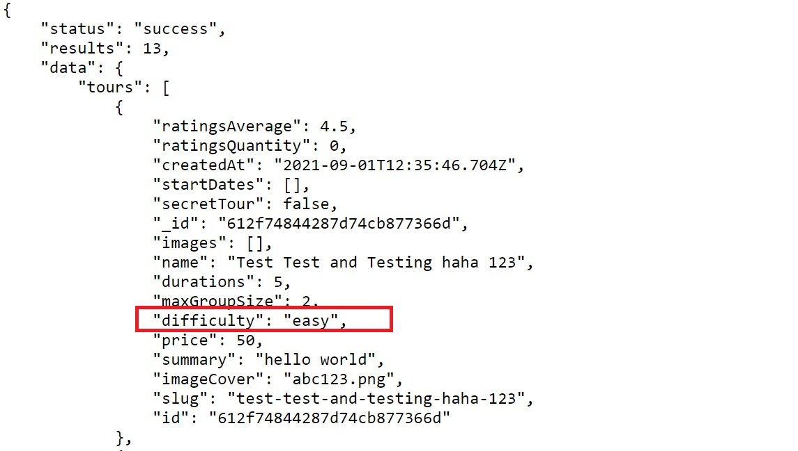

+++
author = "Jeff Chang"
title = "MongoDB Aggregation Pipeline"
date = "2021-09-11"
description = "Have you ever wonder how do we customize our own response field based on the MongoDB Query? Mongo Aggregation Pipeline allows us easily to achieve that Goal"
tags = [
    "nodejs", "mongodb"
]
categories = [
	"NodeJs", "MongoDB"
]
image = "cover.jpg"
+++
### Before we started
1. Kindly scan through the default get all query response body from <a href="/p/mongodb-aggregation-pipeline/response.json" target="_blank">[response.json]</a>
2. Checkout <a href="/p/1-mongodb-query-of-advanced-filtering-sorting-limit-field-and-pagination-with-mongoose#tour-schema" target="_blank">[Tour Schema]</a> for the schema type object
3. In this tutorial, we will trying to create some new fields by grouping and according based on their value in difficulty which will only contains `easy`, `medium` and `difficult`

>> Note: This controller function will be under a route call '/api/v1/tours/tour-stats'. 

## Code

exports.getTourStat = async (req, res) => {
  try {
    console.log("get tour stat")
    const stats = await Tour.aggregate([
      {
        $match: { ratingsAverage: { $gte: 4.5 } }
      },
      {
        $group: {
          _id: '$difficulty', //everything in one group, _id:null, _id :{ $toUpper: '$difficulty' } => spells uppercase
          num: { $sum: 1 }, // find total of tours, aggreagate will loop through the DB data on by one, everytime it loop it will added 1 into this field
          numRatings: { $sum: '$ratingsQuantity' },
          avgRating: { $avg: '$ratingsAverage' },
          avePrice: { $avg: '$price' },
          minPrice: { $min: '$price' },
          maxPrice: { $max: '$price' },
        }
      },
      {
        $sort: { aveRating: 1 }
      },
    ])

    res.status(200).json({
      status: 'success',
      data: {
        stats: stats
      }
    });
  } catch (error) {
    res.status(400).json({
      status: 'fail',
      message: error
    })
  }
}


## Result

{
    "status": "success",
    "data": {
        "stats": [
            {
                "_id": "difficult",
                "num": 2,
                "numRatings": 41,
                "avgRating": 4.6,
                "avePrice": 1997,
                "minPrice": 997,
                "maxPrice": 2997
            },
            {
                "_id": "medium",
                "num": 3,
                "numRatings": 70,
                "avgRating": 4.8,
                "avePrice": 1663.6666666666667,
                "minPrice": 497,
                "maxPrice": 2997
            },
            {
                "_id": "easy",
                "num": 8,
                "numRatings": 159,
                "avgRating": 4.5875,
                "avePrice": 661,
                "minPrice": 50,
                "maxPrice": 1997
            }
        ]
    }
}


## Explanation
1. Aggregation Pipeline provides tons of operators just to achieve your desire goal. Check out <a href="https://docs.mongodb.com/manual/reference/operator/aggregation/" target="_blank">[https://docs.mongodb.com/manual/reference/operator/aggregation/]</a> for more built-in operators
2. First of all, we can use the operator `$match` to **filter** out the value according to the field we set. This case we only want to get the `ratingsAverage` is `$gte` **greater or equal than 4.5**
3. Next, we can create our own response field by grouping the existing field in the Database from specifying the field name inside `_id`.
    - The new field name will follow in this standard `newFieldName : { operator : '$<FieldName> }`
    - For example, We can use the operator `$sum` to count the total number of `easy` in difficulty field `num: { $sum: 1 }`.
    - When aggregation pipeline is running, it will then loop through the response and add the value assigned to the $sum operator. This case will be 1
4. We also uses the operator like `$avg` to get the Avarage number, `$min` to get the minimum value and `$max` to get the maximum value
5. We can the the operator `$sort` to sort the field we want. This case we already create our custom field (after `$group` operator), so it's applicable to put inside the `$sort` operator as well. The concept is same as previously we did for Mongo.find query whereby **1** is sort ascending and **-1** is sort descending

