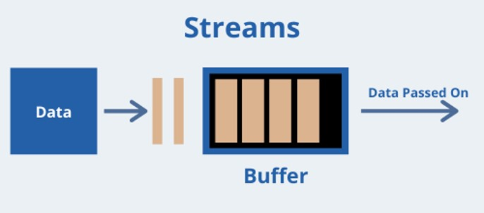
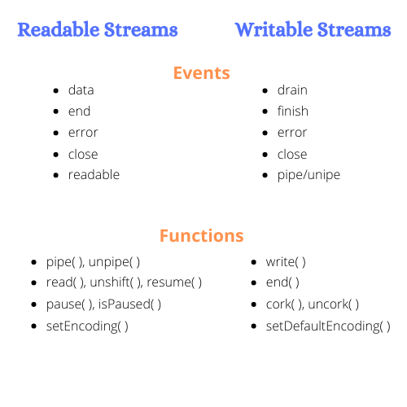
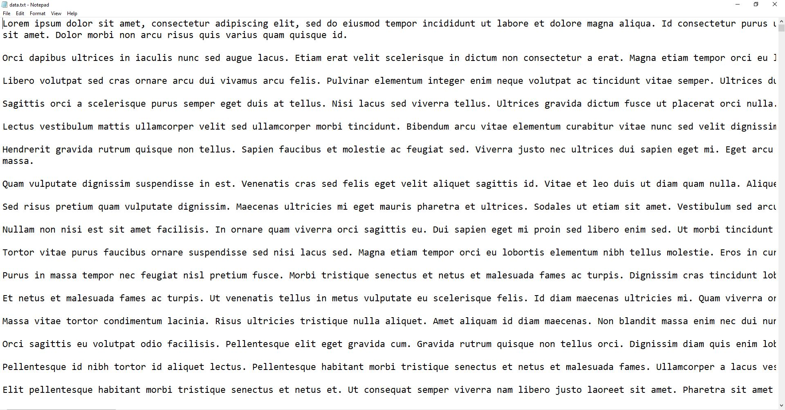

+++
author = "Jeff Chang"
title= "Stream & Buffer" 
date= "2021-05-08"
description= "Stream was introduced in the Unix operating system decades ago, and programs can interact with each other passing streams through the pipe operator. By processing the data with stream, we do not need to load large amounts of data in memory before you are able to process it. Since, we can process the chunk data from the entire file, it also takes way lesser time to start the process." 
tags = [
    "nodejs", "javascript"
]
categories = [
	"NodeJs", "Javascript"
]
image = "cover.jpg"
+++
Meanwhile, buffer is a temporary storage spot for a chunk of data which is being transferred from one to another  
When we make our process as a stream, it will first divide and separate the file into multiple chuck of data so that the end user do not need wait for the entire file / object to be loaded.  

In this article, we wil be going through different stream methods:
* [stream event](#stream-event)
* [createReadStream](#createReadStream)
* [createWriteStream](#createWriteStream)
* [pipe](#pipe)
* [transform stream](#transform-stream)

## Stream and Event
Node has many built-in modules that implement the streaming interface as shown in below:

As stream uses event to handle the data and status, we have to know at least few of them before we started to use it. 
Below are events and functions for readable and writable stream

## Readable Stream
Let's first discuss about the method createReadStream. This is the nodejs built-in [file system module](https://nodejs.org/api/fs.html#fs_fs_createreadstream_path_options) where it allow us to read and load the entire file into chunk by chunk manner.  
As we discuss earlier, each stream is having different event, so this case, we uses the event `data` to read our file.

*data.txt*

*This file contains more than 2000 lines of word.*


const fs = require('fs');

//fs.createReadStream takes in 2 arguments => { FilePath, encoding }
//__dirname in a node script returns the path of the folder where the current JavaScript file resides
const readStream = fs.createReadStream(__dirname + '/data.txt', 'utf-8');

//Whenever the buffer received a new chunk of data, it will trigger this event
readStream.on("data", (chunk) => {
    console.log(chunk)
})



### Result
Kindly play the video below to see the actual output

<video controls autoplay>
  <source src="readtStream.mp4" type="video/mp4">
  <source src="readtStream.ogg" type="video/ogg">
</video>

As we can see createReadStream comes to handy when we trying to load and process from a big file without waiting much to time.

## Writable Stream
Writable stream is also pretty straight forward as it is now writing multiple chunk of data into a new file.  
Let see how we can combine readable and writable stream together  


const fs = require('fs');

//fs.createWriteStreams only taks in single argument which is the file path
//It will automatically create a new file / overwrite if there is file with same name
const writeStream = fs.createWriteStream(__dirname + '/output2.txt');
const readStream = fs.createReadStream(__dirname + '/data.txt', 'utf-8');
readStream.on("data", (chunk) => {
    //write the chunk data into new file
    writeStream.write(chunk)
})

//This will triggered when the writing process in completely done
writeStream.on('finish', (chunk) => {
    console.log("done")
})


 
 ### Explanation
 1. Initialize the readable stream with file location and encoding, initialize the writable stream with the desired file location and name.
 2. Read the chunk data from `data` event in readable stream and use the method `write` from writable stream to write the data into the new file
 3. Trigger the `console.log('done')` when the writing process in **finished**

## Pipe
Readable Stream even comes with a very handy method known as [pipe](https://nodejs.org/api/stream.html#stream_event_pipe) which allow us to use readable and writable stream in pipe chain. 


//The result will be same as what we saw in the writable stream example
const writeStream = fs.createWriteStream(__dirname + '/output2.txt');
const readStream = fs.createReadStream(__dirname + '/data.txt', 'utf-8');
readStream.pipe(writeStream)


## Create a custom transform stream
We can also create our custom transform stream by importing the [Transform class](https://nodejs.org/api/stream.html#stream_new_stream_transform_options) from stream module which is node built-in module.
  
Let's convert all characters into uppercase by creating a new transform stream function

const { Transform } = require('stream');
const { StringDecoder } = require('string_decoder');
const decoder = new StringDecoder('utf8');

const myTransform = new Transform({
    //cb = callback which takes in 2 arguements => (err, data)
    transform(chunk, encoding, cb) {
        //default chunk will be read as byte, we need to convert them into string and transform into uppercase
        const data = decoder.write(chunk).toUpperCase()
        cb(null, data)
    }
});

const readStream = fs.createReadStream(__dirname + '/data.txt');
const writeStream = fs.createWriteStream(__dirname + '/output.txt');

readStream
    .pipe(myTransform) //Read chunk of data and transform them into uppercase
    .pipe(writeStream) //Write the transformed chunk of data into a new file


*Note: Kindly run this file in node environment and observe the output (It should be all uppercase characters)*
 

### Explanation
1. Import necessary package such as Transform class from stream module, decoder module as `utf-8`.
2. Initialize a `Transform` class and convert the them into uppercase by using `transform` method
3. Create a readable stream for reading the original file and writable stream for final output file
4. Use pipe function to connect readable, writable and transform stream.

**Code available at [https://github.com/Jeffcw96/node-stream-example](https://github.com/Jeffcw96/node-stream-example)**

