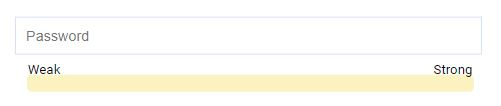
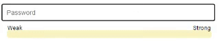

+++
author = "Jeff Chang"
title= "Password Strength Detector" 
date= "2020-09-11"
description= "Regular Expression is a great tool to validate the strengthness of password" 
tags = [
    "html","css","javascript",
]
categories = [
    "Front-end","HTML","CSS","Javascript",
]
image = "cover.jpg"
featureImage= "pw_detector_03.jpg" # Sets featured image on blog post.
metakeywords = "Front-End, Javascript, HTML, CSS, REGEX, Regular Expression"
+++

In this article, we will create an interative password input and use Regular Expression for validation.

<!--more-->
In this article, we will going to build something interactive with the password strength by using Javascript regular expression. A very first step, create an input password type element and apply an **onkeyup event** to it so that we can detect the strength of password everytime user key in new character. In this case, we are using `this` keyword to pass as the argument which is referring the input DOM element, so that later on we no need to get the DOM element by using javascript again.


    <input id="userPassword" type="password" class="form-input" onkeyup="strongPasswordDetection(this)" 
    placeholder="Password">



Then we can create 2 `div` element, one is for the progression bar while another is showing the strengthness of the password by changing it's width. To increase the user experience, I had create 2 labels which are **Weak** and **Strong** to make the design looks more informative and beautiful


<!--index.html-->

    <small class="password-detector-label weak">Weak</small>
    <small class="password-detector-label strong">Strong</small>
    



Based on the code above, the `div` element that contains the class `progress-bar` is the parent of other 3 elements. So we can set it to be position relative and apply some other css element such as background color, width, height and so on to it.


.progress-bar{
        background: #FBF2C0;
        width:80%;
        height:1.5vh;
        position:relative;
        border:1px solid #FBF2C0;
        border-radius:5px;
        margin: 10px 10px 10px 3.5vw;
}


Since now we have a parent which contains the **relative position**, we can now set the children nodes to position absolute so that we can take the full control of it's position.


.progress{
    position:absolute;
    width:0%;
    height:100%;
    background: linear-gradient(90deg, rgba(2,0,36,1) 0%, rgba(9,9,121,1) 35%, rgba(0,212,255,1) 100%);
    left:0;
    transition: all .3s;
}



.password-detector-label{
    position: absolute;
    top:-15px;
    color: black;
}



.weak{
    left: 0;
}

.strong{
    right: 0;
}


Let's take a look on our current result. 

    

Before we dive in to the javascript function, let's assume what are condition we want to handle for the password detection.

**THE PASSWORD MUST INCLUDE**
1. at least 14 characters
2. at least One Lowercase
3. at least One Uppercase
4. at least One Special Character
5. at least One Number

Regular expression is very suitable and useful in this case. However, we cannot put all the condition in one line of code as we need to check seperately so that we can increase the password strength width when it's fulfilled the condition.

My personal approach is create an empty variable inside that function, when it matched with the condition, we will then add some value to in and eventually set the value as the width of the password strength bar.


function strongPasswordDetection(e) {
    var passwordInput = e.value; //Get the password value
    var passwordStrengthBar = document.getElementById("passwordStrengthBar"); //Refering the password strength DOM element
    var upperCaseDetector = /[A-Z]/; //Check Uppercase
    var lowerCaseDetector = /[a-z]/; //Check Lowercase
    var numberDetector = /[0-9]/; //Check number
    var specialCharacterDetector = /[-!$%^&*()_+"|'~=`{}[:;<>?,.@#\]]/g; //Check special character
    var score = 0;
}


After the initialization is done, We can now use `.test()` method to check whether the password is fulfilled the conditions we set earlier. It will return true if it's matched, and return false if it's doesn't matched.


if (lowerCaseDetector.test(passwordInput)) {
    score += 20;
}
if (upperCaseDetector.test(passwordInput)) {
    score += 20;
}
if (numberDetector.test(passwordInput)) {
    score += 20;
}
if (specialCharacterDetector.test(passwordInput)) {
    score += 20;
}
if (passwordInput.length >= 14) {
    score += 20;
}
passwordStrengthBar.style.width = score + "%";


That's It !!. we build the interactive password detector. 

    

For further action such as password submission, we don't want to create so many of if statement again right??
This case, we can use the one line code with Regular Expression for checking. And we can use back the same method which is `test()` to check whether the input has fulfilled the condition or not. 


// ^The password string will start this way
// (?=.*[a-z])	The string must contain at least 1 lowercase alphabetical character
// (?=.*[A-Z])	The string must contain at least 1 uppercase alphabetical character
// (?=.*[0-9])	The string must contain at least 1 numeric character
// (?=.*[!@#$%^&*])	The string must contain at least one special character, but we are escaping reserved RegEx characters to avoid conflict
// (?=.{14,})	The string must be eight characters or longer            
var verifyPassword = new RegExp("^(?=.*[a-z])(?=.*[A-Z])(?=.*[0-9])(?=.*[!@#\$%\^&\*])(?=.{14,})");


[Click Me to See Complete Code](https://github.com/Jeffcw96/password_detector/tree/master)

{}

