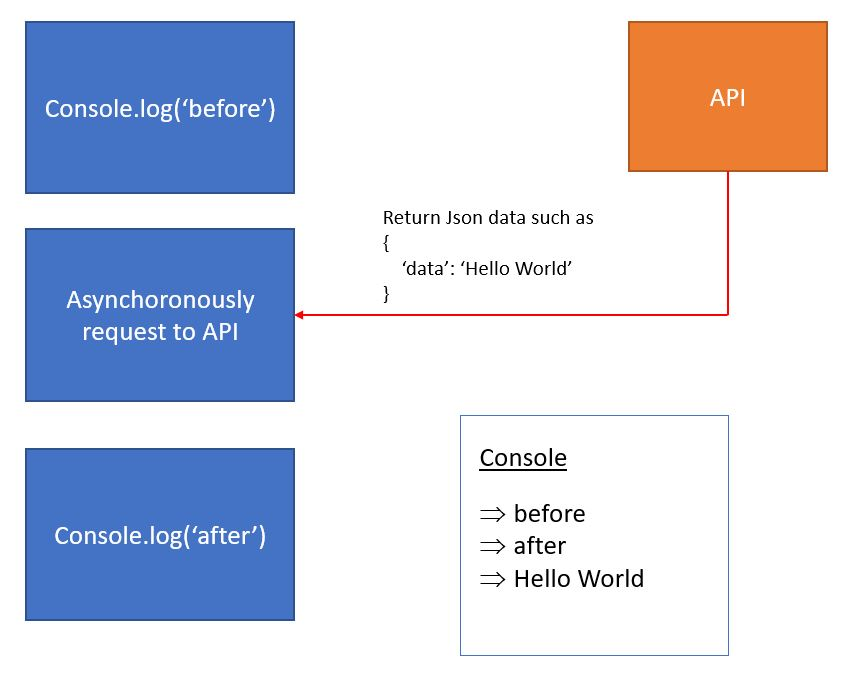

+++
author = "Jeff Chang"
title= "Promise" 
date= "2020-11-01"
description= "Javascript is a single-threaded programming language in the sense that it can only process one statement or only one thing can happen at a time. However, when we have a large scale data coming from API. The program might just stop and wait until the data is fully received from the end point even there are bunch of pending code waiting to be executed right after the request." 
tags = [
    "javascript",
]
categories = [
    "Front-end","Javascript"
]
metakeywords = "Promise, Javascript, Asynchoronous, Concurrent Javascript, Promise.All"
image = "cover.jpg"
+++

This is where **asynchoronous** Javascript comes into play. Basically there are 3 asynchoronous way in Javascript that we can use which are **callbacks**, **promises** and **async/await**. As these methods are in asynchoronous, which means instead of waiting the data to be completely received from the API and execute the following code.
The program now will not stop and wait after making the request to API and execute into next code, it will then jump back to the asynchoronous code after the data is fully loaded.

In this article, we will focus on the **Promise** asynchoronous method. First and foremost, Promise basically takes in 2 paramenters which are **resolve** and **reject**. As we can imagine when the program match with the **right condition**, it will then be **resolved**. Otherwise, it will be **rejected**.


let myPromise = new Promise((resolve, reject) => {
    let rand = Math.floor(Math.random() * 10);
    let desiredVal = 6;
    if (rand == desiredVal) {
        resolve([rand, desiredVal]);
    } else {
        reject([rand, desiredVal]);
    }
})

We can then use [Promise.prototype.then()](https://developer.mozilla.org/en-US/docs/Web/JavaScript/Reference/Global_Objects/Promise/then) to retrieve and execute the code inside **resolve** and use [Promise.prototype.catch()](https://developer.mozilla.org/en-US/docs/Web/JavaScript/Reference/Global_Objects/Promise/catch) to run the code inside **reject**


myPromise.then((arr) => {
    console.log(`FOUND IT, ${arr[0]} from random and ${arr[1]} from desired value`);
}).catch((arr) => {
    console.log(`NOT FOUND, ${arr[0]} from random and ${arr[1]} from desired value`);
})

<small style="display:block"><em>Note: Because .then() and .catch() only takes in one parameter so we need to wrap them into an array or object when we have multiple paremeters to pass in  </em></small>

<h4 style="margin:0">myPromise.then()</h4>

<h4 style="margin:0">myPromise.catch()</h4>

<h2 style="margin-bottom:0">Promise with Object</h2>

let hungry = true;
function areYouHungry(hungry) {
    return new Promise((resolve, reject) => {
        if (hungry) {
            resolve({
                name: "Jeff",
                statement: " is very hungry"
            })
        } else {
            reject({
                name: "Jeff",
                reason: "Because he just got a Filet O Fish set from MCD"
            })
        }
    })
}



let isHungry = areYouHungry(hungry);
isHungry.then((result)=>{
    console.log(result.name + result.statement);
}).catch((err) =>{
    console.log(err.name + " is not hungry. " + err.reason);
})


<h4 style="margin:0">isHungry.then(), isHungry == true</h4>

<h4 style="margin:0">isHungry.catch(), isHungry == false</h4>

## Promise.all
Promise.all is the method that takes in an array of all Promises and return the resolve function. *Note: when there is one or more Promise get rejected. It will immediately throw the error function without execute the resolve function from other Promises.*


let promiseOne = new Promise((resolve, reject) => {
    resolve("promise One is Good");
})

let promiseTwo = new Promise((resolve, reject) => {
    resolve("promise Two is Good");
})

let delayTimer = new Promise((resolve, reject) => {
    setTimeout(() => {
        resolve("Delay Time's Up");
    }, 3000);
})


Promise.all([
    promiseOne,
    promiseTwo,
    delayTimer
]).then((messages) => {
    console.log(messages); //return ['promise One is Good', 'promise Two is Good', 'Delay Time's Up']
})


As we can observe from photo below, eventhough the *promiseOne* and *promiseTwo* can resolve quickly without wating for single second, but they still have to wait until other promise to be successfully resolved which is **delayTimer** promise.

{}

