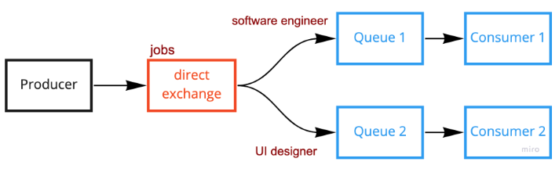

+++
author = "Jeff Chang"
title= "RabbitMQ direct exchange" 
date= "2022-05-07"
description= "In last article, we were demonstrating the implementation of RabbitMQ fanout exchange which behaves the pattern like publish and subscribe. In this arle, we will be demonstrating the other exchange type call Direct exchange" 
tags = [
    "nodejs","javascript","rabbitmq"
]
categories = [
    "NodeJs","Javascript","RabbitMQ"
]
+++

Prerequisite:

- Please ensure you've [installed RabbitMQ](https://www.rabbitmq.com/download.html) in your local machine.
  - Alternatively, you may run RabbitMQ docker container
  - `docker run -it --rm --name rabbitmq -p 5672:5672 -p 15672:15672 rabbitmq:3.9-management`
- We will using RabbitMQ Javascript client [amqplib](https://amqp-node.github.io/amqplib/). Please ensure you've setup a new project with this package installed.
  - Alternatively, you can also clone this [project](https://github.com/Jeffcw96/rabbit-mq) to have application-ready demonstrations.

We are going to demonstrate the `Direct exchange` message queue flow as shown in figure below

## Code demonstration

We will run `producer.js` and `comsumer.js` separately.

### producer.js

<!-- prettier-ignore -->

const amqp = require("amqplib");
async function fanoutExchange(){
    try{
        const rabbitmqUrl = "amqp://localhost:5672";
        const connection = await amqp.connect(rabbitmqUrl);
        const exchange = "transports";
        const exchangeType = "fanout";
        const routingKey = "";
        const options = {};
        const payload = {
            vehicleType: "car",
            numberOfPassenger: 3,
        };
        let channel = await connection.createChannel();
        await channel.assertExchange(exchange, exchangeType, options);
        channel.publish(
            exchange,
            routingKey,
            Buffer.from(JSON.stringify(payload)),
            options
        );
    }catch(error){
        console.error(error)
    }
}
fanoutExchange()


### consumer.js

<!-- prettier-ignore -->

const amqp = require("amqplib");
async function fanoutExchangeConsumer(){
    try{
        const rabbitmqUrl = "amqp://localhost:5672";
        const connection = await amqp.connect(rabbitmqUrl);
        const exchange = "transports";
        const exchangeType = "fanout";
        const routingKey = "";
        const options = {};
        let channel = await connection.createChannel();
        await channel.assertExchange(exchange, exchangeType, options);
        const { queue } = await channel.assertQueue("", options);
        channel.bindQueue(queue, exchange, routingKey);
        channel.consume(queue, (data) => {
            console.log("Received", JSON.parse(data.content.toString()));
            channel.ack(data, false, true);
        });
    }catch(error){
        console.error(error)
    }
}
fanoutExchangeConsumer()


**Before we start:**

- To have better visualization, please run the `producer.js` in 1 terminal and `consumer.js` in 2 terminals. You can either use the [split terminal in Visual Studio Code](https://code.visualstudio.com/docs/editor/integrated-terminal#_grouping) or run the files in your machine terminals.
- If you're not using the example from the provide [Git Repository](https://github.com/Jeffcw96/rabbit-mq). Please ensure you run the `consumer.js` in 2 terminal followed by running `producer.js` in 1 terminal

### Result for this example

<video controls muted style="width:100%">
  <source src="example.mp4" type="video/mp4">
  <source src="example.ogg" type="video/ogg">
</video>

## Steps to demo from [Git Repository](https://github.com/Jeffcw96/rabbit-mq)

- Open a new terminal
- `npm run dev` to start the server
- Open **2** new terminals and run the following command:
  - `npm run consumer process=exchange exchange=transports exchangeType=fanout routingKey=''`
- Make a POST request to `http://localhost:3000/api/transports/exchange/fanout` with your custom payload.

### Result

<video controls muted style="width:100%">
  <source src="gitrepo.mp4" type="video/mp4">
  <source src="gitrepo.ogg" type="video/ogg">
</video>

## Explanations

- **Producer**

  1. Before process started, we need to first connect to the RabbitMQ.
  2. The next step is make connection with the channel and start creating our desire exchange by using `assertExchange()` method
     - In here we specify the following arguments value:
       - exchange name which is `transports` in this example
       - exchange type which is `fanout`
       - we didn't specify the options in this example but feel free to have a look on the availabe options at [here](https://amqp-node.github.io/amqplib/channel_api.html#channelassertexchange)
  3. And now, we can start publishing our message to the exchange by using [`publish()`](https://amqp-node.github.io/amqplib/channel_api.html#channel_publish) method with the following arguments:
     - we can use back the exchange name we specified earlier **'transports'**
     - `routingKey`, we could just left it as empty as it doesn't apply anything for `fanout` exchange type
     - `payload`, Publish message only accepts **buffer** payload. To achieve this, we can first **stringify** our payload if it's an object and convert it into a Buffer by using [`Buffer.from`](https://www.w3schools.com/nodejs/met_buffer_from.asp)
     - `options`, we didn't specify the options in this example but feel free to have a look on the availabe options at [here](https://amqp-node.github.io/amqplib/channel_api.html#channel_publish)

- **Comsumer**
  1. Before process started, we need to first connect to the RabbitMQ.
  2. The next step is make connection with the channel and start creating our desire exchange by using `assertExchange()` method
     - In here we specify the following arguments value:
       - exchange name which is `transports` in this example
       - exchange type which is `fanout`
       - we didn't specify the options in this example but feel free to have a look on the availabe options at [here](https://amqp-node.github.io/amqplib/channel_api.html#channelassertexchange)
  3. And now we can start create our queue and bind with the exchange we created earlier.
     - As you can observer from the code, we actually putting it as empty string when creating the queue `channel.assertQueue("",options)`. This is because we do not need to bother the queue name when binding the exchange and queue. By putting empty string for the queue name, it will actually return us a unique and random queue name such as `amq.gen-JzTY20BRgKO-HjmUJj0wLg`
     - There are some useful options we can take note when creating the queue which are :
       - `durable` : if true, the queue still stay alive even if we restart the broker.
       - `exclusive` : if true, queue will be deleted when connection is closed.
       - `expires` : specifiy the time in millisecond to delete the queue when there is no consumer connecting to the queue.
       - checkout other options [here](https://amqp-node.github.io/amqplib/channel_api.html#channelassertqueue)
       - We could just left the `routing key` as empty for the binding between exchange and queue because it does not apply anything for the `fanout` exchange.
       - Check out the `direct`, `topic` exchange for the use case of `routing key`
  4. After the binding process is finished, we can now consume the message whenever there is a incoming message from the broker by using [`.consume()`](https://amqp-node.github.io/amqplib/channel_api.html#channel_consume) method
  5. When we received the message, we can now **acknowledge** the message by using [`ack()`](https://amqp-node.github.io/amqplib/channel_api.html#channel_ack) method so that the broker will knows we successfully retrive the message.
