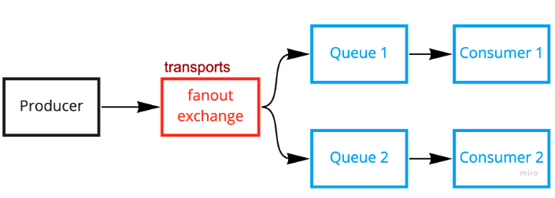

+++
author = "Jeff Chang"
title= "RabbitMQ fanout exchange" 
date= "2022-04-26"
description= "A message queue is a form of asynchronous service-to-service communication used in serverless and microservices architectures. One of the good example is by using RabbitMQ. In this article, we will demonstrate how to perform a publish and subscribe process via RabbitMQ" 
tags = [
    "nodejs","javascript","rabbitmq"
]
categories = [
    "NodeJs","Javascript","RabbitMQ"
]
+++

Prerequisite:

- Please ensure you've [installed RabbitMQ](https://www.rabbitmq.com/download.html) in your local machine.
  - Alternatively, you may run RabbitMQ docker container
  - `docker run -it --rm --name rabbitmq -p 5672:5672 -p 15672:15672 rabbitmq:3.9-management`
- We will using RabbitMQ Javascript client [amqplib](https://www.npmjs.com/package/amqplib). Please ensure you've setup a new project with this package installed.
  - Alternatively, you can also clone this [project](https://github.com/Jeffcw96/rabbit-mq) to have application-ready demonstrations.

We are going to demonstrate the `Fanout exchange` message queue flow as shown in figure below

## Code demonstration

We will run `producer.js` and `comsumer.js` separately.

### producer.js

<!-- prettier-ignore -->

async function fanoutExchange(){
    try{
        const rabbitmqUrl = "amqp://localhost:5672";
        const connection = await amqp.connect(rabbitmqUrl);
        const exchange = "transports";
        const exchangeType = "fanout";
        const routingKey = "";
        const options = {};
        const payload = {
            vehicleType: "car",
            numberOfPassenger: 3,
        };
        let channel = await connection.createChannel();
        await channel.assertExchange(exchange, exchangeType, options);
        channel.publish(
            exchange,
            routingKey,
            Buffer.from(JSON.stringify(payload)),
            options
        );
    }catch(error){
        console.error(error)
    }
}
fanoutExchange()


### consumer.js

<!-- prettier-ignore -->

async function fanoutExchangeConsumer(){
    try{
        const rabbitmqUrl = "amqp://localhost:5672";
        const connection = await amqp.connect(rabbitmqUrl);
        const exchange = "transports";
        const exchangeType = "fanout";
        const routingKey = "";
        const options = {};
        let channel = await connection.createChannel();
        await channel.assertExchange(exchange, exchangeType, options);
        const { queue } = await channel.assertQueue("", options);
        channel.bindQueue(queue, exchange, routingKey);
        channel.consume(queue, (data) => {
            console.log("Received", JSON.parse(data.content.toString()));
            channel.ack(data, false, true);
        });
    }catch(error){
        console.error(error)
    }
}
fanoutExchangeConsumer()

