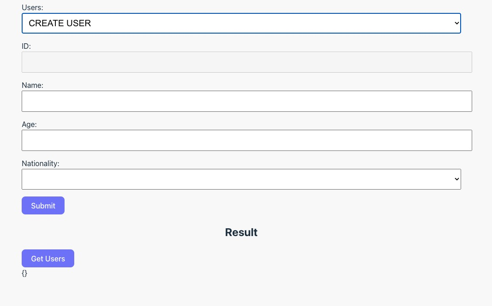
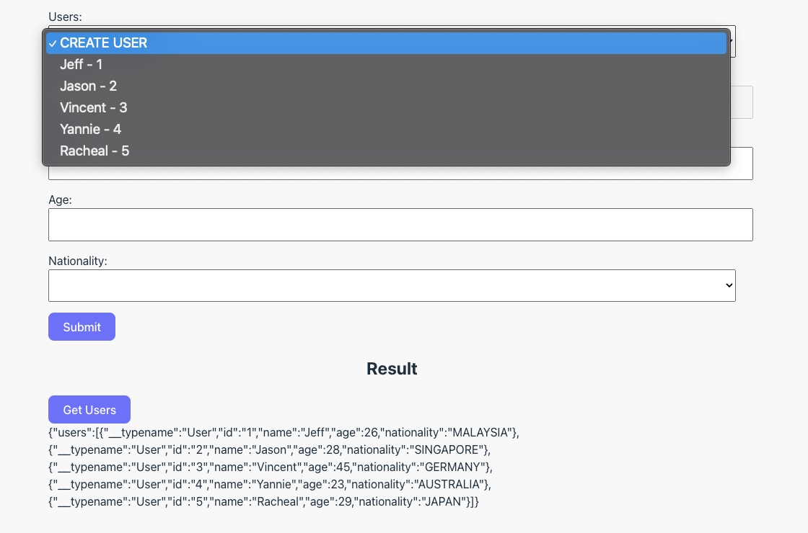

+++
author = "Jeff Chang"
title = "Connect GraphQL query and mutation in React Apollo Client"
date = "2023-06-17"
description = "In this article, we will be implementing Apollo Client GraphQL and connect to it's server"
tags = [
    "react", "graphql"
]
categories = [
    "React","Javascript", "GraphQL"
]
image= "cover.jpg"
+++

## Table of contents

- [Introduction](#introduction)
    - [Prerequisite](#introduction-prerequisite)
    - [Objective](#introduction-objective)
- [Initial configurations](#initial-configurations)
- [useQuery hook](#useQuery)
- [useMutation hook](#useMutation)
- [Result](#result)


### Introduction<a name="introduction"></a>

Before we get started, it's high recommend to clone the [Github repo](https://github.com/Jeffcw96/graphlq-learning-journey) so that we could follow along this tutorial and fill in the necessary code of the starter pack

> What are we need?
- [Final pack of Apollo GraphQL server tutorial](https://github.com/Jeffcw96/graphlq-learning-journey/tree/master/01-apollo-graphql-server/final)
- [Starter pack of Apollo GraphQL client tutorial](https://github.com/Jeffcw96/graphlq-learning-journey/tree/master/02-react-graphql/starter)


#### Prerequisite<a name="introduction-prerequisite"></a>
1. Open the **final** pack of **01-apollo-graphql-server** directory:
    1. Install the necessary packages by running `npm install` command.
    2. Start the GraphQL server locally by running `npm run start` command and the server should start port `4000`
2. Open the **starter** pack of **02-react-graphql** directory:
    1. Install the necessary packages by running `npm install` command.
    2. Start the React server locally by running `npm run dev` command and the server should start at port `5173`

We can now navigate to http://localhost:5137/ and here is how the React application should look like



#### Objective<a name="introduction-objective"></a>
As you can see from the image above, we have multiple inputs available in the UI which is representing each attribute of our [USER type](https://jeffdevslife.com/p/understanding-graphql-query-and-mutation-in-apollo-server/#schema-type) defined in last tutorial except the `friends` field.

The objective of this tutorial is to connect the following GraphQL query and mutation from this React application into your GraphQL local server.
- CREATE USER
- UPDATE USER
- GET USERS

### Initial configurations<a name="initial-configurations"></a>
Before we get started, it's important that we have all the necessary packages ready. Kindly install the following NPM packages:
- [@apollo/client](https://www.npmjs.com/package/@apollo/client)
- [graphql](https://www.npmjs.com/package/graphql)

Once these packages are ready, we could now initialize our Apollo Client and wrap it as a React context provider under the ***main.jsx*** file.

```react
...
import { ApolloClient, InMemoryCache, ApolloProvider } from "@apollo/client";

const client = new ApolloClient({
  uri: "http://localhost:4000/",
  cache: new InMemoryCache(),
});

ReactDOM.createRoot(document.getElementById("root")).render(
  <React.StrictMode>
    <ApolloProvider client={client}>
      <App />
    </ApolloProvider>
  </React.StrictMode>
);
```

#### Explainations
1. We first import the necessary class and context provider from `@apollo/client` package.
2. We then instantiate and initialise our Apollo Client with the right parameters such as:
    - `uri` will be connecting to our GraphQL server.
    - `cache` will be the instance of InMemoryCache, which Apollo Client uses to cache query results after fetching them.
3. Then we wrap our React application under the Apollo Context provider to ensure it could access in everywhere of our application.


### useQuery<a name="useQuery"></a>
Before we start connecting the `users` query from the React App, it's important that we have define our query which is the similar syntax and command we used under the GraphQL editor in **<YOUR_GRAPHQL_SERVER_URL>/graphql**

We could write our GraphQL query command under the ***operations/user.js*** directory with the aid of imported `gql` function from `@apollo/client` package.

```js
import { gql } from "@apollo/client";

export const GET_USERS = gql`
  query GetUsers {
    users {
      id
      name
      age
      nationality
    }
  }
`;
```
#### Explaination
We utilized the `gql` function to wrap our GraphQL query command which first required us to defined the query name `[GetUsers]` as well as the targetted resolver `[users]` to be called from the server. Then we could assign this command into a variable and export it.

#### Execute GraphQL query with `useQuery` function
Let's navigate to the ***App.jsx*** file and work with the `useQuery` function.

> There is **nothing** you would need to deal with the `react-hook-form` package.



...
import { useQuery } from "@apollo/client";
import { GET_USERS } from "./operations/user";

function App() {
  ...
  const [responseData, setResponseData] = useState({});
  const [users, setUsers] = useState([]);
  const { data } = useQuery(GET_USERS);

  ...

  const selectUser = (user) => {
    const userId = user.target.value;

    // If it's a create user process
    if (userId == -1) {
      reset();
      return;
    }

    // Uncomment below code once we implemented GET_USER GraphQL query
    // const selectedUser = data.users.find((user) => user.id === userId);
    // setValue("id", selectedUser.id);
    // setValue("name", selectedUser.name);
    // setValue("age", selectedUser.age);
    // setValue("nationality", selectedUser.nationality);
    
  };

  // Uncomment below code once we implemented GET_USER GraphQL query
  // useEffect(() => {
  //   if (data && data.users) {
  //     setUsers(data.users);
  //     setResponseData(data);
  //   }
  // }, [data]);

  return (
    <>
      <form onSubmit={handleSubmit(onSubmit)}>
        ...
      </form>
    </>
  );
}
export default App;


### **IMPORTANT**: Please uncomment the highlighted code above from your end.

#### Explaination
1. We first imported the `useQuery` hook from `@apollo/client` package and the GraphQL command variable called `GET_USERS` that we have defined earler.
2. We can then call provide our `GET_USERS` GraphQL commands into the `useQuery` hook and it will actually make the request immediately once this component got loaded and the response data will be stored under a attribute called `data` from the hook.
3. Once we uncomment the highlighted code above, we can actually see the response data in the UI Result section as well as the `Users` dropdown input is now contain the list of users that we have defined in our server.



### useMutation<a name="useMutation"></a>
Since we are now able to retrieve the list of users from our GraphQL server. Let's connect the other resolvers such as **Create User** and **Update User** with the useMutation hook.

We could write our GraphQL query command under the ***operations/user.js*** directory with the aid of imported `gql` function from `@apollo/client` package.

```js
import { gql } from "@apollo/client";

...

export const CREATE_USER = gql`
  mutation CreateUser($input: CreateUserInput!) {
    createUser(input: $input) {
      id
      name
      age
      nationality
    }
  }
`;

export const UPDATE_USER = gql`
  mutation UpdateUser($input: UpdateUserInput!) {
    updateUser(input: $input) {
      id
      name
      age
      nationality
    }
  }
`;

```
#### Explaination
We utilized the `gql` function to wrap our `createUser` and `updateUser` resolvers into it's respective mutation and assigned into a variable.
Take note that these mutations are required us to pass in the payload. We can refer back to the defined [schema type](https://github.com/Jeffcw96/graphlq-learning-journey/blob/master/01-apollo-graphql-server/final/schema/type-defs.js#L9-L12) of our input from GraphQL backend as following:

```
type Mutation {
  createUser(input: CreateUserInput!): User
  updateUser(input: UpdateUserInput!): [User!]
}
```

#### Execute GraphQL mutations with `useMutation` function
Let's navigate to the ***App.jsx*** file and work with the `useMutation` function.

> Data access to each inputs have been completed. We can access each of the input's value under `data` argument from `onSubmit` function .


...
import { useMutation, useQuery } from "@apollo/client";
import { CREATE_USER, GET_USERS, UPDATE_USER } from "./operations/user";

function App() {
  ...
  const [responseData, setResponseData] = useState({});
  const [users, setUsers] = useState([]);
  const { data, refetch } = useQuery(GET_USERS);
  const [createUser] = useMutation(CREATE_USER);
  const [updateUser] = useMutation(UPDATE_USER);

  const onSubmit = async (data) => {
    const payload = {
      name: data.name,
      age: Number(data.age),
      nationality: data.nationality,
    };

    try {
      if (data.id) {
        payload.id = data.id;
        const result = await updateUser({ variables: { input: payload } });
        setResponseData(result);
        return;
      }

      const result = await createUser({ variables: { input: payload } });
      setResponseData(result);
    } catch (error) {
      console.error(error);
    }
  };

  return (
    <>
      <form onSubmit={handleSubmit(onSubmit)}>
        ...
      </form>
    </>
  );
}
export default App;


#### Explaination
1. We first initialize the `useMutation` hooks by passing in the GraphQL command variable called `CREATE_USER` and `UPDATE_USER` that we have defined earler. It will then return a list of result back in an Array form but in this tutorial, we only care about the first element which is the function that will execute the GraphQL mutation.
2. From code line 21 to 26 is the place where we verify if the any user has been selected from the User dropdown input where the given payload will be come along with their unique id. Then we will perform an update user action.
3. Otherwise, we will perform a create user action if the user id is not specified.
4. **Note**: Please ensure to pass in the correct payload otherwise, we will be getting a GraphQL error.
  - We would need to pass in our payload into the specified mutation variable and wrap under the `variables` object. In this example, we have defined our Mutation input as `$input`, so the format will be `({variables: {input: <PAYLOAD_OBJECT>}})`

### Result<a name="result"></a>
<video controls muted style="width:100%">
  <source src="result.mov" type="video/mp4">
  <source src="result.ogg" type="video/ogg">
</video>