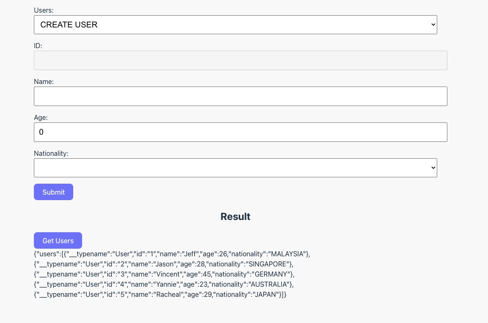

+++
author = "Jeff Chang"
title = "Generate GraphQL schema type in React"
date = "2023-08-06"
description = "In last article, we learnt how to organize our GraphQL modules properly and create enable the type-safe functionality in our GraphQL resolvers. Let's learn how to do it from React!"
tags = [
    "react", "graphql", "typescript"
]
categories = [
    "React","Typescript", "GraphQL"
]
image= "cover.jpg"
+++

## Table of contents

- [Introduction](#introduction)
  - [Prerequisite](#introduction-prerequisite)
  - [Objective](#introduction-objective)
- [GraphQL schema codegen](#schema-codegen)
- [Enable type-safe in the GraphQL Query and Mutation](#type-safe)

### Introduction<a name="introduction"></a>

Before we get started, it's high recommend to clone the [Github repo](https://github.com/Jeffcw96/graphlq-learning-journey) so that we could follow along this tutorial and fill in the necessary code of the starter pack

> What do we need?

- [Final pack of GraphQL server Typescript codegen](https://github.com/Jeffcw96/graphql-learning-journey/tree/master/03-graphql-server-typescript-codegen/final)
- [Starter pack of React GraphQL Typescript codegen](https://github.com/Jeffcw96/graphql-learning-journey/tree/master/04-react-graphql-typescript-codegen/starter)

#### Prerequisite<a name="introduction-prerequisite"></a>

1. Open the **final** pack of **03-graphql-server-typescript-codegen** directory:
   1. Install the necessary packages by running `npm install` command.
   2. Start the GraphQL server locally by running `npm run start` command and the server should start port `4000`
2. Open the **starter** pack of **04-react-graphql-typescript-codegen** directory:
   1. Install the necessary packages by running `npm install` command.
   2. Start the React server locally by running `npm run dev` command and the server should start at port `5173`

We can now navigate to http://localhost:5137/ and here is how the React application should look like



#### Objective<a name="introduction-objective"></a>

This project has been setup exactly the same as what we have done in the [Connect GraphQL query and mutation in React Apollo Client](/p/connect-graphql-query-and-mutation-in-react-apollo-client/) article **but** it has been converted from Javascript to Typescript.

> What we need to do ?

We would need to generate a GraphQL schema file that is powered by our GraphQL backend service in our React application andadd type safety into our App.tsx file.

### GraphQL schema codegen<a name="schema-codegen"></a>

First and foremost, we would need to install the following dependencies to help us generate the GraphQL schema:

- [@graphql-codegen/cli](https://www.npmjs.com/package/@graphql-codegen/cli)
- [@graphql-codegen/typescript](https://www.npmjs.com/package/@graphql-codegen/typescript)
- [@graphql-codegen/typescript-operations](https://www.npmjs.com/package/@graphql-codegen/typescript-operations)

`npm install @graphql-codegen/cli @graphql-codegen/typescript @graphql-codegen/typescript-operations -D`

Then, we can create a codegen.yml file in our root directory with the following settings:

```yaml
schema: http://localhost:4000/graphql
documents: src/operations/*.ts
ignoreNoDocuments: true
generates:
  ./src/schema.ts:
    plugins:
      - "typescript"
      - "typescript-operations"
```

#### Explainations

1. We first specific our `schema` property which will point to our GraphQL backend service to generate the GraphQL scalar types for us
2. We then let the code generator knows the directory of the GraphQL operations in `documents` property.
3. By setting `ignoreNoDocuments` to **true**, we're telling GraphQL Code Generator not to worry if it doesn't find any GraphQL operations in our frontend code.
4. `generates` property will be the place to specify the file directory of the generated GraphQL scalar type.
   - We could then add the plugins such as `typescript` and `typescript-operations` underneath this property.

Once this is done, we can add a new script command in our package.json as such:

```json
{
  ...
  "scripts": {
    ...
    "codegen": "graphql-codegen"
  },
  ...
```

Let's run `npm run codegen` and you should be able to see the schema file is generated under **src/schema.ts** directory !

### Enable type-safe in the GraphQL Query and Mutation<a name="type-safe"></a>

Here will be the final code of our App.tsx file.

```tsx
...
import {
  CreateUserInput,
  CreateUserMutation,
  CreateUserMutationVariables,
  GetUsersQuery,
  GetUsersQueryVariables,
  UpdateUserInput,
  UpdateUserMutation,
  UpdateUserMutationVariables,
} from "./schema";

function App() {
  ...
  const [users, setUsers] = useState<UpdateUserInput[]>([]);
  const { data, refetch } = useQuery<GetUsersQuery, GetUsersQueryVariables>(
    GET_USERS
  );
  const [createUser] = useMutation<
    CreateUserMutation,
    CreateUserMutationVariables
  >(CREATE_USER);
  const [updateUser] = useMutation<
    UpdateUserMutation,
    UpdateUserMutationVariables
  >(UPDATE_USER);

  const onSubmit = async (data: UpdateUserInput) => {
    const payload: CreateUserInput | UpdateUserInput = {
      id: "",
      name: data.name,
      age: Number(data.age),
      nationality: data.nationality,
    };

    try {
      ...
    } catch (error) {
      console.error(error);
    }
  };

  ...

  return (
    <>
      <form onSubmit={handleSubmit(onSubmit)}>
        ...
      </form>
    </>
  );
}

export default App;

```

#### Explainations

As you can observe the example above, the generated GraphQL schema file is allowing us to import the type such as the GraphQL Query and Mutation with it's variable type as well as the Input type. We can then import them all and put them into a right place to enable a type-safe functionality in our React application.
