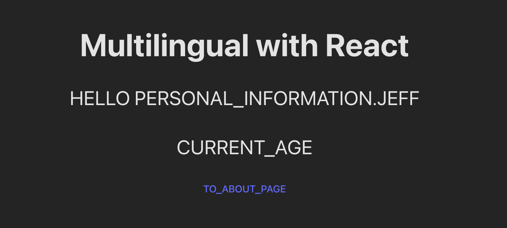

+++
author = "Jeff Chang"
title = "Multilingual React App with i18next Typescript"
date = "2023-05-01"
description = "Are you looking to implement multilingual support for your React app? If so, you've come to the right place! In this tutorial, we will be using the i18n NPM package to achieve this functionality."
tags = [
    "react",
]
categories = [
    "React","Typescript"
]
image = "cover.jpg"
+++

## Table of contents

- [Introduction](#introduction)
- [Understand the concept](#understand-the-concept)
- [Initialize translation module](#initialize-our-translation-module)
- [Implement language switcher](#implement-language-switcher)
- [Translate our application based on the last preference language](#integrate-with-local-storage)
- [Final outcome](#final-outcome)

### Introduction<a name="introduction"></a>

Before we get started, it's high recommend to clone the [Github repo](https://github.com/Jeffcw96/multilingual-react-app) and we can follow along with the article contents.

The first step after we downloaded the repo is to checkout the the **starter** folder and run `npm install` and `npm run dev` to start our React app locally.

### Understand the concept<a name="understand-the-concept"></a>

You should see the following UI after you start the server


You may wonder the wordings here look a little bit weird as it is fully uppercase and the words are joined with underscore. You may checkout the folders under _/src/language/en.ts_ and _/src/language/cn.ts_ and you may aware the words showing in our homepage are actually the keys of these translations.

What are we going to do later is we will utilize some methods from the [react-i18next](https://www.npmjs.com/package/react-i18next) and translate these keys into it's own translation value.

### Initialize translation module<a name="initialize-translation-module"></a>

We can now navigate to the _/src/language.ts_ file start configuring our translation module.

```ts
import i18n from "i18next";
import { initReactI18next } from "react-i18next";
import { cn, en } from "./languages";

i18n.use(initReactI18next).init({
  resources: {
    cn: { translation: cn },
    en: { translation: en },
  },
  lng: "en",
  fallbackLng: "en",
});

export default i18n;
```

#### Explaination

1. We first pass the `i18n` instance to `react-i18next`.
2. Initialize the instance with necessary options.
   - We could pass more keys into the [resources](https://www.i18next.com/overview/configuration-options#languages-namespaces-resources) field if we have more language to be translated.
   - `cn: { translation: cn }`. This line of code means we can switch our application language by passing in `cn` or `en` into the [changeLanguage](https://www.i18next.com/overview/api#changelanguage) method. We also need to specified the objects when the language is selected. For example, we are passing in the languages file we have earlier into it's respective resources key.
3. The `lng` is refering to the default language use when the application is loaded
4. `fallbackLng` is stands for fall back language which will be used when the given language is not available.

### Implement language switcher<a name="implement-language-switcher"></a>

We can now navigate to the _/src/App.tsx_ file to implement the language switcher logic.

```tsx
import i18n from "./language";
import { Routes, Route } from "react-router-dom";
import "./App.css";
import About from "./About";
import Home from "./Home";

function App() {
  function changeLanguage(language: "en" | "cn") {
    i18n.changeLanguage(language);
  }

  return (
    <>
      <Routes>
        <Route path="/" element={<Home />} />
        <Route path="/about" element={<About />} />
      </Routes>
      <button onClick={() => changeLanguage("en")}>English</button>
      <button onClick={() => changeLanguage("cn")}>Chinese</button>
    </>
  );
}

export default App;
```

#### Outcome

<video controls muted style="width:100%">
  <source src="starter-react-multilingual.mov" type="video/mp4">
  <source src="starter-react-multilingual.ogg" type="video/ogg">
</video>

#### Explaination

We can utilize the [changeLanguage](https://www.i18next.com/overview/api#changelanguage) method to change the language and it's now working great where it will stick back to the selected language even if we navigate to other page. However, it's **not working** when we are having hard refresh or we enter the url by ourselve. One of the reason is because, when we are doing hard refreshing and changing the web url directly, no state will be preserved and React will actually rerender our UI. This cause as issue if we have selected `cn` at the beginning but our default language is `en`

### Translate our application based on the last preference language<a name="integrate-with-local-storage"></a>

We can then integrate with the `useLocalStorage` hook, _the code is ready in the starter pack_ and here is what the final implementation looks like.

```tsx
import i18n from "./language";
import { Routes, Route } from "react-router-dom";
import "./App.css";
import About from "./About";
import Home from "./Home";
import { useEffect } from "react";
import { useLocalStorage } from "./hooks/useLocalStorage";

function App() {
  const [defaultLanguage, setDefaultLanguage] = useLocalStorage(
    "language",
    "en"
  );
  function changeLanguage(language: "en" | "cn") {
    i18n.changeLanguage(language);
    setDefaultLanguage(language);
  }

  useEffect(() => {
    i18n.changeLanguage(defaultLanguage);
  }, [defaultLanguage]);

  return (
    <>
      <Routes>
        <Route path="/" element={<Home />} />
        <Route path="/about" element={<About />} />
      </Routes>
      <button onClick={() => changeLanguage("en")}>English</button>
      <button onClick={() => changeLanguage("cn")}>Chinese</button>
    </>
  );
}

export default App;
```

#### Explaination

1. Firstly, we imported and initialize the `useLocalStorage` hook. There is 1 value and 1 function returned from the hook where are the current language store in the our browser's local storage, another is the function that allows us to update our preference language in local storage
   - This hook required 2 arguments which are the key in our local storage and the default value for the given key
2. We can then slightly modify our `changeLanguage` function to include the update to local storage as well by calling `setDefaultLanguage(language)`
3. We also utilized the [useEffect](https://react.dev/reference/react/useEffect) hook to handle the preference language stored in the local storage when everytime our App is refreshed or loaded.

### Final Outcome<a name="final-outcome"></a>

<video controls muted style="width:100%">
  <source src="final-react-multilingual.mov" type="video/mp4">
  <source src="final-react-multilingual.ogg" type="video/ogg">
</video>
