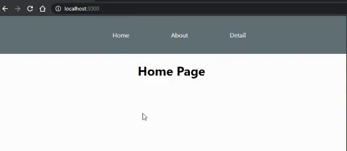

+++
author = "Jeff Chang"
title= "React Router Dom" 
date= "2021-03-05"
description= "React router dom is using dynamic routing which allows us to handle our route in web app in the way that we can create and customize our own url and render based on different components" 
tags = [
    "react",
]
categories = [
    "React","Javascript"
]
image = "cover1.jpg"
+++

There are few sections we are going to introduce in this article:
* [Setup React Router Dom](#setup)
* [Explanation of BrowserRouter, Switch, Route, Link](#explanation)
* [Define our own router](#customization)

<h2>Let's have a look on a short demo below</h2>

## Setup React Router Dom
To setup react router dom, we first need to install and import into our Web App `npm i react-router-dom`  
Next, kindly create few components so that it can be used in the router later on. 
It can be a very simple component such as return a `<h1>` DOM.

Detail.js


import React from 'react'
export default function Detail() {
    return (
        

            <h1>Detail Page</h1>
        

    )
}


About.js


import React from 'react'
export default function Detail() {
    return (
        

            <h1>About Page</h1>
        

    )
}


App.js


import React from 'react';
import './App.css';
import About from './About';
import Detail from './Detail';
import { BrowserRouter as Router, Switch, Route } from 'react-router-dom';

function App() {
  return (
    <Router>
      

        <Switch>
          <Route path="/" exact component={Home} />
          <Route path="/about" component={About} />
          <Route path="/detail" exact component={Detail} />
        </Switch>
      

    </Router>
  );
}

const Home = () => (
  

    <h1>Home Page</h1>
  

)

export default App;


### Explanations
1. Basically there are 3 main features required in order to use react router which are **Router**, **Switch** and **Route**.
2. As we can easily guess based on their naming. **Router** is like a parent element which will wrap all the **Route** inside. 
3. **Switch** Renders the first child <Route> or <Redirect> that matches the location (Route path).
4. **Route** basically takes in 2 parameters which are the path `url link' and the component to render. 
5. But there is a special condition where we mentioned in point 3 **Switch** will render the first child which matched with the url. Meaning to say it will still render the `<Home />` component even we want visit the url `/about` as it first match with the `/` url. 
6. This is where `exact` come into play. `Exact` allow us to only render the component repectively if the location/ url is totally match with the path value.

Nav.js


import React from 'react'
import { Link } from "react-router-dom";
export default function Nav() {
    const navStyle = {
        color: 'white',
        textDecoration: 'none'
    };

    return (
        <nav>
            <ul className="nav-link">
                <Link style={navStyle} to="/">
                    <li>Home</li>
                </Link>
                <Link style={navStyle} to="/about">
                    <li>About</li>
                </Link>
                <Link style={navStyle} to="/detail">
                    <li>Detail</li>
                </Link>
            </ul>
        </nav>
    )
}


ItemDetails.js


import React from 'react'

export default function ItemDetails({ match }) {
    return (
        

            //match will return an object will has a field called params. Inside params will list the object field and value
            <h1>{match.params.id}</h1> 
        

    )
}


App.js <strong>(updated)</strong>


import React from 'react';
import './App.css';
import Nav from './Nav';
import About from './About';
import Detail from './Detail';
import ItemDetails from './ItemDetails'; 
import { BrowserRouter as Router, Switch, Route } from 'react-router-dom';

function App() {
  return (
    <Router>
      

        <Nav /> //Add component outside of the "Switch" so that it will render in every location
        <Switch>
          <Route path="/" exact component={Home} />
          <Route path="/about" component={About} />
          <Route path="/detail" exact component={Detail} />
          <Route path="/detail/:id" component={ItemDetails} />  // ":id" allow us to pass different value into this path
        </Switch>
      

    </Router>
  );
}

const Home = () => (
  

    <h1>Home Page</h1>
  

)

export default App;



### Explanations
1. **Link** from react router allow us to navigate into different **url** which matched from it's parameter called `to`
2. As we can observe from the updated App.js code. We added the component `<Nav />` outside the `Switch` route and this will save our time as it will render in every component from the **Route**.
3. We also added a new **Route** which it's path is `path="/detail/:id"`. This is useful when we do not have fix url as the keyword `:id` allows us to pass in different.
4. Let's say we enter http://localhost:3000/detail/testing in our browser.Then, we will see `testing` will be render in the `<ItemDetails/>` component as we uses `{match.params.id}` to call out the value.   

Console log of <strong>match object</strong>


isExact: true
params: {id: "testing"}
path: "/detail/:id"
url: "/detail/testing"


