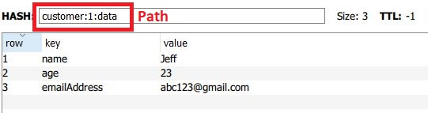
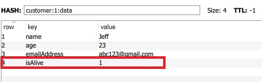
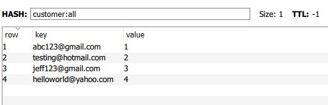

+++
author = "Jeff Chang"
title = "Redis Hash"
date = "2020-11-08"
description = "Redis Hashes are maps between string fields and string values (key-value pair), so they are the perfect data type to represent objects."
tags = [
    "redis", "go"
]
categories = [
	"Redis", "GO"
]
metakeywords = "github.com/go-redis/redis, redis with golang, redis hash, redis, nosql, redis data type, HSet, HMSet, HGetAll, HGet, HExist"
image = "cover.jpg"
+++

It will be useful for store multiple data that come from an object such as Customer and inside Customer object we have their Name, Age, Address and other info.

Because Redis isn't like some of the SQL or NO-SQL languages that will auto generate ID when we create the instance or model.
As a result, it's important to plan and think of the redis structure before we move on to construct them so that later on we can easily access and get the desired data.

In this article, we will be import and use few default package from Golang and Github for [go-redis](https://github.com/go-redis/redis). If you are not sure how to install **Redis Server** in Window. Make sure you checkout my [previous blog to install redis](/p/setup-redis-on-window/)

import (
	"github.com/go-redis/redis"
)


Before we start to use the Redis command, we need to initialize and connect to our redis server

var Client = redis.NewClient(&redis.Options{
	Addr:        "localhost:6379" //your redis address with the port. Default is localhost:6379
	Password:    "", //password if applicable
	DB:          1, //Redis offering 16 DB in total. 0 ~ 15 will be alright
	ReadTimeout: 10 * time.Minute,
})


## Incr and HMSet
As mentioned earlier, redis will not auto generate the ID for every model. As a result, we need to create the customer ID ourself. In this case, we uses the command **Incr** to get the integer value. By default, we do not have any structure for storing the ID. So it will increment from 0 to 1. If that's exist value in the key, it will increment by one respectively.

customerId := Client.Incr("customer:ids").Val() /*Return 1*/


As Redis Hash is in key-value pair, so we can create a [Map](https://gobyexample.com/maps) to store all the customer data

customer := make(map[string]interface{})
customer["name"] = "Jeff"
customer["age"] = 23
customer["emailAddress"] = "abc123@gmail.com"


And now we can Set them in redis server by using **HMSet** command. Since **Incr** command return integer data type, so we need to convert them into string.
HMSet takes in 2 argument where first one is the path, second will be the Map Object

//HMSet(key string, fields map[string]interface{})
Client.HMSet("customer:"+strconv.FormatInt(customerId, 10)+":data", customer)


## HSet
Let's say if we need to update the field by inserting new data. **HSet** will be a good choice for taking single key field and single value field.
HSet takes in 3 argument where first one will be the path, second is the key, and third will be the value.

//HSet(key, field string, value interface{})
Client.HSet("customer:1:data", "isAlive", true)


## HGetAll
**HGetAll** is the command to get all the data from the particular redis path. 
It only takes in one parameter which is the redis path and we need to specify the method whether to be **.Val()** or **.Result**.
Let's closely look what is the different between this 2 command in the go-redis package file *(commands.go)*

//.Val()
func (cmd *StringStringMapCmd) Val() map[string]string {
	return cmd.val
}

//.Result()
func (cmd *StringStringMapCmd) Result() (map[string]string, error) {
	return cmd.val, cmd.err
}

### Val() vs Result()
As we can see **Val()** returns only one value which is the entire Object of the redis path while **Result()** returns 2 values which are Object as well as the error. So, we can utilize and determine to use these 2 commands in different situations for example, **Result()** will be more suitable when we are dealing something with the condition or error.

Let's execute the **HGetAll** command and see what response we get.

customerData := Client.HGetAll("customer:1:data").Val()
fmt.Println(customerData) /*return map[age:23 emailAddress:abc123@gmail.com isAlive:1 name:Jeff]*/


Because **Val()** and **Result()** methods will return the Map object while their both key and value are in **String** data type. So it will convert our boolean data
1 = **true**, 0 = **false**. However, it's very easy to convert them back into our desired data type by using [strconv package](https://golang.org/pkg/strconv/)


isAlive, _ = strconv.ParseBool(customerData["isAlive"])
fmt.Println(isAlive) /*return true*/


## HGet
HGet command taks in 2 parameters which is the redis path and the key field

customerName := Client.HGet("customer:1:data", "name").Val()
fmt.Println(customerName) /*return 'Jeff'*/


## HExist
Let's say we now have multiple email data in a key call **customer:all** and we wanted to check whether our desired email is existed or not.

Instead of having the standard way which is get all the object in the particular path by using **HGetAll** and check with if else statement. We can use **HExist** command to check our desired value is in the redis path or not. It takes in 2 parameters which are the path and the key field want to search


isExist := Client.HExists("customer:all", "jeff123@gmail.com").Val()
fmt.Println(isExist) /*return true*/


{}

