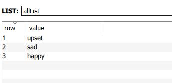

+++
author = "Jeff Chang"
title = "Redis List"
date = "2020-11-29"
description = "Redis Lists are simply lists of strings, sorted by insertion order. It is possible to add elements to a Redis List pushing new elements on the head (LPUSH) or on the tail (RPUSH) of the list."
tags = [
    "redis", "go"
]
categories = [
	"Redis", "GO"
]
image = "cover.jpg"
metakeywords = "github.com/go-redis/redis, redis with golang, redis list, redis, nosql, redis data type, LSET, LRANGE, LPUSH, RPUSH, LPOP, RPOP"
+++

We will be covered few basic commands for this **List** data type. We also will use the [go-redis](https://github.com/go-redis/redis) package for some having some example code wrriten in Golang.

* [LRANGE](#LRANGE)
* [LPUSH](#LPUSH-RPUSH)
* [LPOP](#LPOP-RPOP)
* [RPUSH](#LPUSH-RPUSH)
* [RPOP](#LPOP-RPOP)
* [LSET](#LSET)

### Setup and connect redis server in Golang

var Client = redis.NewClient(&redis.Options{
	Addr:        "localhost:6379" //your redis address with the port. Default is localhost:6379
	Password:    "", //password if applicable
	DB:          1, //Redis offering 16 DB in total. 0 ~ 15 will be alright
	ReadTimeout: 10 * time.Minute,
})


## LRANGE

LRANGE command basically takes in 3 parameters, which are the key, start position and end position. 0 being the first element of the list (the head of the list), 1 being the next element, and so on. These offsets can also be negative numbers indicating offsets starting at the end of the list. For example, -1 is the last element of the list, -2 the penultimate, and so on.
Let's say now we have multiple data are storing in the same key called *allList*, we can use LRANGE command to get them all or get them according to specific position

<code>LRANGE allList 1 2</code>
<code style="display:block; color:#ED9D1F">> sad</code>
<code style="display:block; color:#ED9D1F">> happy</code>

<code>LRANGE allList 0 -1</code>
<code style="display:block; color:#ED9D1F">> upset</code>
<code style="display:block; color:#ED9D1F">> sad</code>
<code style="display:block; color:#ED9D1F">> happy</code>

#### In go-redis (LRange)

//Client.LRange("key", start, end)
Client.LRange("allList", 1, 2) /*return [sad, happy]*/
Client.LRange("allList", 0, -1) /*return [upset, sad, happy]*/


{}

## LPUSH && RPUSH

<strong>LPUSH >></strong> Insert all the specified values at the <strong>head</strong> of the list stored at key. 
<strong>RPUSH >></strong> Insert all the specified values at the <strong>back/ tail</strong> of the list stored at key. 
If key does not exist, it is created as empty list before performing the push operations.

<code>LPUSH allList "angry"</code>
<code>LRANGE allList 0 -1</code>
<code style="display:block; color:#ED9D1F">> angry</code>
<code style="display:block; color:#ED9D1F">> upset</code>
<code style="display:block; color:#ED9D1F">> sad</code>
<code style="display:block; color:#ED9D1F">> happy</code>

<code>RPUSH allList "angry"</code>
<code>LRANGE allList 0 -1</code>
<code style="display:block; color:#ED9D1F">> upset</code>
<code style="display:block; color:#ED9D1F">> sad</code>
<code style="display:block; color:#ED9D1F">> happy</code>
<code style="display:block; color:#ED9D1F">> angry</code>

#### In go-redis (LPUSH && RPUSH)

Client.LPush("allList", "angry") 
Client.LRange("allList", 0, -1) /*return [angry, upset, sad, happy]*/
Client.LPush("allList", "satisfied", "grateful") /*allList > [grateful, satisfied, angry, upset, sad, happy]*/

/* ----------------------------------------------------------------------------------------- */
Client.RPush("allList", "angry") 
Client.LRange("allList", 0, -1) /*return [upset, sad, happy, angry]*/
Client.LPush("allList", "satisfied", "grateful") /*allList > [upset, sad, happy, angry, satisfied, grateful]*/


{}

## LPOP && RPOP

<strong>LPOP >></strong> Remove the <strong>first</strong> element store in the list at selected key 
<strong>RPOP >></strong> Remove the <strong>last</strong> element store in the list at selected key 

<code style="display:block; color: black">LRANGE allList 0 -1</code>
<code style="display:block; color:#ED9D1F">> angry</code>
<code style="display:block; color:#ED9D1F">> upset</code>
<code style="display:block; color:#ED9D1F">> sad</code>
<code style="display:block; color:#ED9D1F">> happy</code>

<code style="display:block;">LPOP allList</code>
<code>LRANGE allList 0 -1</code>
<code style="display:block; color:#ED9D1F">> upset</code>
<code style="display:block; color:#ED9D1F">> sad</code>
<code style="display:block; color:#ED9D1F">> happy</code>

<code style="display:block;">RPOP allList</code>
<code>LRANGE allList 0 -1</code>
<code style="display:block; color:#ED9D1F">> angry</code>
<code style="display:block; color:#ED9D1F">> upset</code>
<code style="display:block; color:#ED9D1F">> sad</code>

#### In go-redis (LPOP && RPOP)

Client.LRange("allList", 0, -1) /*return [angry, upset, sad, happy]*/
Client.LPop("allList") /*allList > [upset, sad, happy]*/

/* ----------------------------------------------------------------------------------------- */

Client.LRange("allList", 0, -1) /*return [angry, upset, sad, happy]*/
Client.RPop("allList") /*allList > [angry, upset, sad]*/


{}

## LSET
Update the element inside the list by specifying the index
<code style="display:block; color: black">LRANGE allList 0 -1</code>
<code style="display:block; color:#ED9D1F">> angry</code>
<code style="display:block; color:#ED9D1F">> upset</code>
<code style="display:block; color:#ED9D1F">> sad</code>
<code style="display:block; color:#ED9D1F">> happy</code>

<code style="display:block;">LSET allList 0 'determined'</code>
<code style="display:block;">LSET allList -1 'disappointed'</code>
<code>LRANGE allList 0 -1</code>
<code style="display:block; color:#ED9D1F">> determined</code>
<code style="display:block; color:#ED9D1F">> upset</code>
<code style="display:block; color:#ED9D1F">> sad</code>
<code style="display:block; color:#ED9D1F">> disappointed</code>

#### In go-redis (LPOP && RPOP)

Client.LRange("allList", 0, -1) /*return [angry, upset, sad, happy]*/
Client.LSet("allList", 0, "determined") /*allList > [determined, upset, sad, happy]*/
Client.LSet("allList", -1, "disappointed") /*allList > [determined, upset, sad, disappointed]*/


{}

