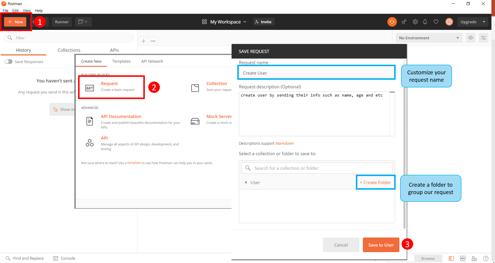
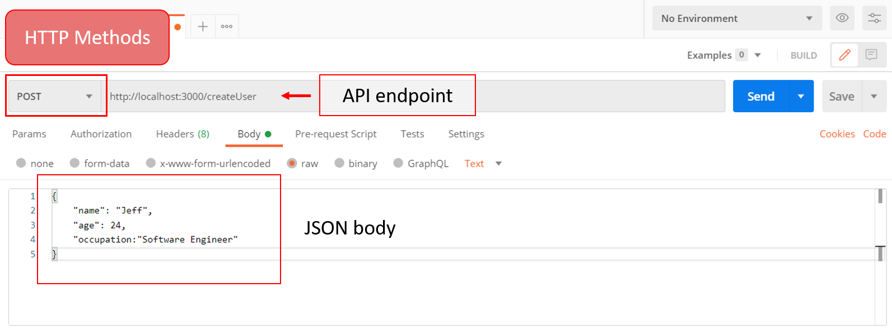
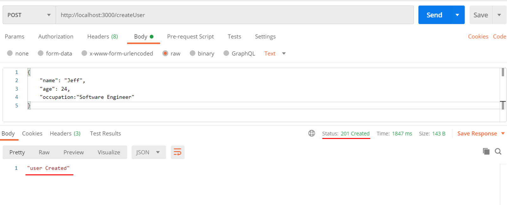
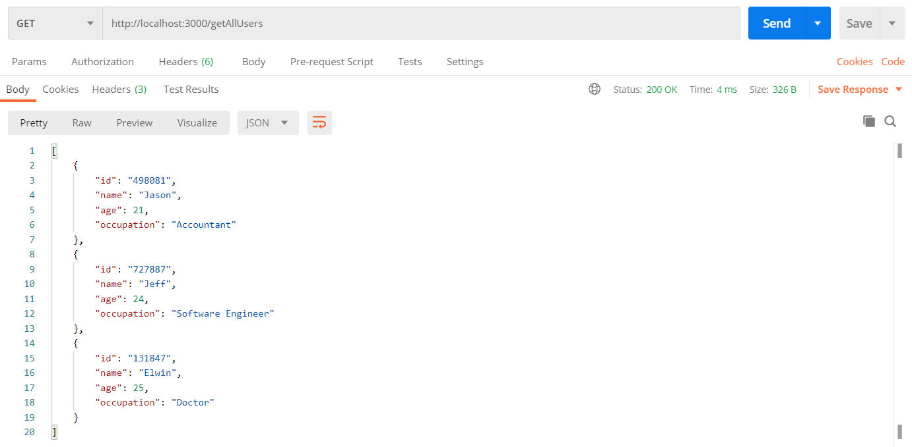
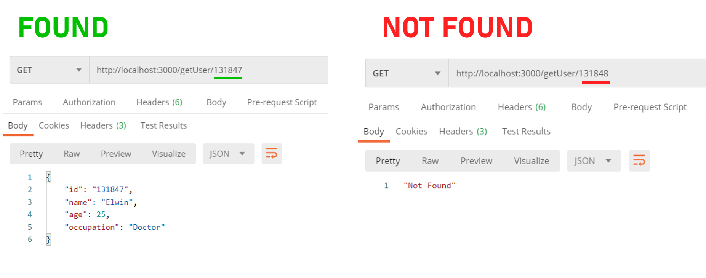
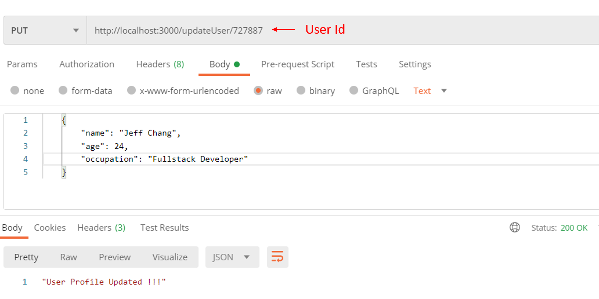
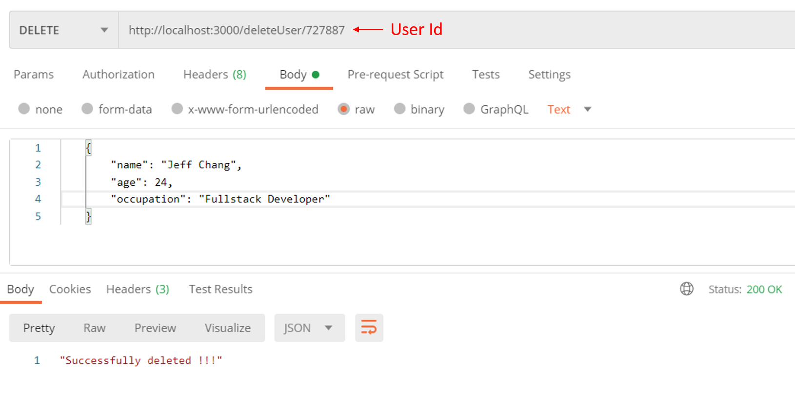

+++
author = "Jeff Chang"
title = "REST API with Go"
date = "2020-12-15"
description = "In this article, we are going to build a simple restful service with Golang by using Gorilla Mux package"
tags = [
    "go", 
]
categories = [
    "GO", 
]
metakeywords = "Golang, Restful, Rest API, Restful service, Full Stack Development, HTTP protocol"
image = "cover.jpg"
+++

### Prerequisites:

* Before everything started. Please make sure you have installed [GO and set as your environment variable.](https://golang.org/doc/install).
* It would be better if you already understand how to [create a simple web server with GO](/p/setup-go-server).

We will be covered 4 common HTTP methods in our REST API as well as the testing tool for testing each endpoints
* [Postman](#postman)
* [POST](#post)
* [GET](#get)
	* [GET BY ID](#getbyid)
* [PUT](#put)
* [DELETE](#delete)

## Postman
[Postman](https://www.postman.com/downloads/) is a great tool when trying to dissect RESTful APIs made by others or test ones you have made yourself. Their interface is very user-friendly. For example we can always specific different HTTP methods *like POST, GET, PUT, and etc* from the dropdown menu. 

Figure below is showing a simple way to create a request as well as categorize or group them into a collection

We are making a sample POST request. *Noted: we can define our JSON body by clicking **Body** > **raw***

Before we started to make any HTTP requests. There are few packages we going to use in this example:

import (
	"encoding/json"
	"fmt"
	"math/rand"
	"net/http"
	"strconv"

        //package to serve our HTTP request and server
	"github.com/gorilla/mux"
)


We also need to declare a struct and a slice so that we can use and append them later on in the memory.

type User struct {
	Id         string `json:"id"`
	Name       string `json:"name"`
	Age        int64  `json:"age"`
	Occupation string `json:"occupation"`
}

var allUsers []User


#### Setup Server and registered routes

func main() {
	router := mux.NewRouter()

        //router.HandleFunc("<endpoint>", <function name>).Methods("<HTTP method>")
	router.HandleFunc("/createUser", CreateUser).Methods("POST")
	router.HandleFunc("/getAllUsers", GetUsers).Methods("GET")
	router.HandleFunc("/getUser/{id}", GetUserById).Methods("GET")
	router.HandleFunc("/updateUser/{id}", UpdateUser).Methods("PUT")
	router.HandleFunc("/deleteUser/{id}", DeleteUser).Methods("DELETE")

	fmt.Println("Server is at Port 3000")
	http.ListenAndServe(":3000", router)
}

As you can see there are multiple routes function above which will be the examples we going to discussed later on
Now, run the file by inserting the commands in command prompt `go build` , `go run main.go`. Then you should see the sentence  
`Server is at Port 3000` in the log.

{} 

## POST
Let's start with our very first POST request. As showing from the code above. We are using the function `CreateUser` to serve the router url `/createUser`.   
And this is how the function looks like:


func CreateUser(w http.ResponseWriter, r *http.Request) {
	var user User                              //initialize with struct
	json.NewDecoder(r.Body).Decode(&user)      //passing JSON object to struct
	user.Id = strconv.Itoa(rand.Intn(1000000)) //Generate random ID
	allUsers = append(allUsers, user)          //save user into all users in memory
	w.Header().Set("Content-Type", "application/json; charset=UTF-8")
	w.WriteHeader(http.StatusCreated)
	json.NewEncoder(w).Encode("user Created")
}

##### Explanation
1. Initialize the variable with struct (User)
2. Decode the JSON object from request body into the variable
3. Assign ID to the object. <small><em>Note: Assign random number as ID is not recommended as it has the duplicated possibility</em></small>
4. Save the variable into array as total user

##### Test POST Request <small><code>http://localhost:3000/createUser</code></small>
Let's test this API by calling it from our POSTMAN

{} 

## GET
This API is designed to get all user information which basically return the value from the array `allUsers`  
Please call the `CreateUser` API for few more times so that we can observe the result clearly.

Let's see how the route and function (`router.HandleFunc("/getAllUsers", GetUsers).Methods("GET")`) looks like:

func GetUsers(w http.ResponseWriter, r *http.Request) {
	w.Header().Set("Content-Type", "application/json; charset=UTF-8")
	json.NewEncoder(w).Encode(allUsers)
}

##### Explanation
1. You may wondering why we can directly encode and response back with the array variable `allUsers`
2. It's because currently, all data are being stored in the memory. In the sense that, all variables will be reset if we restart our server.
3. Is real world application. Those data most likely are being stored in the database. For example: 
    *  Every time user make API request, we first capture and have some internal process such as filtering, conditional matching and so on.
    *  Then we will store them are get them from the database

##### Test GET Request <small><code>http://localhost:3000/getAllUsers</code></small>

### GET Info by ID
As we can see from the route `router.HandleFunc("/getUser/{id}", GetUserById).Methods("GET")`. The parameter `id` is being cover by the curly bracket. This allow us to customize the value to be passed in. For example, based on the photo above, we know the id of the user **ELWIN** is **131847**. We can then set our end point to <small><code>http://localhost:3000/getUser/131847</code></small> to get the particular user info. 


func GetUserById(w http.ResponseWriter, r *http.Request) {
	params := mux.Vars(r) //Get the custom value from endpoint variable
	w.Header().Set("Content-Type", "application/json; charset=UTF-8")

	for _, user := range allUsers {
		if params["id"] == user.Id {
			json.NewEncoder(w).Encode(userDetails)
			return
		}
	}
	w.WriteHeader(http.StatusNotFound)
	json.NewEncoder(w).Encode("Not Found")
}

##### Explanation
1. Gorilla Mux package is already comes with the function `mux.Vars(r)` which takes the `http.Request` as parameter and returns a map of the segments (`parameter[<custom variable name from endpoint>]`).
2. So we can iterate `allUsers` variable and find the matched ID.
3. Return the user profile if found. Otherwise, return Not found as status 404

##### Test GET BY ID Request <small><code>http://localhost:3000/getUser/131847</code></small>

{} 

## PUT
**PUT** request method is usually being use when we want to update the existing record. It basically first delete the currently record and then append the new record. We also need to know which record to be updated by specifying their id.  
Let's see how the route and function (`router.HandleFunc("/updateUser/{id}", UpdateUser).Methods("PUT")`) looks like:


func UpdateUser(w http.ResponseWriter, r *http.Request) {
	params := mux.Vars(r)
	w.Header().Set("Content-Type", "application/json; charset=UTF-8")

	for index, user := range allUsers {
		if params["id"] == user.Id {
			var user User

			//Slice our all users except the user which match with the ID
			allUsers = append(allUsers[:index], allUsers[index+1:]...) 
			json.NewDecoder(r.Body).Decode(&user)
			user.Id = params["id"]
			allUsers = append(allUsers, user) //Append need 
			json.NewEncoder(w).Encode("User Profile Updated !!!")
			return
		}
	}
	w.WriteHeader(http.StatusNotFound)
	json.NewEncoder(w).Encode("User Not Found")
}

##### Explanation
1. Iterate `allUsers` variable and find the matched ID
2. `allUsers = append(allUsers[:index], allUsers[index+1:]...)` this code basically slice out all values except the matched ID value :
	* We first append the value from index **0** up to the index which matched with the ID.
	* We then append the value **right after** the index of matched ID to the end of the array
3. Decode the new JSON body and update their id by getting from the route parameter. *Note: You can also straight away putting this id in your JSON body, then you would need to remove the parameter < id > from the route endpoint*
4. Return status 404 if user is not found
5. Kindly test the code by calling [GET all user](#get) API

##### Test Update User Request <small><code>http://localhost:3000/updateUser/727887</code></small>

{} 

## DELETE
**DELETE** from this example is quite similar to the **PUT** request we discussed earlier. It basically update the allUsers variable by slicing out every value except the ID that matched with the route parameter.  
Let's see how the route and function (`router.HandleFunc("/deleteUser/{id}", DeleteUser).Methods("DELETE")`) looks like:


func DeleteUser(w http.ResponseWriter, r *http.Request) {
	params := mux.Vars(r)
	w.Header().Set("Content-Type", "application/json; charset=UTF-8")

	for index, user := range allUsers {
		if params["id"] == user.Id {
			allUsers = append(allUsers[:index], allUsers[index+1:]...)
			json.NewEncoder(w).Encode("Successfully deleted !!!")
			return
		}
	}

	w.WriteHeader(http.StatusNotFound)
	json.NewEncoder(w).Encode("User Not Found")
}

##### Explanation
1. Iterate `allUsers` variable and find the matched ID
2. `allUsers = append(allUsers[:index], allUsers[index+1:]...)` this code basically slice out all values except the matched ID value :
	* We first append the value from index **0** up to the index which matched with the ID.
	* We then append the value **right after** the index of matched ID to the end of the array
3. Return status 404 if user is not found.
4. Kindly test the code by calling [GET all user](#get) API
##### Test Update User Request <small><code>http://localhost:3000/deleteUser/727887</code></small>

{}

