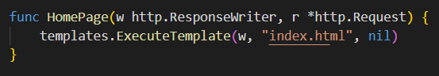

+++
author = "Jeff Chang"
title = "Build Your Backend Server with GOLANG"
date = "2020-08-21"
tags = [
    "go",
]
categories = [
    "GO",
]
metakeywords = "Golang, Server"
codeMaxLines = 1
+++

Want to build a web server but don't know how to start ?? We will be showing a step by step procedure from installation to configuration of server by using [Gorilla Mux Library](https://github.com/gorilla/mux)

## <!--more-->

 will be used for serving the router. First, we need to import the library to our web application.

We can now initialize our router

Mux router will execute the function respectively whenever the request is matched with the end point. Example below showing a simple **POST** request with gorilla mux, when the request path is matched with the end point **(“/getProductDetails”)** The **GetProductDetails** function will be executed. We will discuss more on how we can response back to the front end and other Methods such as _“GET, OPTIONS, PUT, DELETE”_.

Before we start to serve our serve, we need to create a homepage for it. We can use template from golang to serve a HTML template so that when we visit our server, this particular HTML file will be served and displayed. We can create a folder which will hold all template file.

Next, we will import the template library and create a variable for storing the html template.

 

We can now parse the html template file into our variable and serve as our website home page. As we only serve one html file for our template, So we can use template.ParseFiles. In case there are many template file to serve, we can use template.ParseGlob to point to the file directiory. The end point **“/”** means our home page. For example, we set our local host server in port **8080**. Then when we visit that page, the **index.html** will be served.

Finally, we can start and serve our server.

{}

