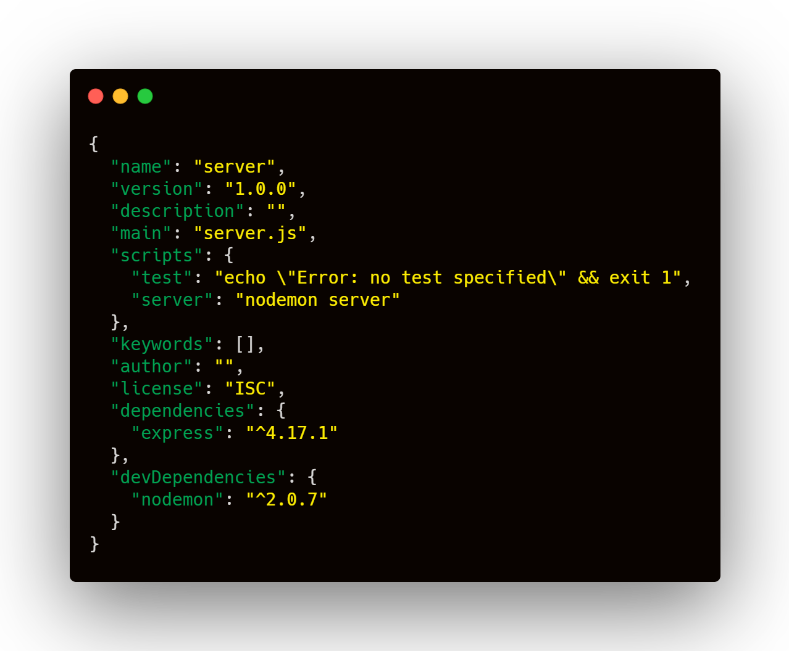
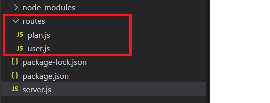

+++
author = "Jeff Chang"
title = "Setup Node server with express"
date = "2021-02-21"
description = "Setting up a server in node js is relatively easy especially with their framework Express. In this article, we will be going through how to setup a server with express, syntax is express server and organizing different routes into different directory"
tags = [
    "nodejs", "javascript"
]
categories = [
	"NodeJs", "Javascript"
]
image = "cover.jpg"
+++

* [Setting up package.json and install related dependencies](#packageJson)
* [Setup and listen to server](#server)
* [Organizing routes](#routes)

## Setting up package.json and install related dependencies 
* First and foremost, we can create a package.json file by opening the terminal **(Ctrl + `)** in Visual Studio Code and initializing the npm **(npm init)**
* After the package.json file is created. We can then install the 2 dependencies which are going to be used in this article. [Express](https://www.npmjs.com/package/express) in main dependency and [Nodemon](https://www.npmjs.com/package/nodemon) in dev dependency. Highly recommend **Nodemon** module which allow us to auto update the changes in our server without restarting it.
* Kindly add a new script command as `"server": "nodemon <your main js file>"` and create a new javascript file according to the value of `main:` property. In my case will be `server.js`

Then you should see your package.json file look something like this.

## Setup and listen to server 
To create a node server with express framework is quite straight forward.

const express = require('express');
const app = express();

app.get('/', (req, res) => {
    res.send('Server is running')
})

app.get('/test', (req, res) => {
    res.send('This is the test endpoint route')
})

app.listen(process.env.PORT || 5000, () => console.log(`Server has started. at PORT 5000`));


#### Explanation
1. Access the express module by calling `require('express')`
2. Config a server and assign into a variable `const app = express()`
3. Serve the http request according to different endpoint. **Note:** You can observe the response message **Server is running** by heading to http://localhost:5000 or **This is the test endpoint route** by heading to http://localhost:5000/test
4. Last but no least, config the listening port to the server. `process.env.PORT || 5000` means it will auto assign random port number if the port **5000** is not available

## Organizing routes 
Imagine if there a tons of api we need to handle. It will be very messy if we combine all of them into one server.js file.  
In this case we can orgranize them into different folder according to their endpoint referer. 
For example now we have different categories of endpoints such as  **http://localhost:5000/user/profile** and **http://localhost:5000/plan/premium**. We can then assign them into different directory as shown in below

Then we can add middleware to serve these api according to different directory.  
**server.js**

app.use("/plan", require('./routes/plan'))
app.use("/user", require('./routes/user'))


**user.js**

const express = require('express');
const router = express.Router()

router.get('profile', (req, res) => {
    res.send("user profile endpoint route") //You should see this message if you type 'http://localhost:5000/user/profile' in browser
})

module.exports = router


**plan.js**

const express = require('express');
const router = express.Router()

router.get('premium', (req, res) => {
    res.send("plan premium endpoint route") //You should see this message if you type 'http://localhost:5000/plan/premium' in browser
})

module.exports = router
