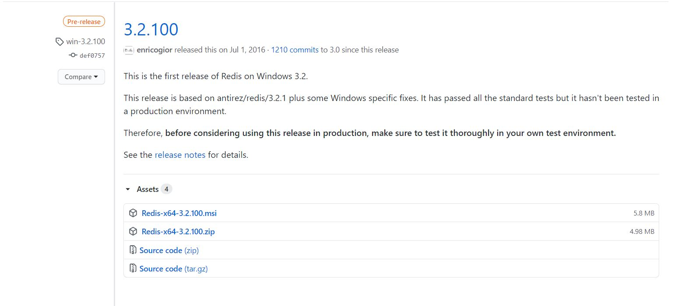
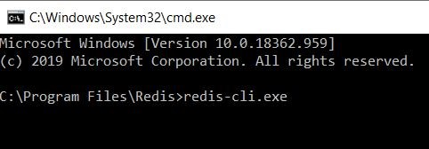
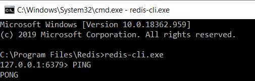
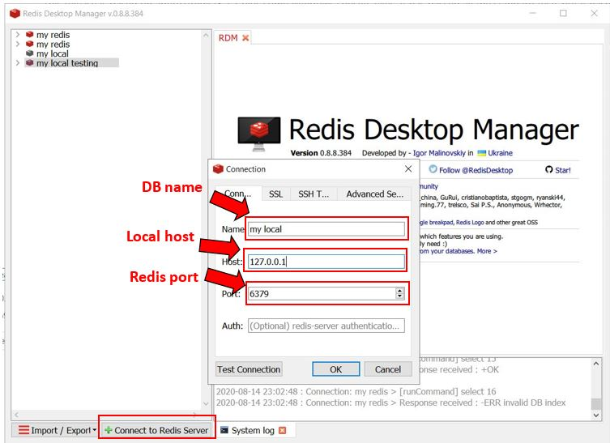

+++
author = "Jeff Chang"
title = "Setup Redis On Window"
date = "2020-08-20"
tags = [
    "redis",
]
categories = [
    "Redis",
]
metakeywords = "Redis, Redis Desktop Manager"
+++

In this article, we will show how to install and configure Redis on Window, We will be setting up the redis server, install Redis Desktop Manager as GUI 
<!--more-->
Redis is an in-memory data structure project implementing a distributed, in-memory key–value database with optional durability. Redis supports different kinds of abstract data structures, such as strings, lists, maps, sets, sorted sets.

Unfornately, the official website does not support redis on window anymore as it no longer being actively maintained on window. But, we can still download the file from github.

[Click Me to Download](https://github.com/microsoftarchive/redis/releases)
* Redis-x64-3.2.100.msi
* Redis-x64-3.2.100.zip

After successfully install, we can navigate to the redis file path. By default it will be stored in **C:\Program Files\Redis.**

To test whether it work correctly we can open command prompt in this particular folder and enter redis-cli.exe *(This command allow us to start writing redis code)*

If everything works perfectly, we will see out localhost follow by the redis port **(setup during installation, by default is 6379)** in next line. Then, we can check the response from redis server by entering **PING** and it will return **PONG** back.

The redis server is now successfully installed in our window ! ! !.

However, I strongly recommend to get a redis GUI software so that we can easily manage and monitor our data in the database.

I’m using **Redis Desktop Manager** in this case. We can easily enter our info as shown in figure below and all data storing in that particular port will be listed.

{}

