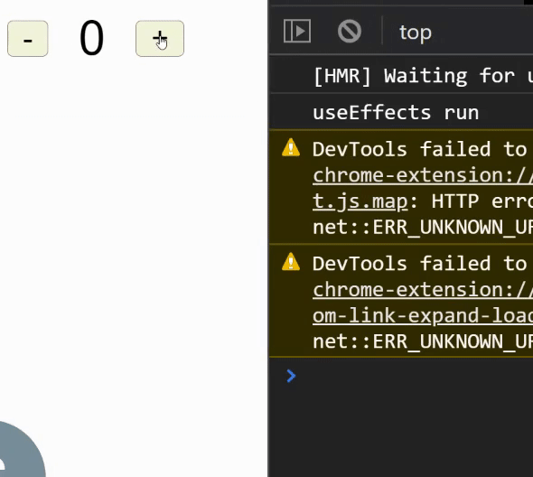

+++
author = "Jeff Chang"
title = "useEffect Hook"
date = "2020-12-27"
description = "useEffect is very useful especially when we wanted to execute blocks of code after the component has rendered. By default, effects run after every completed render, but you can also define to fire them only when certain values have changed which is good for the optimization."
tags = [
    "react"
]
categories = [
    "React","Javascript"
]
+++

## Declaration
* First and foremost, we need to import this hook from our React component.   `import { React, useEffect } from 'react'`
* Let's see how useEffect hook looks like  

    useEffect(() =>{
        //< Run after rendered >
    }, [< condition >])


## Conditions to call useEffect Hook
As we mentioned earlier, we can difine to fire the code inside the useEffect Hook based on certain values changed.  
We will be using back the previous example code which basically incrementing and decrementing the value by using [useState Hooks](/p/usestate-hook/). 


import { React, useState, useEffect } from 'react'
import './App.css';

function App() {
  let [state, setState] = useState(0)

  function Increment() {
    setState((prevState) => prevState + 2);
  }

  function Decrement() {
    setState((prevState) => prevState - 2);
  }

  useEffect(() => {
    console.log("useEffects run");
  })
  return (
    

      <button onClick={Decrement}>-</button>
      
{state}

      <button onClick={Increment}>+</button>
    

  );
}
export default App;

### Result

##### Explanation
As you can see we didn't add any condition in the useEffect hooks. Meaning to say the code `console.log("useEffects run")` will be called everytime the React render the component. *(State changed)*

### Fire Effects after certian state changed.
useEffect hook takes in an array paremeter <small><strong>More Than One</small></strong> for firing the code everytime the paremeters updated.

  useEffect(() => {
    console.log("useEffects run");
  },[state])


### call useEffect hook for only one time
If we never specify or left blank in the useEffect array parameter. It will then only run for one time. 
This will be useful when we are trying to call some APIs and render the data in our component

  useEffect(() => {
    fetch("https://gorest.co.in/public-api/users")
    .then((response)=>{
        return response.json()
    })
    .then((result) =>{
        // Render data into component
    })
  },[])
