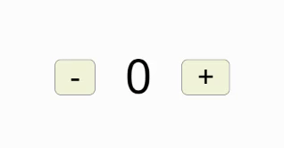
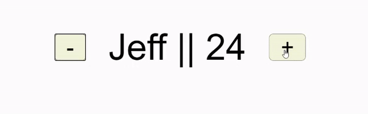
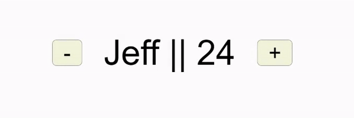

+++
author = "Jeff Chang"
title = "useState Hook"
date = "2020-12-27"
description = "useState hook is very useful in storing single form of data. It returns 2 parametes which are current state and the function to update the state. React will automatically show the latest state value when the current state has changed by rerendering the component. Usestate hook is very useful as we can utilize it to dynamically display the data we want."
tags = [
    "react"
]
categories = [
    "React","Javascript"
]
image = "cover.jpg"
+++

### It's would be better if you already understand  
* Basic setup of React application by entering the command `npx create-react-app < your-app-name >`
* Basic understanding of how React works

## Declaration
* First and foremost, we need to import this hook from our React component.   `import { React, useState } from 'react'`
* useState hook total takes in one parameter **(initial state**) and return 2 parameters **(current state)** and **(function to update the current state)**  

> [**< current state >**, **< function to update state >**] = `useState`(**< initial state >**)
> 
> For example:
> `[state, setState] = useState(0)`

#### Note: 
1. The initial state can be any data type or even null such as object, array, number, string and etc
2. Hook only can be use in functional component. *Not applicable in Class Component*
3. Hooks must be executed in order. In otherwords, we couldn't put the Hooks inside the condition statement like switch and if-else statement.

## Example

import { React, useState } from 'react'
import './App.css';

function App() {
  let [state, setState] = useState(0)

  function Increment() {
    setState(state + 1);
  }

  function Decrement() {
    setState(state - 1);
  }

  return (
    

      <button onClick={Decrement}>-</button>
      
{state}

      <button onClick={Increment}>+</button>
    

  );
}

export default App;

##### Result

##### Explanation
1. We first declare the state equal to 0 for the initial state. 
2. The state value is being passed to the variable called **state**. <small><em>Note: This can be any other naming like "count" and "setCount"</em></small>
3. We can then dynamically show the value from the **state** variable using JSX.
4. When the user click on the `-` button which will then trigger the function called `Decrement` and it will minus the current value by 1 by calling the setState function. 
5. When the user click on the `+` button which will then trigger the function called `Increment` and it will plus the current value by 1 by calling the setState function. 

## Previous State
Something we need to keep in mind is that we could not call the `setState` function for twice or more without updating it based on the previous state.  
For example, we wanted to decrement twice by calling the `setState(state - 1)` for 2 times  
##### Instead of this:

function Decrement() {
  setState(state - 1);
  setState(state - 1);
}


##### Use this

function Decrement() {
  setState((previousState) => previousState - 2)
}


## useState with Object type
Let's say we are working with the object type in useState hook which contains 2 fields `{Name and Age}`. And we use back the previous example function to increament and decrement the age of the user.

#### Example

import { React, useState } from 'react'
import './App.css';

function App() {
  let [state, setState] = useState({ name: "Jeff", age: 24 })

  function Increment() {
    setState((previousState) => {
      return { age: previousState.age + 1 }
    })
  }

  function Decrement() {
    setState((previousState) => {
      return { age: previousState.age - 1 }
    })
  }

  return (
    

      <button onClick={Decrement}>-</button>
      
{state.name} || {state.age} 

      <button onClick={Increment}>+</button>
    

  );
}

export default App;

##### Result

##### Explanation
* As we can see the property **Name** will be overwritten whenever we call the setState function. 
* This is because setState function is used to assign the new value to the state instead of updating based on the previous state.
* To update the property value without deleting or modifying other properties value in the object. We can use [Spread Operator to destructure the object](/p/es6-destructuring-array-and-object/#spread-operator-in-object)

#### Update state value from Object Type

function Increment() {
  setState((previousState) => {
    return { ...previousState, age: previousState.age + 1 }
  })
}

function Decrement() {
  setState((previousState) => {
    return { ...previousState, age: previousState.age - 1 }
  })
}


##### Result

## Additional Knowledge
We can always call a function only **ONCE** for our initial state value.  
This will be very useful when we have a slow or complex computation for our initial state.


function InitialState(){
  console.log("function only run once")
  return 0 //initial state will be 0
}

let [state, setState] = useState(() => InitialState())


### Summary
* Hook only can be use in functional component.
* Hooks must be executed in order.
* Make a good practice to update the state by calling the previous state. `setState((prevState) => < update state code here > )`
* Use spread operator to avoid overwriting of other properties when update some value from object.
