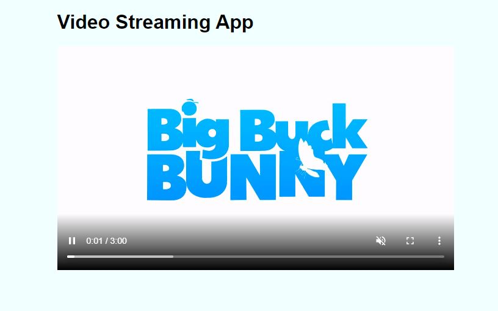

+++
author = "Jeff Chang"
title= "Video Streaming with Node Js" 
date= "2021-05-29"
description= "Last article, we have gone through how to how to read and write the file into a stream. In this article, we are going to build a simple video streaming app with Node Js" 
tags = [
    "nodejs", "javascript"
]
categories = [
	"NodeJs", "Javascript"
]
image = "cover.jpg"
+++
If you not sure how stream and buffer works. Make sure you checkout my [previous article](/p/stream-buffer) which talks about various methods from stream.  
Stream a video can help us speed up the waiting process which will naturally improves the user experience as well 
First of all, let's start a simple express server in port 3000 which will serve the index.html file. 

*index.html*

<!DOCTYPE html>
<html lang="en">
<head>
    <meta charset="UTF-8">
    <meta http-equiv="X-UA-Compatible" content="IE=edge">
    <meta name="viewport" content="width=device-width, initial-scale=1.0">
    <title>Video Streaming App</title>
    
</head>
<body>
    <h1>Video Streaming App</h1>
    <video id='videoPlayer' width="650" controls muted="muted" autoplay>
        <source src="/video" type="video/mp4"/>
    </video>
</body>
</html>


## Result

This article uses a Big Buck Banny video for demo. You may get more public test video from [https://gist.github.com/jsturgis/3b19447b304616f18657](https://gist.github.com/jsturgis/3b19447b304616f18657)

*server.js*

const express = require('express');
const app = express();
const fs = require('fs');

//Serve static file
app.get("/", (req, res) => {
    res.sendFile(__dirname + "/index.html")
})

app.get("/video", (req, res) => {
    // Need range header for telling client which part of the video we want to send back
    const range = req.headers.range;
    if (!range) {
        res.status(400).send("Require Range Header");
        return
    }

    const videoPath = 'bigbuck.mp4';
    const videoSize = fs.statSync(videoPath).size;

    const CHUNK_SIZE = 10 ** 6 // 10 power of 6 is 1MB
    const start = Number(range.replace(/\D/g, ""));// replace all non-digit characters to empty string and parse into Number

    // calculate the ending byte we want to response back to client. If it reached the end of file (total video size)
    //Then send back the video size instead
    const end = Math.min(videoSize - 1, start + CHUNK_SIZE);
    const contentLength = end - start + 1;
    const header = {
        "Content-Range": `bytes ${start}-${end}/${videoSize}`,        
        "Accept-Range": "bytes",
        "Content-Length": contentLength,
        "Content-Type": "video/mp4",
    };
    res.writeHead(206, header)
    const readStream = fs.createReadStream(videoPath, { start, end });
    readStream.pipe(res)
})

const PORT = process.env.PORT || 3000
app.listen(PORT, () => { console.log(`Server is Running at PORT ${PORT}`) })


### Result
Kindly open the url `http://localhost:3000` and open `Developer tool(F12)` -> `Network Tab` -> `Filter by Media`

<video controls autoplay style="max-width:100%">
    <source src="video-stream.mp4" type="video/mp4">
    <source src="video-stream.ogg" type="video/ogg">
</video>

### Explanation
1. As we can see from the video, when we jump to certain time frame of the video, it will immediately load a chunk of stream from the server to ensure the video can be play smoothly.
2. First of all, we need to get the value from [Range HTTP Request Header](https://developer.mozilla.org/en-US/docs/Web/HTTP/Headers/Range) so that we know what is the playing time of the video.
    - Example of range header: `bytes=4065540-`
3. Define the video path , size and total chunk size of the document to be loaded and response to client later. This article uses 1MB for the chunk size
4. There are several headers we need to define before we response back to the client 
   - [Content-Range](https://developer.mozilla.org/en-US/docs/Web/HTTP/Headers/Content-Range): indicates where in a full body message a partial message belongs
   - [Accept-Range](https://developer.mozilla.org/en-US/docs/Web/HTTP/Headers/Accept-Ranges): allow us to resume an interrupted download, rather than to start it from the start again. 
   - Content-Length: size of message body (bytes) we are send back to client
   - Content-Type: MIME type of the response
4. Response with the status code 206 which indicates it's partially content
5. Create a readable stream and read the file by providing the video path, start and end point. In the meantime, we can response back to the client with writable stream by using `pipe()` method
