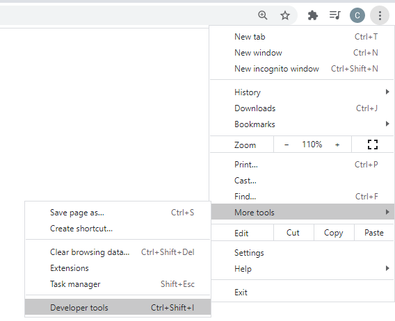
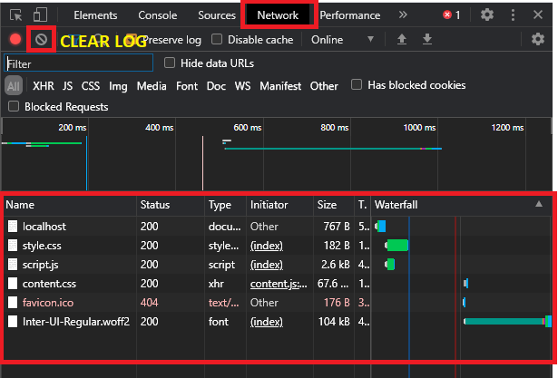
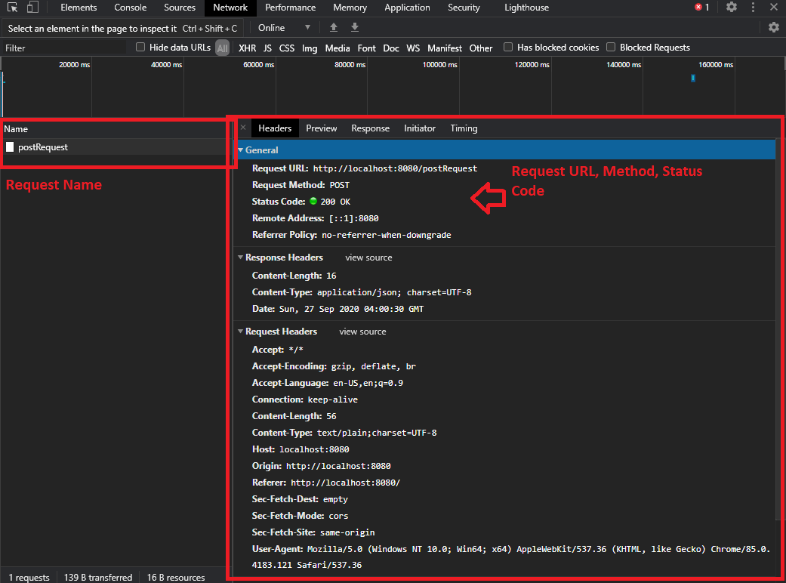
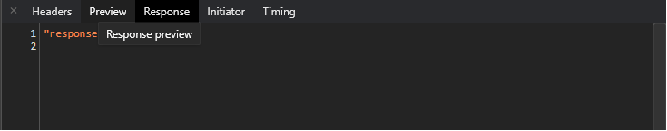

+++
author = "Jeff Chang"
title = "XMLHttpRequest vs Fetch API"
date = "2020-09-25"
description = "Let's compare the two web request tools: XMLHttpRequest vs Fetch API"
tags = [
    "javascript",
]
categories = [
    "Front-end","Javascript"
]
metakeywords = "Front-end, API Request, Fetch API, XHR Request"
image = "cover.jpg"
+++

**XMLHttpRequest(XHR)** objects are used to interact with servers, it uses the concept of AJAX where we can retrieve the data from a URL or backend without having to do a full-page refresh. 

In this case, I will be using JSON object as my Request Payload. 
It's gonna something like this.

var jsonObj = {};
jsonObj.firstParam = "first";
jsonObj.secondParam = 2;
jsonObj.thirdParam = true;


Let's move to how the XHR looks like:

In order to use the XMLHttpRequest, we first need to initialize and call the XHR object

var xhr = new XMLHttpRequest();


There are several setting/ code that you required to set and handle such as *Request Header, URL, Request Method, Object/ Data send to backend/ server*

* This case, i uses the common header which is **application/json** for my Content-type as later on I will send a JSON object to the backend
* I also uses **POST** in my request in order to send data to backend. Of course there are also other method which use in different case. [HTTP Request Method](https://developer.mozilla.org/en-US/docs/Web/HTTP/Methods)


// set Content-Type header
xhr.setRequestHeader('Content-Type', 'application/json');



// xhr.open("Request Method","Request URL")
xhr.open('POST', 'http://localhost:8080/postRequest');


Next, we can now create a **xhr.onload** function. This function will be called once the XMLHttpRequest transaction completes successfully. We can know and observe many things after the request is successfully transacted such as we can know whether the URL is successfully get the request or not by checking the [status code](https://developer.mozilla.org/en-US/docs/Web/HTTP/Status), response message from backend and etc.


xhr.onload = function () {
    console.log("Message from backend",xhr.response);
    console.log("Status Code",xhr.status);
};


And the final step is send the request !!!

// send rquest with JSON payload
xhr.send(JSON.stringify(jsonObj));


## Fetch API

On the other hand, **Fetch** is a new API provides more flexibility and easier to use that doing similar things with XHR request. Fetch return promises that resolves to the Response to that request no matter it is successful or not. 

The procedure is more or less the same such as set the request header, method, object to be send and etc.

For Fetch API, we can first include the settings such as header and request method in a object.


var options = {
    method: 'POST',
    header: new Headers({
        "Content-Type": "application/json",
    }),
    body: JSON.stringify(jsonObj)
}


And Now, we are good to go !


var url = http://localhost:8080/postRequest;
fetch(url, options)
.then((response) => {
    console.log("Status Code",response.status);
    //return response type such as json, blob, text, formData and arrayBuffer
    return response.json()
})
.then((result) => {
    //here will return whatever information from the response.
    console.log("response message from backend", result);
})
.catch((error) => {
    console.log(error);
});


As we can see, **Fetch API** is much more easier and user friendly. However, there are still some limitation on this which is Fetch API not able to handle which is track progress upload. XHR has built in **xhr.upload.onprogress** callback function to track on total byte receive or send and total byte on the file in order to create an interactive upload progress bar and design.

## Tips and Trick
As a developer, there are some tools you need to know in our browser's developer tool.
This case we would like to introduce the **Network** tab to see the request and response information such as status code, request payload and etc in our built-in browser.

I also used **Go** to serve my static file in localhost for this testing purpose. [Create a backend server with GOLANG](https://jeffdevslife.com/p/setup-go-server) 

First and foremost, We may open the the developer tool by going to *Setting* > *More Tools* > *Developer tools*. **OR** we can simply click **F12** as a shortcut key to enter the developer tools.

Next, we can go to the Network Tab and here we can see our static file such as HTML, CSS and javascript and images here. As sometimes the response might have more than 15 or 20 which will then makes you difficult to see your desired reponse. So we can first clear the network log before we observe our desire response.

And now we make an POST request to the backend, and it returns a response to us as well.
As you can see there are several things we can observe here such as Request Name, URL, status Code, and much more. We can easily debug our problem based on these information. For example when we see the status code is 404 *(Not found)*, we might check with our request URL to see whether it has matched with the correct URL, if the status code is 405 *(Method Not Allow)*, we can check the request method is not matched with the backend and etc.

The response data/ information also can be found in the response tab .

{}

